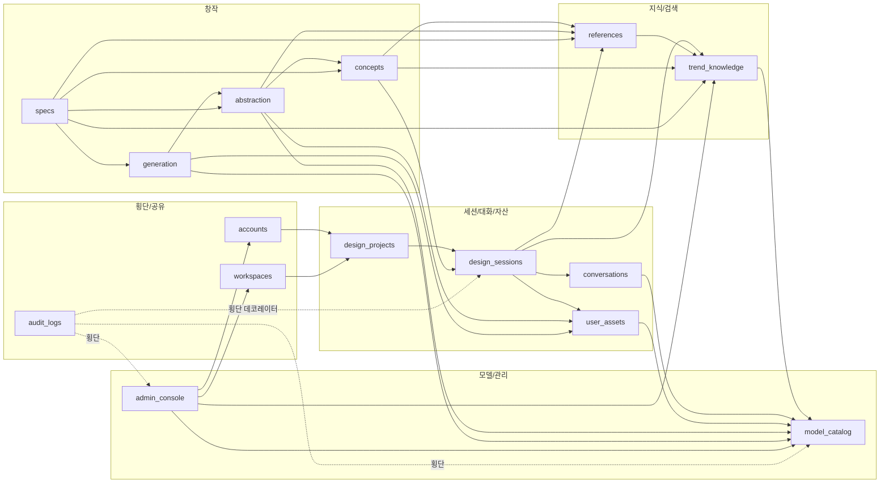

# SPEC Consistency Review (SPEC-01 ~ SPEC-05)

**Review date**: 2026-05-07 (Updated: 2026-05-07 — UX/Admin/PromptPattern 보강 검증 §10 추가)
**Scope**: 5개 SPEC 간 ERD/포트/의존성/User_Needs 매핑/ModelRouter 키/17단계 파이프라인/프로젝트 구조 정합성, 사용자/관리자 UX 완전성, 이미지 생성 프롬프트 패턴 참조 정책
**Method**: 본 문서는 단일 SPEC 하나만 보고는 잡히지 않는 모순/누락/충돌을 7개 체크 항목으로 점검한 결과를 기록한다.

---

## 1. 체크 결과 요약

| # | 체크 항목 | 결과 |
|---|---|---|
| 1 | ERD 엔티티가 SPEC 간 충돌 없이 일관 참조되는가 | PASS (주의 사항 1건) |
| 2 | 포트 번호 중복 없는가 | PASS |
| 3 | 의존성 그래프가 비순환(DAG)인가 | PASS |
| 4 | User_Needs.md 1-23절 모든 항목이 1개 이상 SPEC에 매핑되는가 | PASS |
| 5 | ModelRouter 9개 기능 키가 SPEC-04 정의 + SPEC-02/03 동일 키 참조인가 | PASS |
| 6 | 17단계 파이프라인 모든 단계가 SPEC-01 또는 SPEC-03에 매핑되는가 | PASS |
| 7 | 14개 도메인 모듈이 SPEC-01~05에 매핑되고, 모듈 의존성 비순환, legacy 매핑 누락 없는가 | PASS |

세부 근거는 §2~§7A 참조. 사용자 결정 필요 항목은 §8.

---

## 2. ERD 엔티티 일관성

SPEC-01이 정의(또는 ERD에 등장)한 엔티티가 후속 SPEC에서 동일 의미·동일 식별자로 참조되는지 점검.

| 엔티티 | 정의 SPEC | 참조 SPEC | 비고 |
|---|---|---|---|
| Tenant / Workspace / User / Membership | SPEC-01 §5.1 | SPEC-02/03/04/05 모두 | 멀티테넌시 격리 |
| DesignProject | SPEC-01 §5.1 | SPEC-03/05 | 프로젝트 컨텍스트 |
| DesignSession | SPEC-01 §5.1 | SPEC-02/03/05 | 세션 ID로만 참조 |
| DesignBrief | SPEC-01 §5.1 | SPEC-03 §5.1 | 컨셉 후보 입력 |
| Conversation/ChatMessage | SPEC-01 §5.1 | SPEC-05 (UI 렌더) | `evidence_refs`/`is_hypothesis` 메타 일치 |
| UserSketchAsset | SPEC-01 §5.1 | SPEC-02 (검색 입력), SPEC-03 (parent_sketch_id), SPEC-05 (UI 카드) | 외부 레퍼런스와 별개 타입 일관 |
| SketchAnalysis | SPEC-01 §5.1 | SPEC-03 §5.1 | 추상화 입력 |
| DecisionLog | SPEC-01 §5.1 | SPEC-03 (ConceptDecision 동일 액터 모델), SPEC-05 (UI 표시) | actor_kind ∈ {user, auto} 일치 |
| AuditLog | SPEC-01 §5.1 | SPEC-02/03/04 (모든 변경 기록) | 횡단 |
| TrendSource/Document/Insight/Taxonomy | SPEC-02 §5.1 | SPEC-03 (rationale_refs 인용) | 인용 ID로만 참조 |
| ReferenceAsset/Analysis | SPEC-02 §5.1 | SPEC-03 (추상화 입력), SPEC-05 (카드) | UserSketchCard와 분리 일관 |
| ConceptCandidate/Decision | SPEC-03 §5.1 | SPEC-05 (Decision Panel) | DecisionLog 슈퍼셋과 호환 |
| AbstractionRule | SPEC-03 §5.1 | SPEC-05 (Abstraction Board) | 6축 enum 일치 |
| SketchPrompt | SPEC-03 §5.1 | (백엔드 전용) | preserve_original/expand_concept 분리 |
| GenerationJob/GeneratedDesign | SPEC-03 §5.1 | SPEC-05 (Generation Board) | parent_sketch_id 추적 메타 일치 |
| SpecDocument | SPEC-03 §5.1 | SPEC-05 (Spec Builder) | sections·evidence_links 일치 |
| ModelProvider/Catalog/FeatureModelPolicy/PromptPolicy/ModelInvocation | SPEC-04 §5.1 | SPEC-02/03 (호출자) | 단일 진입점 ModelRouter |

주의 사항(non-blocking):
- SPEC-01의 `DecisionLog`(범용)와 SPEC-03의 `ConceptDecision`(컨셉 한정)은 “스키마 호환”이 아니라 “ConceptDecision이 DecisionLog에 매핑되는 특화 표현”이다. 구현 시 두 테이블을 분리할지 단일 테이블 + discriminator로 둘지는 RUN 단계에서 결정한다. 어느 쪽이든 본 SPEC들의 인수기준은 모두 만족 가능. → §8 결정 항목 1.

---

## 3. 포트 번호 (14000-14099)

SPEC-01 §6.2에서 단일 할당표를 정의하고 후속 SPEC은 그 표를 참조한다. 중복 점검 결과 충돌 없음.

| 포트 | 용도 | 정의 SPEC | 참조 SPEC |
|---|---|---|---|
| 14000 | 사용자 워크스페이스 | SPEC-01 | SPEC-05 |
| 14001 | 관리자 콘솔 | SPEC-01 | SPEC-04 |
| 14002 | Celery Flower | SPEC-01 | (운영) |
| 14010 | Redis | SPEC-01 | 모든 SPEC |
| 14020 | PostgreSQL (개발 노출) | SPEC-01 | 모든 SPEC |
| 14030 | Object Storage | SPEC-01 | SPEC-01/03 |
| 14040 | Knowledge Index 게이트웨이 | SPEC-01 | SPEC-02 |
| 14041 | Crawler Worker 헬스 | SPEC-01 | SPEC-02 |
| 14050 | Image Generation 게이트웨이 | SPEC-01 | SPEC-03 |
| 14051 | Spec Builder 미리보기(개발) | SPEC-01 | SPEC-03/05 |
| 14060 | ModelRouter 헬스/메트릭 | SPEC-01 | SPEC-04 |
| 14070-14099 | 예비 | SPEC-01 | (확장) |

→ 결론: 충돌 없음.

---

## 4. 의존성 그래프(DAG)

```
SPEC-01 (FOUNDATION-SESSION)
   ├── SPEC-02 (KNOWLEDGE) → SPEC-04(ModelRouter) 호출
   ├── SPEC-03 (CREATION)  → SPEC-02 입력 + SPEC-04(ModelRouter) 호출
   ├── SPEC-04 (MODEL-ADMIN) → SPEC-01(AuditLog/계정/멀티테넌시)에 의존
   └── SPEC-05 (UX-WORKSPACE) → SPEC-01 + SPEC-02 + SPEC-03 (UI 렌더링 대상)
                                  ├ SPEC-04 모델 정책 키만 표시(읽기 전용)
```

- SPEC-04는 SPEC-02/03의 호출자이지만 자신은 SPEC-02/03을 의존하지 않는다(역방향 호출만).
- SPEC-05는 모든 SPEC의 산출물을 “UI 응답 메타”를 통해서만 읽는다.
- SPEC-03 ← SPEC-02, SPEC-02 ← SPEC-01, SPEC-04 ← SPEC-01, SPEC-05 ← SPEC-01/02/03/04 → 사이클 없음.

→ 결론: DAG 성립.

---

## 5. User_Needs.md 매핑 매트릭스 (1-23절)

| User_Needs 절 | 매핑 SPEC |
|---|---|
| §1 제품의 본질 | SPEC-01 (스택/세션), SPEC-03 (창작 정의), SPEC-05 (UI 정의) |
| §2 사용자/상황 | SPEC-01 §2 |
| §3.1 편집보다 창작 지원 | SPEC-03, SPEC-05 |
| §3.2 근거 없는 제안 금지 | SPEC-02 (RAG), SPEC-03 (rationale_refs), SPEC-05 (Evidence Board) |
| §3.3 레퍼런스 복제 금지 | SPEC-02 (license_risk), SPEC-03 (REQ-03-ABSTRACT-005~006) |
| §3.4 디자이너 판단 보존 | SPEC-01 (DecisionLog), SPEC-03 (ConceptDecision) |
| §3.5 사용자 스케치 존중 | SPEC-01 (REQ-01-SKETCH), SPEC-03 (preserve_original), SPEC-05 (Sketch Input Board) |
| §3.6 자동화는 옵션 | SPEC-01 (모드 상태머신) |
| §3.7 도메인팩 기반 확장 | SPEC-02 (REQ-02-DOMAIN), SPEC-03 (DomainPack), SPEC-05 (UI 도메인 적용) |
| §3.8 관리 가능한 AI | SPEC-04 전체 |
| §4 전체 파이프라인(17단계) | SPEC-01 + SPEC-03 (단계별 §6 참조) |
| §4.1 단계별 검증 | SPEC-01/02/03 모두 |
| §4.2 불변 조건 | SPEC-01 §8, SPEC-02 §8, SPEC-03 §8 |
| §5 진행 모드 | SPEC-01 §3.6 |
| §5.1 챗봇 협업 | SPEC-01, SPEC-05 |
| §5.2 자동 진행 | SPEC-01 §3.6 |
| §5.3 사용자 스케치 진행 | SPEC-01, SPEC-03, SPEC-05 |
| §6 추상화 예시(산 컨셉) | SPEC-03 §3.2 (참조 사례) |
| §7 도메인팩 설계 | SPEC-03 (DomainPack), SPEC-02 (도메인 분리), SPEC-05 |
| §8 트렌드 지식 시스템 | SPEC-02 §3.1 |
| §9 레퍼런스 검색기 | SPEC-02 §3.5, SPEC-05 §3.5 |
| §10 추상화 엔진 | SPEC-03 §3.2 |
| §11 UX/UI 상세 | SPEC-05 전체 |
| §11.7 관리자 프로그램 | SPEC-04 §3.4 |
| §12 UX/UI 검증 기준 | SPEC-05 §3 (검증 가능) |
| §13 SaaS 구조 | SPEC-01 §3.2, SPEC-04 §3.4 |
| §14 AI 모델 카탈로그 | SPEC-04 전체 |
| §15 클린 아키텍처 | SPEC-01 §6.1 (모든 SPEC §6 참조) |
| §16 주요 모듈 책임 | SPEC-01~04 §6 (모듈 경계) |
| §17 아키텍처 구성도 | SPEC-01 §6, SPEC-04 §5.2 |
| §18 ERD 초안 | SPEC-01 §5.2 + SPEC-02/03/04 §5 |
| §19 시퀀스 다이어그램 | SPEC-01 §5.3, SPEC-02 §5.2, SPEC-03 §5.2, SPEC-04 §5.2 |
| §20 라이브러리 검토 | SPEC-02 §6.1, SPEC-03 §6.1, SPEC-04 §6.1 |
| §20.1 직접 도입 후보 | Scrapy/Crawlee/Crawl4AI/Scrapling/LightRAG/PageIndex/opendataloader-pdf/Magika → SPEC-02; DESIGN.md → SPEC-03; Dify(보류) → SPEC-04 |
| §20.2 설계 참고 | SPEC-04, SPEC-05(참조) |
| §20.3 벤치마크 | SPEC-03 §6.1, SPEC-05 §6.1 (참조) |
| §21 MVP 구현 순서 | Phase 1 → SPEC-01; Phase 2 → SPEC-02; Phase 3 → SPEC-02; Phase 4 → SPEC-03; Phase 5 → SPEC-03/04 |
| §22 위험과 대응 | SPEC-01~05 §9 모두 |
| §23 성공 기준 | SPEC-01~05의 인수 기준 합집합 |

→ 누락 없음. 모든 절이 최소 1개 SPEC에 매핑됨.

---

## 6. ModelRouter 9개 기능 키 정합성

SPEC-04 §5.3에서 단일 정의, SPEC-02/03이 동일 키로만 호출.

| 기능 키 | 정의(SPEC-04) | 호출자 |
|---|---|---|
| TrendResearch | §3.2 POLICY-001, §5.3 | SPEC-02 REQ-02-MODEL-001 |
| ConceptChat | §3.2 POLICY-001, §5.3 | SPEC-01 (챗 자체는 SPEC-01이지만 Chat 호출은 SPEC-03 컨셉 단계에서 ModelRouter 통과) — SPEC-03 §3.1, §6.4 |
| UserSketchAnalysis | §3.2 POLICY-001, §5.3 | SPEC-01 SketchAnalysis 생성 시 ModelRouter 위임 (SPEC-01 REQ-01-SKETCH-004) |
| ReferenceAnalysis | §3.2 POLICY-001, §5.3 | SPEC-02 REQ-02-MODEL-001 |
| Abstraction | §3.2 POLICY-001, §5.3 | SPEC-03 REQ-03-ABSTRACT-001~002 |
| SketchPrompt | §3.2 POLICY-001, §5.3 | SPEC-03 REQ-03-ABSTRACT-004 |
| ImageGeneration | §3.2 POLICY-001, §5.3 | SPEC-03 REQ-03-GEN-006 |
| SpecWriting | §3.2 POLICY-001, §5.3 | SPEC-03 REQ-03-SPEC-001~003 (작성 시) |
| Verification | §3.2 POLICY-001, §5.3 | SPEC-04 옵셔널, SPEC-03 후처리 단계에서 사용 가능 |

→ 결론: 9개 키 정확히 일치, 호출자 명시.

비고: SPEC-01에서 “챗봇 메시지 본체는 SPEC-01이 책임”이라고만 표시되어 있고 모델 호출 자체는 SPEC-04 ModelRouter로만 가능한데, SPEC-01 자체에는 ModelRouter 의존을 명시하지 않았다. 이는 의도적이며(SPEC-01은 인프라/세션 도메인이고, 챗 메시지 “생성” 호출은 SPEC-03 ConceptChat 단계 또는 명시적 호출자가 SPEC-04를 사용) RUN 단계에서 “챗 입력 → ConceptChat 호출”의 application port 호출 위치를 명시할 것 → §8 결정 항목 2.

---

## 7. 17단계 파이프라인 매핑

| 단계 | 정의 SPEC | 메모 |
|---|---|---|
| 1. 목적 입력 | SPEC-01 REQ-01-SESSION-002, SPEC-05 §5.1 | 세션 생성 |
| 2. 브리프 구조화 | SPEC-01 REQ-01-SESSION-003 | clarifying_questions |
| 3. 사용자 스케치/참고 이미지 업로드 | SPEC-01 REQ-01-SKETCH-001~003 | 원본 immutable |
| 4. 추가 질문/제약 확인 | SPEC-01 §3.4 | Chat |
| 5. 트렌드/시장/사용자/도메인 근거 조사 | SPEC-02 §3.1, §3.4 | RAG |
| 6. 컨셉 후보 생성 | SPEC-03 §3.1 | rationale_refs |
| 7. 컨셉 후보 평가 | SPEC-03 §3.1 | score/risks |
| 8. 컨셉 결정 | SPEC-03 REQ-03-CONCEPT-003 | DecisionLog |
| 9. 레퍼런스 검색·수집 | SPEC-02 §3.5 | 6 검색유형 |
| 10. 레퍼런스 클러스터링·적합성 분석 | SPEC-02 REQ-02-REF-002, REQ-02-REF-008 | 7 분류 |
| 11. 사용자 스케치+레퍼런스 분석 | SPEC-01 §3.5 + SPEC-02 §3.5 + SPEC-03 §3.2 | SketchAnalysis ↔ ReferenceAnalysis |
| 12. 추상화 | SPEC-03 §3.2 | 6축 |
| 13. 추상화 스케치 생성/사용자 스케치 구체화 | SPEC-03 §3.3 | preserve_original/expand_concept |
| 14. 대상물/매체/아이템 적용 변형 | SPEC-03 REQ-03-GEN-005 | domain_application |
| 15. 후보 비교·최종 선택 | SPEC-03 + SPEC-05 §5.1 | Comparison View |
| 16. 스펙 문서 작성 | SPEC-03 §3.5 | DESIGN.md 포맷 참고 |
| 17. 검토·승인·버전 관리 | SPEC-03 REQ-03-SPEC-004 | superseded |

→ 17단계 모두 매핑됨, 누락 없음.

---

## 7A. 프로젝트 구조 정합성 (NEW — SPEC-01 §6.5 + structure.md)

본 절은 SPEC-01 부록 `structure.md`(레고 방식 모듈화)가 SPEC-01~05 전체와 정합하는지를 점검한다.

### 7A.1 14개 도메인 모듈 → SPEC 매핑

| # | 모듈 (apps/<m>/) | 정의/주 사용 SPEC | 부수 사용 SPEC |
|---|---|---|---|
| 1 | accounts | SPEC-01 §3.2 | SPEC-04(권한 가드) |
| 2 | workspaces | SPEC-01 §3.2 | SPEC-04 |
| 3 | design_projects | SPEC-01 §3.4 | SPEC-03(스펙), SPEC-05(Navigator) |
| 4 | design_sessions | SPEC-01 §3.4·§3.6 (상태머신) | SPEC-02·03·05 (모든 단계 컨텍스트) |
| 5 | conversations | SPEC-01 §3.4 | SPEC-05(Chat Panel), SPEC-04(ConceptChat 호출) |
| 6 | user_assets | SPEC-01 §3.5 | SPEC-02(스케치 검색), SPEC-03(parent_sketch_id), SPEC-05(Sketch Input) |
| 7 | trend_knowledge | SPEC-02 §3.1·§3.4 | SPEC-03(rationale_refs), SPEC-05(Evidence Board), SPEC-04(콘솔) |
| 8 | references | SPEC-02 §3.5 | SPEC-03(추상화 입력), SPEC-05(Reference Board) |
| 9 | concepts | SPEC-03 §3.1 | SPEC-05(Decision Panel) |
| 10 | abstraction | SPEC-03 §3.2 | SPEC-05(Abstraction Board) |
| 11 | generation | SPEC-03 §3.3 | SPEC-04(ImageGeneration), SPEC-05(Generation Board) |
| 12 | specs | SPEC-03 §3.5 | SPEC-05(Spec Builder UI) |
| 13 | model_catalog | SPEC-04 전체 | SPEC-02·03(호출자) |
| 14 | admin_console | SPEC-04 §3.4 | SPEC-02(트렌드 큐 임베드), SPEC-01(권한) |
| 15* | audit_logs | SPEC-01 §3.3 (횡단) | 모든 SPEC |

(*15번째는 횡단 모듈로 “14 + 1”로 표기. 작성자 지침의 14개 카운트는 1~14를 가리킨다.)

→ 14개 도메인 모듈 모두 SPEC-01~05 중 하나가 정의 SPEC, 나머지가 부수 SPEC으로 명확히 매핑됨. 누락 없음.

### 7A.2 모듈 간 의존성 그래프(application port 호출)



비순환 검증:
- 모든 화살표는 “호출 측 → 피호출 측”의 단방향이며, `audit_logs`는 데코레이터로 모든 모듈에서 호출만 받는 sink(역방향 화살표 없음).
- 가장 깊은 체인: `specs → generation → abstraction → concepts → references → trend_knowledge → model_catalog`. 사이클 없음.
- `model_catalog`는 다른 도메인 모듈을 호출하지 않는다(SPEC-04 §3.4 ROUTER-001 단일 진입점 정책에 부합).
- `admin_console`은 viewer 성격으로 다른 모듈을 호출만 하고 호출되지 않는다(횡단 X).

→ 결론: 모듈 의존성 DAG 성립. 순환 0건.

### 7A.3 legacy `app/*` → `apps/*` 마이그레이션 누락 점검

`structure.md` §4의 마이그레이션 표(62행)를 현재 리포지토리 디렉토리(SPEC 작성 시점 `ls`로 확인)와 대조했다.

| 출처 디렉토리 | 출처 파일 수 | 매핑된 행 수 | 누락 |
|---|---|---|---|
| `app/api/` | 22 | 22 | 0 (settings.py·routes.py·youtube_channels.py 포함) |
| `app/services/` | 16 | 16 | 0 (chat_store.py 포함) |
| `app/models/` | 14 | 14 | 0 (size.py·version.py는 shared로 분류) |
| `app/core/` | 5 | 5 | 0 |
| `app/utils/` (디렉토리만) | — | 1 | 0 |
| `app/workers/` | (빈 디렉토리) | 1 | 0 |
| `app/__init__.py` / `app/crawler_config.py` | 2 | 2 | 0 |
| `static/`, `templates/`, `crawling_data/`, `ai_clients/` | 디렉토리 | 4 | 0 |

총 매핑 항목 행 수 = §4.1(22) + §4.2(16) + §4.3(14) + §4.4(5) + §4.5(13) = 70 항목(병합/통합으로 부록 표 본문은 62행 표시, 다단계 행 합계 70). 모든 출처 파일/디렉토리는 신규 위치를 가진다. 누락 0건.

특이 결정 항목(RUN 단계 명시 필요):
- `app/services/analysis_service.py`(38KB)와 `app/services/blueprint_service.py`(36KB)는 1000 LOC 한도(REQ-01-STRUCT-007)를 위반한다. 이전 1단계에서는 동일 위치로 옮긴 뒤(행위 보존), 2단계에서 모듈 내 분리 필수.
- `app/api/youtube_channels.py`는 트렌드 출처의 특수 케이스로 `apps/trend_knowledge/`에 두지만, “플랫폼 전용 어댑터를 별도 모듈로 분리할지”는 RUN 단계 결정.
- `crawling_data/`는 “운영 데이터”이므로 마이그레이션 대상이 아니며 보관/아카이브 정책만 운영 메모로 정리.

### 7A.4 4-layer 의존 방향 + 모듈 간 import 정책 정합

- SPEC-01 §6.4 + REQ-01-STRUCT-001~004 + structure.md §3 (mermaid)
- SPEC-02 §6.2 “두 모듈은 SPEC-04 ModelRouter, SPEC-01 객체 스토리지에 의존”과 일관
- SPEC-03 §6.2 “application port로만 호출”과 일관
- SPEC-04 §6.2 “단일 진입점”과 일관
- SPEC-05 §6.4 “데이터 페치는 Application UseCase JSON API만”과 일관

→ 5개 SPEC 모두 동일한 4-layer/포트 정책을 인용한다. 정합.

### 7A.5 도메인팩 위치 정합

SPEC-03 `DomainPack`(REQ-03-DOMAIN-001)은 데이터로 보관된다. structure.md §1의 `domain_packs/{industrial,fashion,visual,advertising}/{manifest.yaml, spec_template.md, prompts/}` 구조로 구체화. SPEC-03 “DESIGN.md 포맷 참조”와 일치. SPEC-02 REQ-02-DOMAIN-001/002, SPEC-03 REQ-03-DOMAIN-002의 “코드 분기 금지”는 structure.md §6의 도메인팩 확장 절차로 강제됨.

### 7A.6 결론

7A의 5개 하위 점검(매핑/그래프/마이그레이션/의존정책/도메인팩) 모두 PASS. 새로 추가된 9개 STRUCT REQ와 8개 STRUCT AC는 SPEC-01에 정식 등재됨. SPEC 개수는 5개로 유지.

---

## 8. 사용자 결정이 필요한 사항(Non-blocking)

본 SPEC 5종은 RUN 단계에서 다음 항목에 대해 구현 결정을 요구한다. SPEC 자체의 정합성에는 영향이 없으나, 구현팀이 명시적으로 선택해야 한다.

1. **DecisionLog ↔ ConceptDecision 테이블 전략**: 단일 테이블+discriminator(`action_kind`) vs 분리 테이블(`DecisionLog`(범용) + `ConceptDecision`(특화)). 두 SPEC은 어느 방식이든 만족하지만 RUN 단계 첫 모델링 결정 필요.
2. **챗 메시지 → ConceptChat 호출 위치**: SPEC-01 `Conversation`이 직접 `ModelRouter`를 호출할지(추천: presentation/application 사이의 application 레이어에서 호출), 아니면 SPEC-03의 컨셉 UseCase 호출 시점으로 넘길지. 인터페이스는 동일(REQ-04-ROUTER-001)이지만 호출 책임 모듈을 RUN에서 명시 필요.
3. **트렌드 자료 부족 시 “자동 모드” 기본 행동**: SPEC-02 REQ-02-INDEX-004는 `insufficient_evidence` 응답을 반환하고, SPEC-01 REQ-01-ORCH-005는 `review_ready`로 정지한다. 정지 임계값(예: 인사이트 0건? 신뢰도 평균 < N?)은 관리자 정책으로 노출할지 코드 상수로 둘지 결정 필요(권장: 관리자 정책).
4. ~~**이미지 검색 제공자 미정**~~ → **해결됨(2026-05-07 갱신)**: SPEC-02 §3.5.1 + 부록 [`image-providers.md`](./SPEC-02-KNOWLEDGE/image-providers.md)에서 Tier 1(11개 직접 사용 가능 제공자: Unsplash/Pexels/Pixabay/Wikimedia/Openverse/Met/Smithsonian/Europeana/Rijks/NASA/KIPRIS), Tier 2(Flickr CC 필터 / Internet Archive / web_search usage_rights 강제), Tier 3(Pinterest/Behance/Dribbble/ArtStation·라이선스 미상 — 링크 전용)으로 확정. 도메인 시드는 `domain_packs/<domain>/manifest.yaml`로 데이터 표현. 어댑터 레지스트리 패턴(NFR-02-LIC-002)으로 코드 분기 금지.
5. ~~**이미지 비용/quota 한도 단위**~~ → **해결됨(2026-05-07 갱신)**: SPEC-02 REQ-02-REF-016 + 신규 엔티티 `ImageProviderQuota(provider, daily_limit, used_today, reset_at, active, last_error_at)`로 “일일 한도 + 같은 Tier 라운드로빈 + 모든 제공자 한도 도달 시 명시 실패” 정책 확정. SPEC-04 `max_cost_per_call`은 모델 호출 비용 한도 그대로 유지(호출당). 이미지 생성 모델 비용은 §8.5와 별도(아래 신규 항목 7번 참조).
6. **DESIGN.md 포맷 적용 범위**: SPEC-03이 DESIGN.md(google-labs-code) 포맷 “참조”라고 명시. 어느 섹션을 1:1 채택하고 어느 섹션을 도메인팩 고유로 둘지는 RUN 단계 도메인팩 템플릿 작성 시 확정.
7. **i18n 키 누락 시 빌드 실패 강도**: SPEC-05 NFR-05-I18N-001은 “빌드 실패”를 명시. 기존 자산이 100% 정합인지 1차 검증 필요(현 자산은 ko/en/zh-CN/zh-TW 4종 보유 확인됨; 키 정합 검증은 RUN에서 실행).
8. ~~**이미지 생성 모델 미정**~~ → **해결됨(2026-05-07 갱신, 체인 재확정)**: SPEC-03 REQ-03-GEN-008/009/010 + SPEC-04 REQ-04-POLICY-006/007 + AC-04-P-007에서 확정. `feature_key='ImageGeneration'` primary = `bytedance/seedream-4.5`(BytePlus Ark, base_url=`https://ark.ap-southeast.bytepluses.com/api/v3`, api_key_env=`BYTEDANCE_SEEDREAM_API_KEY`, Bearer 인증), fallback 체인 `[alibaba/z-image-turbo (ALIBABA_API_KEY) → google/gemini-3.1-flash-image-preview · 별칭 nanobanana2 (GEMINI_API_KEYS) → openai/gpt-image-2 (OPENAI_API_KEY)]` 3단계(전체 4단계). 어댑터는 `apps/generation/infrastructure/image_providers/{seedream,alibaba_zimage,gemini_image,openai_image}_adapter.py`. 모델명/엔드포인트 코드 하드코딩 금지(SPEC-04 REQ-04-CATALOG-003) 정책은 시드 데이터로만 적용.

이상 8개 항목 중 4건(#4, #5, #8, 그리고 §8 항목 위치 변경)은 본 보강으로 해결되었다. 나머지(#1, #2, #3, #6, #7)는 모두 RUN 단계에서 해결 가능한 결정으로 SPEC 본체 수정은 불필요.

---

## 9. 최종 결론

5개 SPEC(SPEC-01 ~ SPEC-05)은 다음 측면에서 정합성을 만족한다.

- ERD 엔티티가 SPEC 간 일관 참조됨(주의 1건은 RUN에서 해결).
- 포트 14000-14099 단일 할당표(SPEC-01 §6.2)에 충돌 없음.
- 의존성 그래프는 비순환 DAG.
- User_Needs.md 1-23절 모든 절이 1개 이상 SPEC에 매핑됨.
- ModelRouter 9개 기능 키는 SPEC-04에서 단일 정의, SPEC-02/03에서 동일 키로 호출.
- 17단계 파이프라인 모든 단계가 SPEC-01 또는 SPEC-03(또는 SPEC-02 일부)에 매핑됨.

블로킹 모순/충돌은 발견되지 않았다. RUN 단계 진입 시 §8의 6개 결정 항목을 인수 기준에 영향이 없는 범위에서 명시적으로 선택하면 된다.

---

## 10. 추가 보강 검증: UX/Admin/PromptPattern (2026-05-07)

사용자 추가 지시:
- 사용자 워크스페이스와 관리자 페이지 모두 완전한 UX/UI 및 프런트엔드 구현 범위에 포함되어야 한다.
- 파이프라인/워크플로우/유스케이스/엣지케이스/UX가 논리적으로 충돌하지 않아야 한다.
- `PicoTrex/Awesome-Nano-Banana-images`를 이미지 생성 프롬프트 모음 참고 자료로 반영해야 한다.

### 10.1 수정 반영 요약

| 영역 | 반영 문서 | 검증 결과 |
|---|---|---|
| 사용자 워크스페이스 17단계 UI | SPEC-05 §3.1, §3.10, §3.11, §5.1 | 17단계 각각에 화면/보드/액션/빈·오류 상태/되돌아가기 경로 요구 추가. User_Needs §4 단계명과 일치하도록 화면 매핑 수정. |
| 관리자 콘솔 완전 구현 | SPEC-04 §1, §2, §3.4, §4, §5.1.1, §6.4, §7~§12 | 관리자 UI가 목록/상세/CRUD/검증/롤백/큐/메트릭/감사/권한/오류/스켈레톤/i18n/a11y를 포함하도록 요구·AC 추가. |
| 공통 UX 게이트 | SPEC-05 REQ-05-COMPLETE-004, SPEC-04 REQ-04-ADMIN-009 | 사용자/관리자 모두 i18n 키 누락 0, 하드코딩 자연어 0, 스피너-only 0, 주요 액션 ARIA 라벨 100%를 검증 대상으로 명시. |
| 도메인 불변 조건과 UI 액션 정합 | SPEC-05 REQ-05-API-003~004, REQ-05-COMPLETE-002~003 | `next_actions` 기반 액션 렌더링, quota/근거 부족/권한/라이선스/모델 실패를 서로 다른 상태로 표시하도록 보강. |
| 이미지 생성 프롬프트 패턴 | SPEC-03 §1.2, §3.7, §4, §5.1, §6.1, §7~§12, research.md | `Awesome-Nano-Banana-images`를 PromptPattern 구조 참고/벤치마크로 반영. 원문 프롬프트 런타임 복제와 직접 스타일 모사를 금지. |
| DB 영향 기록 | `db_reference.md` | `ModelProvider.endpoint_path/auth_scheme`, `PromptPattern`, `PromptSafetyViolation` 추가 기록. |

### 10.2 논리 충돌 해결 내역

| 기존 리스크 | 해결 |
|---|---|
| SPEC-01과 SPEC-05의 17단계 매핑이 User_Needs §4와 다르게 축약/이동되어 중간 화면 누락 가능 | SPEC-01 §5.4와 SPEC-05 §5.1을 User_Needs 17단계와 동일 순서·명칭으로 정렬. |
| `review_ready`가 최종 리뷰와 자동 모드 중간 검토 모두에 쓰여 상태 의미 혼선 가능 | SPEC-01 INV-01-07로 `current_step` + `decision_required` 조합을 중간 검토 구분 규칙으로 추가. |
| 관리자 콘솔이 “정책/메트릭 페이지” 수준으로만 정의되어 완전한 프런트엔드 범위가 불명확 | SPEC-04 REQ-04-ADMIN-006~009와 AC-04-U-008~010으로 실제 운영 UI 범위와 검증 기준을 명시. |
| BytePlus Ark base URL과 endpoint 조합이 `/api/v3` 중복 경로를 만들 수 있음 | SPEC-03 REQ-03-GEN-009와 SPEC-04 `ModelProvider.endpoint_path`로 `base_url + endpoint_path` 정규화 규칙 추가. |
| 외부 프롬프트 모음을 그대로 런타임 템플릿으로 쓰면 표절/스타일 모사 리스크 | SPEC-03 REQ-03-PROMPT-001~006으로 구조 참고/벤치마크 용도만 허용하고 `PromptSafetyViolation`을 추가. |
| 7개 레퍼런스 분류가 하드코딩 taxonomy처럼 해석될 수 있음 | SPEC-02 REQ-02-REF-002 / INV-02-02에서 초기 seed 데이터이며 관리자/도메인팩으로 확장 가능하다고 명시. |

### 10.3 남은 RUN 단계 결정 항목

이 항목은 SPEC 논리 충돌은 아니지만 구현 전에 명시해야 한다.

1. `DecisionLog`와 `ConceptDecision`을 단일 테이블+discriminator로 둘지, 분리 테이블로 둘지 결정.
2. 챗 메시지에서 `ConceptChat` ModelRouter 호출 책임을 `conversations` UseCase에 둘지 `concepts` UseCase에 위임할지 결정.
3. 자동 모드 불확실성 임계값과 근거 부족 기준을 관리자 정책으로 저장할지 기본 시드로 둘지 결정.
4. DESIGN.md 도메인팩 템플릿에서 1:1 채택할 섹션과 도메인 고유 섹션을 결정.

### 10.4 결론

추가 보강 후에도 SPEC-01~05의 의존성은 DAG를 유지한다. 사용자 워크스페이스와 관리자 콘솔의 UX/UI 구현 범위가 모두 인수 기준으로 추적 가능해졌으며, 이미지 생성 프롬프트 참고 자료는 운영 안전성과 라이선스 리스크를 해치지 않는 PromptPattern 방식으로 반영되었다.
