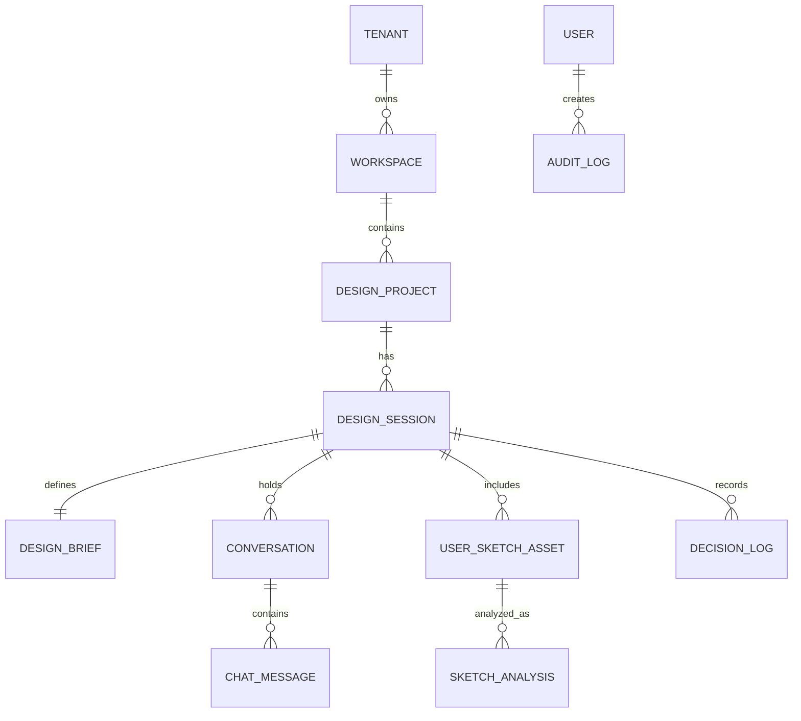
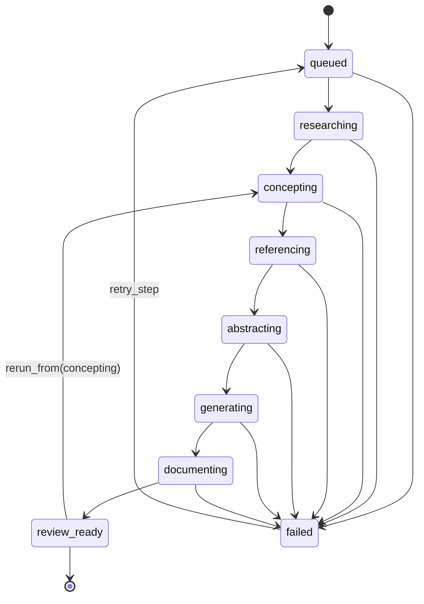

# SPEC-01-FOUNDATION-SESSION: 인프라·계정·디자인 세션 기반

## 1. 개요 (Overview)

### 1.1 목적
범용 디자인 창작 지원 SaaS의 모든 후속 SPEC이 의존하는 인프라 토대를 정의한다. Django·PostgreSQL·Celery·Vanilla 프런트의 표준 스택, conda agent01 환경, 14000번대 포트 할당, 멀티테넌시(Tenant/Workspace) 격리, accounts/audit_logs 등 횡단 모듈, Clean Architecture 4-layer 베이스, 디자인 세션의 핵심 도메인 객체(`DesignProject`, `DesignSession`, `DesignBrief`, `Conversation`, `UserSketchAsset`, `SketchAnalysis`)와 챗봇 협업·자동 진행 모드를 함께 다루는 세션 오케스트레이터(상태머신)을 한 SPEC으로 묶는다.

### 1.2 범위 (In Scope)
- 런타임 인프라: Django(웹/관리자), Celery(워커/비트), PostgreSQL, Redis(브로커/캐시), Object Storage(원본 보존), 정적/미디어 분리
- 환경 표준화: conda env `agent01`, 14000번대 포트 정의표, `.env` 정책(provider/key는 SPEC-04에서 상세화)
- 멀티테넌시 모델: `Tenant`, `Workspace`, `Membership`, 역할(Admin/Lead/Designer/Viewer)
- 인증·권한: 이메일 + 비밀번호 + 세션 인증, 워크스페이스 전환, 역할 기반 권한 가드
- 횡단 관심사: `audit_logs`(사용자/관리자/AI 호출), 표준 로깅, 표준 예외, 표준 DTO/Pagination
- 디자인 세션 모듈: `design_projects`, `design_sessions`, `design_brief`, `conversations`(챗봇 대화/턴/근거 인용), `user_assets`(원본 불변 보존, 썸네일 별도, `SketchAnalysis` 가설 분리)
- 진행 모드 오케스트레이터: 챗봇 협업 모드 + 자동 진행 모드 상태머신(queued/researching/concepting/referencing/abstracting/generating/documenting/review_ready/failed) + 단계별 재실행
- Clean Architecture 4-layer(domain/application/infrastructure/presentation) 모듈 베이스 골격

### 1.3 범위 외 (Out of Scope) — 본 SPEC 처리 안 함
- 트렌드/레퍼런스 수집·검색기 (SPEC-02)
- 컨셉/추상화/생성/스펙 빌더 (SPEC-03)
- 모델 카탈로그·정책·관리자 콘솔 (SPEC-04)
- 사용자 워크스페이스 UI/UX 디테일·스켈레톤·i18n (SPEC-05)

### 1.4 가치 제안
- 모든 기능 모듈이 동일한 멀티테넌시·감사 기준을 공유
- 사용자 스케치 원본 불변 보존이라는 핵심 불변 조건을 인프라 수준에서 강제
- 챗봇/자동 모드를 동일한 세션 상태머신에서 구동하여 후속 SPEC이 단일 진행 컨텍스트를 참조 가능

### 1.5 User_Needs.md 매핑
- §2(사용자/상황), §4(파이프라인), §5(진행 모드), §13(SaaS 구조), §15(클린 아키텍처), §16(모듈 책임), §18(ERD 핵심 테이블), §22(위험과 대응)

### 1.6 부록(Appendix)
본 SPEC의 "프로젝트 구조(레고 방식 모듈화)" 본체는 부록 [`structure.md`](./structure.md)에 정의된다(목표 디렉토리 트리, 4-layer 일관 패턴, REQ-01-STRUCT-001~009, AC-01-STRUCT-001~008, legacy `app/*`→`apps/*` 마이그레이션 매핑 62행, 도메인팩 확장 절차). 본 spec.md의 §3.8(REQ 요약 + 부록 참조), §4(AC 참조), §6.5(구조 결정 요약), §12(추적 매트릭스)에서 부록을 참조한다. 부록은 본 SPEC의 일부이며, 후속 SPEC-02~05도 부록의 구조 표준을 준수한다.

---

## 2. 사용자 스토리 (User Stories)

- US-01-01 (디자이너): 워크스페이스에 로그인하면 본인 소속 프로젝트만 보이고, 다른 테넌트 자료는 절대 노출되지 않는다.
- US-01-02 (디자이너): 새 프로젝트와 디자인 세션을 만들고, 목적/도메인을 선택해 `DesignBrief`를 시작한다.
- US-01-03 (디자이너): 챗봇 협업 모드에서 자연어 목적을 입력하면, 누락 필드를 묻는 후속 질문을 받는다.
- US-01-04 (디자이너): 손그림 사진을 업로드하면 원본은 그대로 보존되고, 썸네일과 AI 해석(가설)이 별도 카드로 표시된다.
- US-01-05 (디자이너): 자동 진행 모드를 선택하면 단계 상태가 실시간으로 갱신되며, 실패 시 단계와 원인이 명확히 보고된다.
- US-01-06 (디자인 리드/PM): 세션 진행 상태(`queued`~`review_ready`)와 단계별 결정 로그를 한 화면에서 추적한다.
- US-01-07 (관리자): 모든 사용자/관리자/AI 호출 행위가 `AuditLog`에 누적되어 사후 감사가 가능하다.
- US-01-08 (디자이너): 특정 단계만 다시 돌리고 싶을 때, 이전 단계 결과는 보존된 채 해당 단계부터 재실행할 수 있다.

---

## 3. 요구사항 (EARS Format Requirements)

### 3.1 인프라·환경 (REQ-01-INFRA)

- REQ-01-INFRA-001 (Ubiquitous): THE SYSTEM SHALL Django + PostgreSQL + Celery(워커/비트) + Redis(브로커) + Vanilla HTML/JS/CSS 스택만 사용한다. (근거: User_Needs §1, §17)
- REQ-01-INFRA-002 (Ubiquitous): THE SYSTEM SHALL conda 가상환경 `agent01`에서 실행되며 모든 의존성은 `environment.yml`/`requirements.txt`로 고정한다. (근거: 작성자 지침)
- REQ-01-INFRA-003 (Ubiquitous): THE SYSTEM SHALL 14000-14099 범위 내에서만 포트를 할당한다. 포트 할당표는 본 SPEC §6.2에 정의하고 후속 SPEC은 이를 참조한다. (근거: 작성자 지침)
- REQ-01-INFRA-004 (Event-driven): WHEN 컨테이너/프로세스가 기동되면, THE SYSTEM SHALL `.env` 부재 또는 필수 키 누락 시 즉시 실패하고 명확한 오류 로그를 남긴다. 거짓 fallback은 금지한다. (근거: User_Needs §3, §14)
- REQ-01-INFRA-005 (Unwanted): IF 코드 레벨에서 모델명·API 키·시크릿이 하드코딩되어 발견되면, THEN THE SYSTEM SHALL CI 단계에서 빌드를 실패시킨다. (근거: User_Needs §3.8, §14)
- REQ-01-INFRA-006 (Ubiquitous): THE SYSTEM SHALL 사용자 업로드 원본 파일을 객체 스토리지(또는 동등한 영속 저장소)에 불변(immutable) 객체로 저장하고, 해시(SHA-256)와 메타데이터를 DB에 기록한다. (근거: User_Needs §5.3, §22)

### 3.2 멀티테넌시·계정 (REQ-01-TENANT)

- REQ-01-TENANT-001 (Ubiquitous): THE SYSTEM SHALL 모든 워크스페이스 스코프 업무 데이터 행이 `tenant_id`와 `workspace_id`를 가지며, ORM 레벨 글로벌 매니저로 자동 필터링한다. 단, `Tenant`, `Workspace`, 전역 `User`처럼 스코프를 정의하는 루트 엔티티와 테넌트 수준 관리자 감사 로그는 명시적 스코프 규칙을 별도 정의한다. (근거: User_Needs §13.3)
- REQ-01-TENANT-002 (Event-driven): WHEN 사용자가 워크스페이스를 전환하면, THE SYSTEM SHALL 세션의 활성 `workspace_id`를 갱신하고 권한을 재평가한다. (근거: User_Needs §13)
- REQ-01-TENANT-003 (State-driven): WHILE 사용자가 인증되지 않은 상태이면, THE SYSTEM SHALL 워크스페이스 데이터에 접근하는 모든 요청을 401/403으로 차단한다.
- REQ-01-TENANT-004 (Ubiquitous): THE SYSTEM SHALL 역할(Tenant Admin / Workspace Lead / Designer / Viewer)별 정책을 권한 매트릭스로 정의하고, 모든 UseCase 입구에서 검증한다.
- REQ-01-TENANT-005 (Unwanted): IF 다른 테넌트의 객체 ID가 요청에 포함되면, THEN THE SYSTEM SHALL 404 또는 403을 반환하고 `AuditLog`에 침해 시도로 기록한다.

### 3.3 감사 로그 (REQ-01-AUDIT)

- REQ-01-AUDIT-001 (Ubiquitous): THE SYSTEM SHALL 사용자 액션, 관리자 액션, AI 호출(요청/응답 메타) 모두를 `AuditLog`에 비파괴적으로 누적 기록한다. (근거: User_Needs §13.2)
- REQ-01-AUDIT-002 (Ubiquitous): THE SYSTEM SHALL `AuditLog` 항목에 `actor_id`, `tenant_id`, `workspace_id`, `action_type`, `target_type`, `target_id`, `payload_digest`, `created_at`를 기록한다.
- REQ-01-AUDIT-003 (Unwanted): IF `AuditLog` 기록이 실패하면, THEN THE SYSTEM SHALL 해당 트랜잭션을 롤백하고 사용자에게 일시 오류로 안내한다.

### 3.4 디자인 세션 도메인 (REQ-01-SESSION)

- REQ-01-SESSION-001 (Ubiquitous): THE SYSTEM SHALL `DesignProject`, `DesignSession`, `DesignBrief`를 별개 Aggregate Root로 분리하고 1:N 관계를 강제한다. (근거: User_Needs §16, §18)
- REQ-01-SESSION-002 (Event-driven): WHEN `DesignSession`이 생성되면, THE SYSTEM SHALL 초기 상태를 `queued`로 두고 진행 모드(`guided` 또는 `auto`)를 기록한다. (근거: User_Needs §5)
- REQ-01-SESSION-003 (Ubiquitous): THE SYSTEM SHALL `DesignBrief` 검증에서 `purpose`, `audience`, `result_form` 중 하나라도 비어 있으면 `clarifying_questions`를 생성한다. (근거: User_Needs §4.1)
- REQ-01-SESSION-004 (Ubiquitous): THE SYSTEM SHALL 챗봇 대화 턴(`Conversation` → `ChatMessage`)을 사용자/AI 발화 단위로 저장하고, 각 AI 발화는 인용 출처(`evidence_refs`)를 포함하거나 명시적으로 “가설”로 표시한다. (근거: User_Needs §5.1, §3.2)
- REQ-01-SESSION-005 (State-driven): WHILE `DesignSession.status`가 `failed`이면, THE SYSTEM SHALL 실패 단계, 원인, 재시도 가능 여부를 사용자에게 표시한다. (근거: User_Needs §5.2, §12.2)

### 3.5 사용자 스케치 자산 (REQ-01-SKETCH)

- REQ-01-SKETCH-001 (Ubiquitous): THE SYSTEM SHALL `UserSketchAsset`을 외부 `ReferenceAsset`과 별개 테이블·별개 카드 타입으로 보관한다. (근거: User_Needs §3.5, §9.4)
- REQ-01-SKETCH-002 (Unwanted): IF 사용자 스케치 원본이 수정·덮어쓰기 요청을 받으면, THEN THE SYSTEM SHALL 거부하고 새 버전 자산으로만 저장한다. (근거: User_Needs §5.3, §22)
- REQ-01-SKETCH-003 (Event-driven): WHEN 스케치가 업로드되면, THE SYSTEM SHALL 파일 타입 검증, 크기 검증, 바이러스 스캔 훅, SHA-256 해시 계산을 수행한 뒤 원본을 immutable 저장소에 저장한다.
- REQ-01-SKETCH-004 (Ubiquitous): THE SYSTEM SHALL `SketchAnalysis`를 “AI 가설” 상태로 저장하고 사용자가 명시적으로 승인/수정해야 다음 단계 입력으로 사용한다. (근거: User_Needs §5.3, §10)
- REQ-01-SKETCH-005 (Ubiquitous): THE SYSTEM SHALL `SketchAnalysis`에 의도, 형태, 구조, 미확정 요소, 유지/변형 가능 요소 필드를 보유한다. (근거: User_Needs §10.2)

### 3.6 진행 모드 오케스트레이터 (REQ-01-ORCH)

- REQ-01-ORCH-001 (Ubiquitous): THE SYSTEM SHALL `DesignSession.status`로 다음 상태를 가진다: `queued`, `researching`, `concepting`, `referencing`, `abstracting`, `generating`, `documenting`, `review_ready`, `failed`. (근거: User_Needs §5.2)
- REQ-01-ORCH-002 (State-driven): WHILE 모드가 `auto`이면, THE SYSTEM SHALL 단계 전환을 자동으로 수행하고 모든 자동 결정에 대해 점수, 근거, 대안, 리스크를 저장한다. (근거: User_Needs §5.2)
- REQ-01-ORCH-003 (State-driven): WHILE 모드가 `guided`이면, THE SYSTEM SHALL 사용자가 단계별 “채택/보류/폐기/더 탐색” 결정을 내릴 때까지 다음 단계로 자동 진행하지 않는다. (근거: User_Needs §5.1)
- REQ-01-ORCH-004 (Event-driven): WHEN 사용자가 특정 이전 단계로 “되돌아가 재실행”을 요청하면, THE SYSTEM SHALL 이전 단계 산출물을 보존한 채 새 버전으로 재실행한다. (근거: User_Needs §5.2)
- REQ-01-ORCH-005 (Unwanted): IF 자동 모드 단계가 불확실성 임계값을 넘으면, THEN THE SYSTEM SHALL `review_ready`와 `decision_required=true`로 정지하고 `current_step`에 검토가 필요한 실제 파이프라인 단계를 유지한다. 사용자가 승인/수정/재실행을 결정하기 전까지 다음 단계로 진행하지 않는다. (근거: User_Needs §5.2, §12.2)
- REQ-01-ORCH-006 (Ubiquitous): THE SYSTEM SHALL 자동 모드 결정도 사용자 결정과 동일한 `DecisionLog` 스키마로 저장한다. (근거: User_Needs §3.4, §4.2)

### 3.7 비동기 작업·관측성 (REQ-01-ASYNC)

- REQ-01-ASYNC-001 (Ubiquitous): THE SYSTEM SHALL 외부 호출(LLM, 크롤링, 파싱, 이미지 생성, 검색)을 모두 Celery 태스크로 비동기 실행한다. (근거: User_Needs §17)
- REQ-01-ASYNC-002 (Event-driven): WHEN 태스크가 실패하면, THE SYSTEM SHALL 단계, 입력 요약, 모델/도구 식별자, 재시도 횟수를 기록하고 사용자가 수동 재시도할 수 있게 한다. (근거: User_Needs §12.2, §22)
- REQ-01-ASYNC-003 (Ubiquitous): THE SYSTEM SHALL 모든 백엔드 로그를 구조화 JSON으로 출력하며 `tenant_id`, `workspace_id`, `session_id`, `step`을 공통 필드로 포함한다.

### 3.8 프로젝트 구조 / 레고 방식 모듈화 (REQ-01-STRUCT) — 본문은 [`structure.md`](./structure.md) §2 참조

본 절은 부록 `structure.md` §2의 EARS REQ를 본 SPEC의 정식 요구사항으로 등재한다. 위반 시 CI 빌드 실패가 명시된 항목은 [HARD]이다.

- REQ-01-STRUCT-001 [HARD] (Unwanted): IF 한 모듈의 코드가 다른 모듈의 Django ORM 모델을 직접 import하면, THEN THE SYSTEM SHALL CI에서 빌드를 실패시킨다. 모듈 간 데이터 접근은 호출 측 모듈의 `application/ports.py`(또는 `shared/application/ports/`)의 인터페이스로만 한다. (근거: User_Needs §15)
- REQ-01-STRUCT-002 (Ubiquitous): THE SYSTEM SHALL 모듈 간 import는 (a) 다른 모듈의 `application/ports.py`, (b) `shared/`의 공용 심볼, (c) `domain_packs/`의 데이터 로더 셋만 허용하고, 그 외 경로는 import-linter로 차단한다. (근거: §15)
- REQ-01-STRUCT-003 [HARD] (Unwanted): IF `apps/<m>/domain/` 트리에서 Django ORM, requests, celery, 외부 API SDK를 import하는 코드가 발견되면, THEN THE SYSTEM SHALL CI에서 거부한다. (근거: §15)
- REQ-01-STRUCT-004 (Ubiquitous): THE SYSTEM SHALL `tools/import_linter.toml`로 4-layer 의존 방향과 모듈 경계를 정적 검증하고, 순환 의존이 0건이어야 한다.
- REQ-01-STRUCT-005 (Ubiquitous): THE SYSTEM SHALL 신규 기능은 신규 모듈 폴더 추가 또는 기존 모듈의 `application/use_cases/<action>.py` 신규 파일 추가만 허용한다(OCP). 기존 파일을 가로지르는 산탄식 수정은 PR 리뷰에서 차단한다.
- REQ-01-STRUCT-006 (Ubiquitous): THE SYSTEM SHALL 각 모듈은 자체 `tests/`(unit/integration/e2e/contracts)를 보유하며, 모듈 외부 의존은 mocking으로 분리한다.
- REQ-01-STRUCT-007 (Unwanted): IF 단일 코드 파일 > 1000 LOC 또는 단일 함수 > 100 LOC가 PR에 포함되면, THEN THE SYSTEM SHALL CI에서 빌드를 실패시킨다. 문서 파일은 본 한도에서 제외하되, 코드 분리는 동일 모듈 내부에서 수행한다. (근거: AGENTS.md/CLAUDE.md 코딩 규칙)
- REQ-01-STRUCT-008 (Unwanted): IF `shared/*` 코드가 단일 모듈에서만 호출되는 것이 확인되면, THEN THE SYSTEM SHALL 해당 코드를 그 모듈로 이동시키고 PR을 머지하지 않는다.
- REQ-01-STRUCT-009 (Ubiquitous): THE SYSTEM SHALL 신규 도메인팩 추가는 `domain_packs/<new>/` 디렉토리 추가 + 관리자 콘솔 등록만으로 완료되어야 한다. `apps/` 코드 수정이 필요하면 SPEC 개정 사유로 처리한다. (근거: User_Needs §3.7, §7)

---

## 4. 인수 기준 (Acceptance Criteria)

- AC-01-T-001: Given 두 테넌트 사용자 A, B가 존재할 때, When A가 B의 `DesignSession`에 직접 ID로 접근하면, Then 시스템은 404를 반환하고 `AuditLog`에 침해 시도가 기록된다. (REQ-01-TENANT-005)
- AC-01-S-002: Given 챗봇 협업 세션이 진행 중일 때, When 사용자가 자연어 목적만 입력하면, Then `DesignBrief`의 비어 있는 필수 필드에 대한 `clarifying_questions`가 최소 1건 생성된다. (REQ-01-SESSION-003)
- AC-01-K-003: Given 사용자가 PNG 스케치를 업로드했을 때, When 동일 세션에서 같은 자산에 대한 “덮어쓰기” 요청이 오면, Then 서버는 거부하고 새 버전(version+1) 자산으로 저장한다. 원본 객체의 SHA-256은 변경되지 않는다. (REQ-01-SKETCH-002, REQ-01-INFRA-006)
- AC-01-O-004: Given 자동 모드 세션이 `concepting`에서 모델 호출 실패가 3회 발생했을 때, When 정책상 재시도가 모두 소진되면, Then 상태는 `failed`로 전이되고 실패 단계/원인/재시도 가능 여부가 화면 및 API에 노출된다. (REQ-01-ORCH-005, REQ-01-ASYNC-002)
- AC-01-A-005: Given 일반 사용자가 관리자 전용 액션을 시도할 때, When 권한이 없으면, Then 403이 반환되고 `AuditLog`에 `unauthorized_admin_attempt`가 기록된다. (REQ-01-TENANT-004, REQ-01-AUDIT-001)
- AC-01-M-006: Given 세션이 `auto`로 시작되었을 때, When 사용자가 도중에 `guided`로 전환하면, Then 진행 중이던 자동 단계는 안전 지점에서 정지하고 모드 변경이 `DecisionLog`에 기록된다. (REQ-01-ORCH-002, REQ-01-ORCH-003)
- AC-01-R-007: Given `referencing` 단계까지 완료된 세션에서, When 사용자가 “concepting부터 재실행”을 요청하면, Then 기존 `referencing` 산출물은 보존되고 `concepting` 신버전이 생성된다. (REQ-01-ORCH-004)

### 4.1 프로젝트 구조 인수 기준 — 본문은 [`structure.md`](./structure.md) §7 참조

다음 8개 인수 기준은 부록 `structure.md` §7에 본문이 있고, 본 SPEC의 정식 인수 기준에 포함된다.

- AC-01-STRUCT-001: legacy `app/services/pipeline_orchestrator.py` → `apps/design_sessions/application/orchestrator/state_machine.py` 이전 후 17단계 자동 모드 E2E가 마이그레이션 전과 등가.
- AC-01-STRUCT-002: legacy `app/services/image_generation_service.py` → `apps/generation/` 이전 후 `GenerationJob` 결과의 추적 메타(`parent_sketch_id`/`rule_ids`/`brief_id`)가 등가.
- AC-01-STRUCT-003: legacy `app/services/ai_research_service.py` + `pipeline_crawl_utils.py` → `apps/trend_knowledge/` 이전 후 `TrendDocument`/`TrendInsight` 필드가 등가.
- AC-01-STRUCT-004: import-linter가 모듈 간 직접 infrastructure import를 CI에서 차단.
- AC-01-STRUCT-005: `apps/<m>/domain/`의 `from django.db` 또는 `import requests`를 CI가 빌드 실패로 차단.
- AC-01-STRUCT-006: import-linter 그래프에서 순환 의존 0건, 모듈 간 호출은 `application/ports.py`로만.
- AC-01-STRUCT-007: 1000 LOC 초과 코드 파일 PR을 CI가 실패시킨다. 문서 파일은 LOC 한도에서 제외한다.
- AC-01-STRUCT-008: 도메인팩 `interior` 추가가 `domain_packs/interior/` + 관리자 콘솔 등록만으로 완료되며 `apps/` 코드 변경 0건으로 17단계 E2E를 완주.

---

## 5. 도메인 모델 (Domain Model)

### 5.1 핵심 엔티티
- `Tenant(id, name, plan, created_at)`
- `Workspace(id, tenant_id, name)`
- `User(id, email, password_hash, default_workspace_id)`
- `Membership(user_id, workspace_id, role)` — role ∈ {admin, lead, designer, viewer}
- `AuditLog(id, actor_id, tenant_id, workspace_id, action_type, target_type, target_id, payload_digest, created_at)`
- `DesignProject(id, workspace_id, title, domain, status, owner_id)` — domain ∈ {industrial, fashion, visual, advertising}
- `DesignSession(id, project_id, mode, status, current_step, version, started_by)` — mode ∈ {guided, auto}
- `DesignBrief(id, session_id, purpose, audience, usage_context, constraints, result_form, score)`
- `Conversation(id, session_id)` ← `ChatMessage(id, conversation_id, role, content, evidence_refs, is_hypothesis, created_at)`
- `UserSketchAsset(id, session_id, uploader_id, original_uri, sha256, mime_type, size, version, parent_asset_id)`
- `SketchAnalysis(id, sketch_id, intent, form_notes, structure_notes, unclear_points, keep_elements, vary_elements, status)` — status ∈ {hypothesis, confirmed, rejected}
- `DecisionLog(id, session_id, step, action, actor_kind, actor_id, rationale, evidence_refs, created_at)` — actor_kind ∈ {user, auto}

### 5.2 ERD 발췌

### 5.3 세션 상태머신

### 5.4 17단계 파이프라인 → 세션 상태 매핑

User_Needs §4의 17단계 파이프라인이 세션 상태머신(9개 상태)에 어떻게 매핑되는지 정의한다. 세션 상태는 다수의 파이프라인 단계를 포함할 수 있다.

| Step | 파이프라인 단계 | 세션 상태 | SPEC 참조 |
|------|---------------|---------|-----------|
| 1 | 목적 입력 | `queued` | SPEC-05 Purpose Input Board |
| 2 | 브리프 구조화 | `queued` | SPEC-01 DesignBrief validation |
| 3 | 사용자 스케치/참고 이미지 업로드(선택) | `queued` | SPEC-01 UserSketchAsset |
| 4 | 추가 질문과 제약 확인 | `queued` | SPEC-01 Conversation / Clarifying Questions |
| 5 | 트렌드/시장/사용자/도메인 근거 조사 | `researching` | SPEC-02 TrendSource crawling / RAG |
| 6 | 컨셉 후보 생성 | `concepting` | SPEC-03 ConceptCandidate |
| 7 | 컨셉 후보 평가 | `concepting` | SPEC-03 Concept scoring |
| 8 | 컨셉 결정 | `concepting` | SPEC-03 ConceptDecision / DecisionLog |
| 9 | 레퍼런스 검색과 수집 | `referencing` | SPEC-02 ReferenceAsset search |
| 10 | 레퍼런스 클러스터링과 적합성 분석 | `referencing` | SPEC-02 ReferenceAnalysis |
| 11 | 사용자 스케치와 레퍼런스 분석 | `abstracting` | SPEC-01 SketchAnalysis + SPEC-02 ReferenceAnalysis |
| 12 | 레퍼런스/스케치 추상화 | `abstracting` | SPEC-03 6-axis Abstraction |
| 13 | 추상화 스케치 생성 또는 사용자 스케치 구체화 | `generating` | SPEC-03 refinement / variation |
| 14 | 대상물/매체/아이템 적용 디자인 변형 생성 | `generating` | SPEC-03 domain_application |
| 15 | 후보 비교와 최종 방향 선택 | `generating` | SPEC-03 Comparison (sub-state) |
| 16 | 스펙 문서 작성 | `documenting` | SPEC-03 SpecDocument |
| 17 | 검토·승인·버전 관리 | `review_ready` | SPEC-03 SpecDocument approval + SPEC-05 Spec Builder |

**INV-01-06:** Step 15(비교·평가)는 `generating` 상태의 하위 단계(sub-state)로 처리한다. 별도의 세션 상태를 추가하지 않는다. `DesignSession.current_step` 필드(1~17)로 세부 진행을 추적한다.

**INV-01-07:** `review_ready`는 최종 검토뿐 아니라 자동 모드의 사람 검토 체크포인트를 표현할 수 있다. 이때 `current_step`과 `decision_required=true`가 실제 정지 단계를 구분하며, 검토 완료 후에는 정의된 상태머신의 다음 단계로 재개한다.

---

## 6. 아키텍처 결정 (Architecture Decisions)

### 6.1 Clean Architecture 4-layer 매핑
- `apps/<module>/domain`: Entity·VO·Domain Service. Django ORM 비의존. (User_Needs §15)
- `apps/<module>/application`: UseCase·DTO·Command/Query·Port 인터페이스. 트랜잭션 경계.
- `apps/<module>/infrastructure`: Django ORM Repository·Celery 어댑터·외부 게이트웨이. Port 구현체.
- `apps/<module>/presentation`: Django View·Form·Template·정적 자산. JSON API 어댑터.

### 6.2 14000번대 포트 할당표 (전 SPEC 공통 참조)
| 용도 | 포트 |
|---|---|
| Django Web (사용자 워크스페이스) | 14000 |
| Django Admin (관리자 콘솔) | 14001 |
| Celery Flower (모니터링) | 14002 |
| Redis (브로커/캐시) | 14010 |
| PostgreSQL (개발용 노출) | 14020 |
| Object Storage (MinIO 등 개발) | 14030 |
| Knowledge Index 서비스(SPEC-02 RAG 게이트웨이) | 14040 |
| Crawler Worker 헬스체크 HTTP(SPEC-02) | 14041 |
| Image Generation 게이트웨이(SPEC-03) | 14050 |
| Spec Builder 미리보기 서버(SPEC-03/05) | 14051 |
| Model Router 헬스(SPEC-04) | 14060 |
| 예비 (확장) | 14070-14099 |

### 6.3 라이브러리 채택/보류
| 후보 | 판정 | 사유 |
|---|---|---|
| Django + DRF(있을 시 부분 사용) | 채택 | 사용자/관리자 분리, ORM, 마이그레이션 |
| PostgreSQL | 채택 | 트랜잭션·JSONB·전문검색 필요 |
| Celery + Redis | 채택 | 비동기 파이프라인 (User_Needs §17) |
| Vanilla HTML/JS/CSS | 채택(고정) | 작성자 지침 |
| MinIO/S3 호환 객체 스토리지 | 채택 | 원본 불변 저장 (REQ-01-INFRA-006) |
| `google/magika` (파일 타입 감지) | 보류(SPEC-02 채택) | 본 SPEC은 인터페이스만 노출, 실제 사용은 SPEC-02 파일 파이프라인에서 |
| Dify 류 워크플로우 플랫폼 | 보류 | 자체 상태머신을 Django/Celery에 두고 Dify는 영감 자료로만 활용 |
| OpenClaw/AionUi 등 에이전트 데스크톱 | 보류 | 본 시스템은 SaaS 웹, 데스크톱 에이전트는 범위 밖 |

### 6.4 모듈 경계와 의존 방향
- 모든 모듈은 `domain → application → infrastructure/presentation` 단방향 의존
- 모듈 간 직접 ORM 접근 금지. `application/ports/`의 인터페이스로만 호출
- `audit_logs`는 모든 UseCase 데코레이터로 횡단 적용

### 6.5 프로젝트 구조 결정 (요약) — 본문은 [`structure.md`](./structure.md)

레고 방식 모듈화의 결정 사항을 요약한다. 완전한 디렉토리 트리, 4-layer 일관 패턴, 마이그레이션 매핑(62행), 도메인팩 확장 절차는 부록 `structure.md`에 있다.

**핵심 결정**:

1. **14개 제품 도메인 모듈 + 1개 횡단 모듈 + 1개 운영 호스트**: `apps/{accounts, workspaces, design_projects, design_sessions, conversations, user_assets, trend_knowledge, references, concepts, abstraction, generation, specs, model_catalog, admin_console}`가 User_Needs §15·§16의 14개 제품 도메인 모듈이다. `apps/audit_logs`는 모든 UseCase에 적용되는 횡단 모듈이며, `tasks/`는 Celery 큐/스케줄 운영 호스트다.

2. **모든 도메인 모듈은 동일한 4-layer 폴더 패턴**: `domain/`(Pure Python), `application/`(UseCase + ports), `infrastructure/`(ORM + 외부 어댑터 + Celery 태스크), `presentation/`(View + Template + Static). 패턴은 `structure.md` §1.2 참조.

3. **shared/와 domain_packs/ 분리**: `shared/`는 2개 이상 모듈이 쓰는 인프라/도메인 공용. `domain_packs/`는 산업/패션/시각/광고 + 향후 신규 도메인을 “데이터로만” 표현. 코드 분기 금지.

4. **레이어 의존 방향(역의존 금지)**: presentation → application → domain ← infrastructure. 모듈 간 호출은 호출 측 모듈의 `application/ports.py`로만. mermaid는 `structure.md` §3.

5. **점진 이관(Strangler)**: legacy `app/{api,services,models,core,utils,workers}` → `apps/{module}/{layer}` 매핑이 `structure.md` §4에 62행 정의. 한 번에 전체 삭제 금지. 신규 모듈 골격을 먼저 세우고 단계적으로 옮긴다.

6. **CI 가드**: import-linter, 모델명/키 하드코딩 정적 검사, 코드 파일 1000 LOC 초과 실패는 `tools/`에 위치(`structure.md` §1).

이 결정은 SPEC-02 ~ SPEC-05의 모듈 위치 결정에도 그대로 적용된다.

---

## 7. 비기능 요구사항 (NFR)

- NFR-01-PERF-001: 사용자 워크스페이스 첫 응답(p95) ≤ 1.0s, 챗 메시지 단건 송수신 p95 ≤ 800ms.
- NFR-01-PERF-002: 평균 동시 활성 세션 1,000개 / 워커 풀에서 메시지 큐 지연 p95 ≤ 2s.
- NFR-01-SEC-001: OWASP ASVS L2 이상 준수, CSRF/XSS/SSRF/IDOR/Clickjacking 방어 표준 적용.
- NFR-01-SEC-002: 비밀번호 Argon2id 저장, 세션 쿠키 `Secure; HttpOnly; SameSite=Lax`.
- NFR-01-SEC-003: 모든 외부 호출(LLM, 크롤링) URL allowlist 기반 SSRF 방어.
- NFR-01-DATA-001: 사용자 스케치 원본은 immutable 객체로 저장, 삭제는 “tombstone” 방식(논리 삭제)만 허용.
- NFR-01-OBS-001: 구조화 로그 + Celery 태스크 트레이스 ID + 요청 상관관계 ID 표준화.
- NFR-01-LIC-001: 도입 라이브러리 라이선스 매트릭스 유지(SPEC-02/03/04와 합산).
- NFR-01-A11Y-001: 본 SPEC 범위는 백엔드/도메인이 중심이지만, 모든 백엔드 응답은 SPEC-05 UX의 단계 표시·근거 표시를 위한 메타(`current_step`, `evidence_refs`, `is_hypothesis`)를 포함한다.

---

## 8. 불변 조건 (Invariants)

본 SPEC은 다음의 파이프라인 불변 조건(User_Needs §4.2)을 인프라 수준에서 강제한다.

- INV-01-01: 사용자 업로드 스케치 원본은 절대 수정·덮어쓰기되지 않는다. (REQ-01-INFRA-006, REQ-01-SKETCH-002)
- INV-01-02: 자동 모드의 결정도 사용자 결정과 동일한 `DecisionLog`에 저장된다. (REQ-01-ORCH-006)
- INV-01-03: AI 발화는 `evidence_refs` 또는 `is_hypothesis=true` 중 하나를 반드시 가진다. (REQ-01-SESSION-004)
- INV-01-04: 세션 상태 전이는 정의된 상태머신 외 경로를 허용하지 않는다. (REQ-01-ORCH-001)
- INV-01-05: 모든 워크스페이스 스코프 업무 데이터 행은 `tenant_id`/`workspace_id` 격리를 만족한다. 스코프 루트 엔티티와 테넌트 수준 관리자 로그는 명시된 예외 규칙을 따른다. (REQ-01-TENANT-001)
- INV-01-06: 17단계 파이프라인의 Step 15(비교·평가)는 `generating` 상태의 하위 단계로 처리되며, 별도의 세션 상태를 추가하지 않는다. `DesignSession.current_step`으로 세부 진행을 추적한다. (§5.4)
- INV-01-07: `review_ready`가 중간 검토 체크포인트로 사용될 때는 `current_step`과 `decision_required`로 최종 리뷰와 구분한다. (§5.4)

---

## 9. 위험과 대응 (Risks)

| 위험 | 대응 |
|---|---|
| 원본 스케치 손실 (User_Needs §22) | immutable 객체 저장 + SHA-256 검증 + tombstone 삭제만 허용 |
| 사용자 스케치 오해석 | `SketchAnalysis.status='hypothesis'` 기본값, 사용자 승인 후 후속 단계로 진행 |
| SaaS 데이터 혼선 | 글로벌 매니저 자동 필터링 + 침해 시도 `AuditLog` 기록 |
| 자동 모드 품질 저하 | 불확실성 임계값 시 `review_ready` 정지 + 검토 필요 항목 강조 |
| 모델 실패 누수 | Celery 재시도 정책 + 거짓 fallback 금지 + 사용자 표시 |
| 중간 검토와 최종 검토 상태 혼선 | `review_ready` 사용 시 `current_step`/`decision_required`를 함께 저장하고 UI/API에서 정지 단계를 명시 |

---

## 10. 의존성 (Dependencies)

- 외부: PostgreSQL 14+, Redis 7+, Object Storage(S3/MinIO), Python 3.11+, Django 4.2+, Celery 5+
- 내부 SPEC 의존: 없음(본 SPEC이 기반)
- 본 SPEC을 의존하는 SPEC: SPEC-02, SPEC-03, SPEC-04, SPEC-05 전부

---

## 11. 범위 외 (Out of Scope)

- 트렌드 출처 등록·문서 수집·RAG 색인(→ SPEC-02)
- 레퍼런스 검색기 UI/검색 알고리즘(→ SPEC-02/SPEC-05)
- 컨셉 후보 생성·점수화·추상화·이미지 생성·스펙 문서 빌드(→ SPEC-03)
- 모델 카탈로그 / FeatureModelPolicy / PromptPolicy / 모델 비용 모니터링(→ SPEC-04)
- Design Studio 7-Board UI, 스켈레톤 로딩, i18n 자산 활용 디테일(→ SPEC-05)

---

## 12. 추적 매트릭스 (Traceability)

| REQ ID | User_Needs 매핑 | 주요 인수기준 |
|---|---|---|
| REQ-01-INFRA-001 | §1, §17 | (스택 검증) |
| REQ-01-INFRA-003 | 작성자 지침 | 포트 할당표 §6.2 |
| REQ-01-INFRA-005 | §3.8, §14 | (CI 정적 검사) |
| REQ-01-INFRA-006 | §5.3, §22 | AC-01-K-003 |
| REQ-01-TENANT-001 | §13.3 | AC-01-T-001 |
| REQ-01-TENANT-005 | §13.3 | AC-01-T-001 |
| REQ-01-AUDIT-001 | §13.2 | AC-01-A-005 |
| REQ-01-SESSION-003 | §4.1 | AC-01-S-002 |
| REQ-01-SESSION-004 | §3.2, §5.1 | (메시지 evidence_refs) |
| REQ-01-SKETCH-002 | §5.3, §22 | AC-01-K-003 |
| REQ-01-SKETCH-004 | §5.3, §10 | (가설 승인 흐름) |
| REQ-01-ORCH-001 | §5.2 | AC-01-O-004 |
| REQ-01-ORCH-002~003 | §5 | AC-01-M-006 |
| REQ-01-ORCH-004 | §5.2 | AC-01-R-007 |
| REQ-01-ORCH-006 | §3.4, §4.2 | (DecisionLog 검증) |
| REQ-01-ASYNC-001 | §17 | AC-01-O-004 |
| INV-01-06 (§5.4) | §4 (17단계 파이프라인) | (current_step 추적) |
| INV-01-07 (§5.4) | §5.2 (자동 모드 검토 필요) | (review checkpoint 구분) |
| REQ-01-STRUCT-001 | §15 | AC-01-STRUCT-004 |
| REQ-01-STRUCT-002 | §15 | AC-01-STRUCT-006 |
| REQ-01-STRUCT-003 | §15 | AC-01-STRUCT-005 |
| REQ-01-STRUCT-004 | §15·§16 | AC-01-STRUCT-006 |
| REQ-01-STRUCT-005 | OCP / §15 | (PR 리뷰 가드) |
| REQ-01-STRUCT-006 | §15 | (모듈 단위 테스트) |
| REQ-01-STRUCT-007 | CLAUDE.md | AC-01-STRUCT-007 |
| REQ-01-STRUCT-008 | §15 | (정적 분석 PR 가드) |
| REQ-01-STRUCT-009 | §3.7, §7 | AC-01-STRUCT-008 |

---

문서 종료. 후속 SPEC은 본 문서의 §5 도메인 모델, §6.2 포트 할당표, §6.5/[`structure.md`](./structure.md), §8 불변 조건을 정합 기준으로 사용한다.
