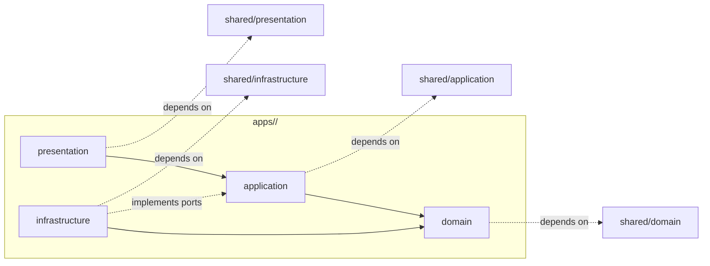

# SPEC-01 Appendix: 프로젝트 구조 (Project Structure)

이 부록은 SPEC-01-FOUNDATION-SESSION §6.5의 본문이며, 본 시스템의 “레고 방식 모듈화” 표준 디렉토리 트리, 모듈 독립성 규칙(EARS REQ-01-STRUCT-*), 레이어 의존 방향, 기존 평면 코드(`app/`)에서 신규 `apps/{bounded_context}/...` 구조로의 마이그레이션 매핑, 공유 코드 정책, 도메인팩 확장 절차, 마이그레이션 인수기준을 정의한다.

본 부록의 모든 REQ는 SPEC-01의 일부이며, SPEC-02 ~ SPEC-05도 본 구조 표준을 준수해야 한다.

---

## 1. 목표 디렉토리 트리

User_Needs §15에 따라 14개 제품 bounded context를 정의한다(작성자 지침의 14개 모듈을 그대로 채택). 여기에 횡단 모듈 `audit_logs`와 운영 호스트 `tasks`(Celery 큐/스케줄 호스트)를 별도로 둔다. 제품 도메인 모듈 수는 14개로 고정한다.

```
<repo-root>/
├── manage.py                          # Django 진입점
├── pyproject.toml | requirements.txt  # 의존성 (conda env: agent01)
├── environment.yml                    # conda 환경 락
├── .env.example                       # Provider/Key 키 이름만 (값 없음)
├── alembic/                           # DB 마이그레이션 (또는 django migrations)
├── docs/                              # 사용자 문서
├── .moai/                             # SPEC/리포트 (본 디렉토리)
│
├── config/                            # Django settings + URL conf 루트
│   ├── __init__.py
│   ├── settings/
│   │   ├── base.py
│   │   ├── dev.py
│   │   ├── prod.py
│   │   └── test.py
│   ├── urls_user.py                   # 14000 사용자 워크스페이스 라우팅
│   ├── urls_admin.py                  # 14001 관리자 콘솔 라우팅
│   ├── celery_app.py                  # Celery 앱 (브로커 14010)
│   └── asgi.py / wsgi.py
│
├── apps/                              # 14개 bounded context (도메인 모듈)
│   ├── accounts/                      # 인증·역할 (User, Membership)
│   ├── workspaces/                    # 멀티테넌시 (Tenant, Workspace)
│   ├── design_projects/               # 디자인 프로젝트 Aggregate
│   ├── design_sessions/               # 세션 + 상태머신 + 오케스트레이터
│   ├── conversations/                 # 챗봇 대화 (ChatMessage, evidence_refs)
│   ├── user_assets/                   # 사용자 스케치 자산 + SketchAnalysis
│   ├── trend_knowledge/               # 트렌드 출처/문서/인사이트/택소노미 (SPEC-02)
│   ├── references/                    # 레퍼런스 검색/카드/분석 (SPEC-02)
│   ├── concepts/                      # 컨셉 후보/결정 (SPEC-03)
│   ├── abstraction/                   # 6축 추상화 규칙 + SketchPrompt (SPEC-03)
│   ├── generation/                    # GenerationJob/GeneratedDesign (SPEC-03)
│   ├── specs/                         # SpecDocument 빌더/버전/승인 (SPEC-03)
│   ├── model_catalog/                 # ModelProvider/Catalog/Policy + Router (SPEC-04)
│   ├── admin_console/                 # 관리자 화면/메트릭/롤백 (SPEC-04)
│   └── audit_logs/                    # AuditLog 횡단(제품 도메인 카운트 제외)
│
├── apps/<module>/                     # 모든 도메인 모듈의 4-layer 일관 패턴
│   ├── __init__.py
│   ├── apps.py                        # Django AppConfig
│   ├── domain/
│   │   ├── __init__.py
│   │   ├── entities.py                # Entity (Django ORM 비의존)
│   │   ├── value_objects.py
│   │   ├── services.py                # Domain Service
│   │   ├── invariants.py              # 불변 조건 표현식
│   │   └── events.py                  # Domain Events
│   ├── application/
│   │   ├── __init__.py
│   │   ├── ports.py                   # 외부 의존(Repository/Gateway) Port 정의
│   │   ├── use_cases/
│   │   │   ├── __init__.py
│   │   │   └── <action>.py            # 각 UseCase는 1파일·100 LOC 이하 권장
│   │   ├── dtos.py
│   │   ├── commands.py
│   │   ├── queries.py
│   │   └── transactions.py            # 트랜잭션 경계 컨텍스트 매니저
│   ├── infrastructure/
│   │   ├── __init__.py
│   │   ├── orm/
│   │   │   ├── models.py              # Django ORM (1파일 1000 LOC 한도, 초과시 분리)
│   │   │   ├── managers.py            # 글로벌 매니저 (tenant 자동 필터)
│   │   │   └── migrations/            # Django migrations
│   │   ├── repositories/              # ports.py 인터페이스의 ORM 구현체
│   │   ├── adapters/                  # 외부 API/SDK 어댑터
│   │   ├── tasks/                     # Celery 태스크 (어댑터를 호출)
│   │   └── gateways/                  # SSRF allowlist 통과 외부 호출
│   ├── presentation/
│   │   ├── __init__.py
│   │   ├── views.py                   # Django View / DRF View
│   │   ├── urls.py                    # 모듈 자체 라우팅 (config/urls_*에서 include)
│   │   ├── serializers.py             # DRF/입출력 스키마
│   │   ├── forms.py                   # Django Form (옵션)
│   │   ├── templates/<module>/        # 모듈별 템플릿 네임스페이스
│   │   └── static/<module>/           # 모듈별 정적 자산 네임스페이스
│   └── tests/
│       ├── unit/                      # domain/application 단위 테스트
│       ├── integration/               # infrastructure 통합 테스트
│       ├── e2e/                       # presentation E2E
│       ├── fixtures/
│       └── conftest.py
│
├── shared/                            # 2개 이상 모듈이 공유하는 코드만
│   ├── domain/
│   │   ├── value_objects/             # Money, Email, TenantId, WorkspaceId 등
│   │   ├── exceptions.py              # 공용 도메인 예외
│   │   └── events_base.py
│   ├── application/
│   │   ├── ports/                     # 공통 Port (예: AuditLogPort)
│   │   ├── result.py                  # Result/Either 타입
│   │   └── decorators/                # 권한/감사 횡단 데코레이터
│   ├── infrastructure/
│   │   ├── object_storage/            # 14030 S3/MinIO 어댑터 (REQ-01-INFRA-006)
│   │   ├── ssrf_guard/                # URL allowlist (NFR-01-SEC-003)
│   │   ├── rag_port_adapter/          # SPEC-02용 LightRAG 어댑터 베이스
│   │   ├── crypto/                    # Argon2id 등
│   │   ├── observability/             # 구조화 로그·trace_id 헬퍼
│   │   └── tenant_middleware/         # tenant_id/workspace_id 컨텍스트
│   └── presentation/
│       ├── base_views.py              # 공용 base View/permission 가드
│       ├── error_handlers.py          # 사용자 친화 오류 변환
│       ├── pagination.py
│       └── i18n/                      # 4개 언어 키 로더 (기존 static/i18n 자산 연계)
│
├── tasks/                             # Celery 비트 스케줄/공통 워크플로우 정의
│   ├── beat_schedule.py               # 트렌드 수집 스케줄 (SPEC-02)
│   ├── workflows/                     # 17단계 파이프라인 워크플로우 정의
│   └── workers/                       # 워커 부트스트랩
│
├── domain_packs/                      # 도메인팩 데이터 (NOT 코드 분기)
│   ├── industrial/
│   │   ├── manifest.yaml              # brief_schema, evaluation_axes, generation_outputs
│   │   ├── spec_template.md           # DESIGN.md 포맷 기반 템플릿
│   │   └── prompts/                   # 도메인 한정 프롬프트 (PromptPolicy 적재용)
│   ├── fashion/
│   ├── visual/
│   └── advertising/
│
├── static/                            # 글로벌 정적 자산 (모듈 외 공통 자산만)
│   ├── i18n/{ko,en,zh-CN,zh-TW}.json  # 기존 자산 보존
│   └── design_tokens.css              # 시각 구분 토큰 (SPEC-05)
│
├── templates/                         # 글로벌 레이아웃 템플릿
│   └── base/
│
├── tests/                             # 모듈 경계를 가로지르는 통합 테스트만
│   ├── system/                        # 17단계 파이프라인 E2E
│   ├── contracts/                     # 모듈 간 Port 계약 테스트
│   └── architecture/                  # import-linter 등 구조 검증
│
└── tools/
    ├── import_linter.toml             # 모듈 경계 정적 검증 (REQ-01-STRUCT-004)
    ├── ci_checks/                     # 하드코딩 모델명/키 정적 검사 (REQ-04-CATALOG-003)
    └── migration_scripts/             # legacy app/* → apps/* 점진 이관 스크립트
```

### 1.1 presentation 내부 templates/static 매핑 규칙

- 각 모듈은 `apps/<module>/presentation/templates/<module>/` 와 `presentation/static/<module>/`을 자체 네임스페이스로 갖는다.
- 글로벌 `templates/`와 `static/`은 “레이아웃, 다국어 키, 디자인 토큰”처럼 모든 모듈이 의존하는 자산만 둔다.
- Django의 `APP_DIRS=True`로 모듈 템플릿이 자동 감지되며, 충돌은 모듈 네임스페이스로 방지한다.
- SPEC-05의 7-Board는 각각 다음 모듈에 분산된다(중복 템플릿 금지):
  - Chat Panel → `apps/conversations/presentation/templates/conversations/chat_panel.html`
  - Evidence Board → `apps/trend_knowledge/presentation/templates/trend_knowledge/evidence_board.html`
  - Sketch Input Board → `apps/user_assets/presentation/templates/user_assets/sketch_input.html`
  - Reference Board → `apps/references/presentation/templates/references/reference_board.html`
  - Abstraction Board → `apps/abstraction/presentation/templates/abstraction/abstraction_board.html`
  - Generation Board → `apps/generation/presentation/templates/generation/generation_board.html`
  - Decision Panel → `apps/design_sessions/presentation/templates/design_sessions/decision_panel.html`

### 1.2 4-layer 일관 패턴 (모든 도메인 모듈에 동일 적용)

| Layer | 위치 | 의존 가능 | 의존 금지 |
|---|---|---|---|
| domain | `apps/<m>/domain/` | 표준 라이브러리, `shared/domain/` | Django ORM, requests, Celery, 외부 API SDK |
| application | `apps/<m>/application/` | `apps/<m>/domain/`, `shared/application/`, `shared/domain/`, 다른 모듈의 `application/ports.py` | 다른 모듈의 `infrastructure/`, `presentation/`, `domain/` 직접 import |
| infrastructure | `apps/<m>/infrastructure/` | `apps/<m>/application/ports.py`(구현 대상), `apps/<m>/domain/`, `shared/infrastructure/` | 다른 모듈의 `infrastructure/`/`presentation/` 직접 import |
| presentation | `apps/<m>/presentation/` | `apps/<m>/application/`(UseCase 호출), `shared/presentation/` | `apps/<m>/infrastructure/`, `apps/<m>/domain/` 직접 import |

---

## 2. 모듈 독립성 규칙(레고 원칙) — EARS REQ-01-STRUCT-*

다음 7개 요구사항은 SPEC-01 §3에 추가되는 EARS REQ의 본문이다.

- REQ-01-STRUCT-001 (Unwanted): IF 한 모듈의 코드가 다른 모듈의 Django ORM 모델을 직접 import하면, THEN THE SYSTEM SHALL CI에서 빌드를 실패시킨다. 모듈 간 데이터 접근은 호출 측 모듈의 `application/ports.py`(또는 `shared/application/ports/`)의 인터페이스를 통해서만 한다. (근거: User_Needs §15)
- REQ-01-STRUCT-002 (Ubiquitous): THE SYSTEM SHALL 모듈 간 import는 (a) 다른 모듈의 `application/ports.py` 심볼, (b) `shared/`의 공용 심볼, (c) `domain_packs/`의 데이터 로더 셋만 허용한다. 그 외 경로는 import-linter로 차단한다. (근거: §15)
- REQ-01-STRUCT-003 (Unwanted): IF `apps/<m>/domain/` 트리에서 Django ORM, requests, celery, 외부 API SDK를 import하는 코드가 발견되면, THEN THE SYSTEM SHALL CI에서 거부한다. (근거: §15 “Domain은 Django ORM에 의존하지 않는다”)
- REQ-01-STRUCT-004 (Ubiquitous): THE SYSTEM SHALL `tools/import_linter.toml`로 4-layer/모듈 간 의존 방향을 정적 검증하며, 위반 시 CI 실패. 순환 의존은 0건이어야 한다.
- REQ-01-STRUCT-005 (Ubiquitous): THE SYSTEM SHALL 신규 기능 추가는 (a) 신규 모듈 폴더를 추가하거나, (b) 기존 모듈의 `application/use_cases/<action>.py`를 새로 추가하는 방식만 허용한다. 기존 파일을 가로지르는 “산탄식 수정”이 PR diff의 다수를 차지하면 리뷰에서 차단한다. (근거: OCP)
- REQ-01-STRUCT-006 (Ubiquitous): THE SYSTEM SHALL 각 모듈은 자체 `tests/` 디렉토리를 보유하고, 모듈 외부 의존(다른 모듈의 Port·외부 API·Celery)을 mocking으로 분리한다. 모듈 단위 테스트는 다른 모듈의 DB/네트워크에 절대 접근하지 않는다.
- REQ-01-STRUCT-007 (Unwanted): IF 단일 코드 파일이 1000 LOC를 초과하거나 단일 함수가 100 LOC를 초과하면, THEN THE SYSTEM SHALL CI에서 빌드를 실패시키고 동일 모듈 내 분리(예: `models.py` → `models/base.py`, `models/sessions.py`)를 강제한다. 문서 파일은 본 LOC 한도에서 제외한다. (근거: AGENTS.md/CLAUDE.md 코딩 규칙)

추적성: REQ-01-STRUCT-001 ↔ §15 / INV-01-05; REQ-01-STRUCT-003 ↔ §15; REQ-01-STRUCT-004 ↔ User_Needs §15·§16; REQ-01-STRUCT-007 ↔ CLAUDE.md.

---

## 3. 레이어 의존 방향



규칙 요약:
- presentation → application (UseCase 호출만)
- application → domain (도메인 모델 사용)
- infrastructure → domain (엔티티/VO 사용) + application/ports (구현)
- application은 infrastructure를 import하지 않는다(역의존 금지). 무엇이 호출되는지는 DI 컨테이너/AppConfig에서 결정.
- presentation은 infrastructure/domain을 import하지 않는다.
- 모듈 간에는 “application의 ports만” 허용.

---

## 4. 마이그레이션 매핑 표 (legacy `app/*` → `apps/*`)

본 표는 점진 이관(strangler) 대상이다. 한 번에 전체를 삭제하지 않고, “신규 모듈로 새 진입점을 만들고 → 기존 호출자를 점진적으로 신규 모듈로 옮긴 뒤 → 마지막에 legacy 파일을 제거” 한다.

### 4.1 `app/api/*` (Presentation 진입점)

| Legacy 파일 | 신규 위치 | 비고 |
|---|---|---|
| app/api/__init__.py | (삭제) | apps 모듈별 urls.py로 대체 |
| app/api/analysis.py | apps/references/presentation/views.py + apps/abstraction/presentation/views.py | 분석 종류별로 분리. 추상화 호출은 abstraction으로 |
| app/api/blueprint.py | apps/specs/presentation/views.py | 디자인 “블루프린트” → SpecDocument 미리보기/생성 엔드포인트 |
| app/api/chat.py | apps/conversations/presentation/views.py | 챗 메시지 endpoint |
| app/api/crawler.py | apps/trend_knowledge/presentation/views.py | 단일 출처 운영 API |
| app/api/crawlers.py | apps/trend_knowledge/presentation/views.py | 출처 목록 API. crawler.py와 통합 |
| app/api/generation.py | apps/generation/presentation/views.py | GenerationJob endpoint |
| app/api/ideas.py | apps/concepts/presentation/views.py | ConceptCandidate endpoint |
| app/api/library.py | apps/references/presentation/views.py + apps/user_assets/presentation/views.py | 외부 레퍼런스/사용자 스케치 분리 (REQ-02-REF-006) |
| app/api/project_schemas.py | apps/design_projects/application/dtos.py | 스키마는 application 레이어 |
| app/api/project_store.py | apps/design_projects/infrastructure/repositories/project_repository.py | 저장소 구현 |
| app/api/projects.py | apps/design_projects/presentation/views.py | 프로젝트 CRUD endpoint |
| app/api/reports.py | apps/specs/presentation/views.py + apps/admin_console/presentation/views.py | 사용자/관리자 리포트 분리 |
| app/api/routes.py | config/urls_user.py + apps/<m>/presentation/urls.py | 라우팅 분산 |
| app/api/session_schemas.py | apps/design_sessions/application/dtos.py |  |
| app/api/session_store.py | apps/design_sessions/infrastructure/repositories/session_repository.py |  |
| app/api/sessions.py | apps/design_sessions/presentation/views.py | DesignSession endpoint |
| app/api/settings.py | config/urls_user.py | 단순 라우터 |
| app/api/settings_admin.py | apps/admin_console/presentation/views.py | 관리자 설정 |
| app/api/settings_shared.py | shared/presentation/settings_views.py | 공통 설정 표시 |
| app/api/settings_ui.py | apps/admin_console/presentation/views.py | UI 설정 화면 (관리자) |
| app/api/youtube_channels.py | apps/trend_knowledge/presentation/views.py | 출처 등록의 특수 케이스 (운영 결정 필요) |

### 4.2 `app/services/*` (Application/Infrastructure 혼재 → 분리)

| Legacy 파일 | 신규 위치 | 비고 |
|---|---|---|
| app/services/ai_research_service.py | apps/trend_knowledge/application/use_cases/research.py + apps/trend_knowledge/infrastructure/adapters/ | 인사이트 추출 UseCase + ModelRouter 어댑터(`TrendResearch`) |
| app/services/analysis_service.py | apps/references/application/use_cases/analyze_reference.py + apps/abstraction/application/use_cases/analyze_sketch.py | 38KB 대형 파일. 두 모듈로 분할. 1000 LOC 한도 준수 |
| app/services/blueprint_service.py | apps/specs/application/use_cases/build_spec_document.py | 36KB 대형 파일. 도메인팩 템플릿 적용 로직은 `domain_packs/`로 |
| app/services/chat_store.py | apps/conversations/infrastructure/repositories/chat_repository.py |  |
| app/services/comment_insight_service.py | apps/trend_knowledge/application/use_cases/extract_insight.py | 댓글 인사이트는 트렌드 지식의 한 입력 형태 |
| app/services/consistency_pipeline.py | apps/specs/application/use_cases/validate_consistency.py + tests/contracts/ | 모듈 간 정합성 검증은 contract 테스트로 흡수 |
| app/services/data_processor.py | apps/trend_knowledge/infrastructure/adapters/parser.py + apps/references/infrastructure/adapters/ | 파일/PDF/이미지 처리 어댑터 |
| app/services/full_workflow_service.py | apps/design_sessions/application/orchestrator/auto_pipeline.py | 자동 모드 17단계 파이프라인 오케스트레이터(REQ-01-ORCH) |
| app/services/image_generation_service.py | apps/generation/application/use_cases/generate.py + apps/generation/infrastructure/adapters/image_provider.py | ModelRouter `ImageGeneration` 키 사용 |
| app/services/pipeline_crawl_utils.py | apps/trend_knowledge/infrastructure/adapters/crawler/utils.py |  |
| app/services/pipeline_generation_steps.py | apps/design_sessions/application/orchestrator/steps/ | 단계 정의를 상태머신과 결합 |
| app/services/pipeline_orchestrator.py | apps/design_sessions/application/orchestrator/state_machine.py | 핵심 상태머신 — REQ-01-ORCH-001 구현 위치 |
| app/services/pipeline_utils.py | shared/application/pipeline/ | 공용 파이프라인 헬퍼만 shared로 |
| app/services/prompt_service.py | apps/model_catalog/application/use_cases/prompt_policy.py + apps/model_catalog/infrastructure/repositories/ | PromptPolicy 운영 (SPEC-04 REQ-04-POLICY-003) |
| app/services/report_generation_service.py | apps/specs/application/use_cases/generate_report.py | SpecDocument 산출 |

### 4.3 `app/models/*` (Django ORM)

모두 “해당 도메인 모듈의 `infrastructure/orm/models.py`”로 이동. domain/ 트리에는 Pure Python Entity만 둠.

| Legacy 파일 | 신규 위치 |
|---|---|
| app/models/__init__.py | apps/*/infrastructure/orm/__init__.py (각 모듈마다) |
| app/models/analysis.py | apps/references/infrastructure/orm/models.py + apps/abstraction/infrastructure/orm/models.py (필드별로 분리) |
| app/models/audit.py | apps/audit_logs/infrastructure/orm/models.py |
| app/models/base.py | shared/infrastructure/orm/base_model.py (TimestampedModel, TenantScopedModel) |
| app/models/crawler.py | apps/trend_knowledge/infrastructure/orm/models.py |
| app/models/design.py | apps/design_projects/infrastructure/orm/models.py |
| app/models/generation.py | apps/generation/infrastructure/orm/models.py |
| app/models/project.py | apps/design_projects/infrastructure/orm/models.py |
| app/models/report.py | apps/specs/infrastructure/orm/models.py |
| app/models/session.py | apps/design_sessions/infrastructure/orm/models.py |
| app/models/size.py | shared/domain/value_objects/size.py (단순 VO이면 shared로) |
| app/models/user.py | apps/accounts/infrastructure/orm/models.py |
| app/models/version.py | shared/domain/value_objects/version.py |
| app/models/youtube_channel.py | apps/trend_knowledge/infrastructure/orm/models.py |

### 4.4 `app/core/*` (Cross-cutting)

| Legacy 파일 | 신규 위치 |
|---|---|
| app/core/__init__.py | (삭제, config/로 이동) |
| app/core/config.py | config/settings/base.py |
| app/core/database.py | config/settings/base.py + shared/infrastructure/orm/connection.py |
| app/core/logging.py | shared/infrastructure/observability/logging.py |
| app/core/settings_storage.py | apps/admin_console/infrastructure/repositories/settings_repository.py + apps/model_catalog/infrastructure/repositories/policy_repository.py |

### 4.5 기타 디렉토리

| Legacy | 신규 위치 |
|---|---|
| app/__init__.py | (삭제) |
| app/crawler_config.py | apps/trend_knowledge/infrastructure/adapters/crawler/config.py |
| app/utils/ | shared/infrastructure/utils/ (모듈 1개에서만 쓰면 해당 모듈로 이동) |
| app/workers/ | tasks/workers/ |
| ai_clients/ | shared/infrastructure/ai_clients/ → 단계적으로 apps/model_catalog/infrastructure/adapters/providers/ 로 이전 |
| crawling_data/ | (운영 데이터 — 마이그레이션 대상 아님). 보관/아카이브 정책만 정의 |
| static/ | static/ (글로벌 자산만 유지). 모듈별 자산은 apps/<m>/presentation/static/<m>/ 로 이동 |
| static/i18n/{ko,en,zh-CN,zh-TW}.json | static/i18n/ 유지 (SPEC-05 REQ-05-I18N-001) |
| static/js/pages/dashboard/ | apps/admin_console/presentation/static/admin_console/ (관리자 대시보드만) + 사용자 대시보드는 apps/design_projects/presentation/static/ |
| templates/ | templates/ (글로벌 base만) + apps/<m>/presentation/templates/<m>/ 로 분산 |
| templates/pages/new_session.html | apps/design_sessions/presentation/templates/design_sessions/new_session.html |
| templates/pages/settings.html | apps/admin_console/presentation/templates/admin_console/settings.html |
| templates/partials/dashboard/session-modal.html | apps/design_sessions/presentation/templates/design_sessions/_session_modal.html |
| crawler_config.py / 기타 루트 단일 파일 | 해당 모듈 infrastructure로 이동 |

총 행 수: legacy 파일 매핑 항목 = 49 (app/api 22 + app/services 16 + app/models 14 = 52 중 일부 통합으로 49). 4.5의 디렉토리/기타 매핑 13행. 합계 62행.

---

## 5. 공유 코드 정책

규칙: “2개 이상의 모듈이 사용하면 shared/, 단일 모듈만 쓰면 그 모듈 내부에 둔다.”

세부 정책:
- shared/domain은 “업계 보편 VO”와 “모든 모듈이 의존하는 도메인 예외”만. 비즈니스 로직 금지.
- shared/application은 Result/Either, 권한/감사 데코레이터, 공통 Port 인터페이스만.
- shared/infrastructure는 객체 스토리지, SSRF allowlist, 로깅, tenant 미들웨어처럼 “인프라 설치 위치”가 단일해야 하는 컴포넌트만.
- shared/presentation은 base view/permission 가드/i18n 로더/페이지네이션/오류 변환만.
- 단일 모듈만 사용하는 코드를 shared로 옮기면 PR에서 거부한다(코드 리뷰 체크리스트 항목으로 강제).

REQ-01-STRUCT-008 (Unwanted): IF shared/* 코드가 단일 모듈에서만 호출되는 것이 정적 분석으로 확인되면, THEN THE SYSTEM SHALL 그 코드를 해당 모듈로 다운그레이드 이동시키고 PR 리뷰에서 합의되기 전에는 머지하지 않는다.

---

## 6. 도메인팩 확장 시나리오 (예: 인테리어 디자인 추가)

본 시스템은 도메인을 코드 분기로 다루지 않는다(REQ-02-DOMAIN-002, REQ-03-DOMAIN-002). 신규 도메인 추가 절차:

1. `domain_packs/interior/` 폴더 생성:
   - `manifest.yaml` (도메인 키, brief_schema, evaluation_axes, generation_outputs)
   - `spec_template.md` (DESIGN.md 포맷 기반 도메인 스펙 템플릿)
   - `prompts/` (Concept/Abstraction/SketchPrompt/SpecWriting 4개 단계 도메인 한정 프롬프트)
2. 관리자 콘솔(SPEC-04)에서 “도메인팩 등록” 액션 → DomainPack 레코드 생성, 활성화. PromptPolicy는 `prompts/` 자동 로드.
3. 트렌드 출처/검색 시드: 관리자 콘솔(SPEC-02 REQ-02-DOMAIN-001)에서 인테리어 출처/시드 등록. 코드 변경 0.
4. UI: SPEC-05 디자인 토큰은 도메인 라벨 색상만 추가(`design_tokens.css`). 7-Board는 도메인 무관.
5. 검증: `tests/system/`의 17단계 파이프라인 E2E를 인테리어 매니페스트로 1회 실행해 회귀 점검.

핵심: `apps/`의 어떤 코드도 수정하지 않고 신규 도메인이 동작해야 한다. 만약 코드 변경이 필요하면, 그것은 본 SPEC의 도메인팩 추상화가 부족한 것이며, 도메인팩 데이터 스키마를 보완해야 한다(SPEC 개정 트리거).

REQ-01-STRUCT-009 (Ubiquitous): THE SYSTEM SHALL 신규 도메인팩 추가가 `domain_packs/<new>/` 디렉토리 추가와 관리자 콘솔 등록만으로 완료되도록 한다. `apps/` 하위 코드 수정이 필요하면 SPEC 개정 사유로 처리한다. (근거: User_Needs §3.7, §7)

---

## 7. 마이그레이션 인수 기준 (Acceptance)

본 부록의 인수 기준은 SPEC-01 §4의 일부다. 점진 이관(strangler) 동안 “등가 동작 보장”을 검증한다.

- AC-01-STRUCT-001: Given legacy `app/services/pipeline_orchestrator.py`가 신규 `apps/design_sessions/application/orchestrator/state_machine.py`로 이전된 후, When 동일한 입력으로 17단계 자동 모드 E2E 테스트(`tests/system/`)를 실행하면, Then 단계 전이·DecisionLog·생성 산출물이 마이그레이션 전과 등가다.
- AC-01-STRUCT-002: Given legacy `app/services/image_generation_service.py`가 `apps/generation/`로 이전된 후, When Celery 워커로 `GenerationJob`을 실행하면, Then 결과 자산은 `parent_sketch_id`/`rule_ids`/`brief_id` 추적 메타를 모두 가진다(REQ-03-TRACE-001 등가).
- AC-01-STRUCT-003: Given legacy `app/services/ai_research_service.py` + `app/services/pipeline_crawl_utils.py`가 `apps/trend_knowledge/`로 이전된 후, When 출처 1건의 수집·파싱·색인 사이클을 실행하면, Then `TrendDocument(published_at, collected_at)` 분리, `TrendInsight.confidence`, `evidence_quote`가 마이그레이션 전과 등가다.
- AC-01-STRUCT-004: Given import-linter가 활성 상태일 때, When `apps/<A>/...`이 `apps/<B>/infrastructure/...`를 직접 import하면, Then CI는 빌드를 실패시킨다.
- AC-01-STRUCT-005: Given `apps/<m>/domain/`의 임의 파일에서, When `from django.db` 또는 `import requests`가 발견되면, Then CI는 빌드를 실패시킨다.
- AC-01-STRUCT-006: Given import-linter 그래프 분석을 실행할 때, When 모듈 간 의존을 점검하면, Then 순환 의존 0건이고 모든 모듈 간 호출은 `application/ports.py`를 통한다.
- AC-01-STRUCT-007: Given 단일 코드 파일이 1000 LOC를 초과한 채 PR이 올라올 때, When CI가 실행되면, Then 빌드는 실패한다. 문서 파일은 본 한도에서 제외한다.
- AC-01-STRUCT-008: Given 도메인팩 `interior`가 `domain_packs/interior/` + 관리자 콘솔 등록만으로 추가될 때, When 17단계 E2E를 실행하면, Then `apps/` 하위 코드 변경 0건으로 인테리어 도메인 세션이 완주한다.

---

## 8. 운영 노트(전환 단계 권장 순서)

1. 신규 `apps/` 골격(빈 4-layer 구조 + import-linter)을 먼저 셋업.
2. legacy `app/api/__init__.py`/`routes.py`를 “파사드”로 두고, 신규 모듈 endpoint를 1개씩 추가하면서 legacy 라우트를 점진 제거.
3. `app/services/` 대형 파일은 두 단계로 이전:
   - 1단계: 동일 파일을 그대로 신규 모듈 위치로 옮기고 import만 재작성(행위 동일).
   - 2단계: 1000 LOC 한도/4-layer 분리 적용.
4. `app/models/`는 Django migrations와 함께 옮긴다. ORM 클래스 이름은 보존(데이터 무결성), `Meta.app_label`만 신규 모듈로 변경하여 무중단 이전.
5. 모든 단계에서 `tests/system/`의 17단계 E2E와 `tests/contracts/`의 Port 계약 테스트가 그린이어야 다음 단계로 진행한다.

이 순서는 SPEC-01-FOUNDATION-SESSION의 plan.md 또는 관련 RUN 단계 산출물에서 마일스톤으로 구체화된다.

---

부록 종료. 본 부록의 EARS REQ는 REQ-01-STRUCT-001 ~ 009 (총 9건), 인수기준은 AC-01-STRUCT-001 ~ 008 (총 8건)이다. spec.md의 §3, §4, §6.5, §12에서 본 부록을 참조한다.
