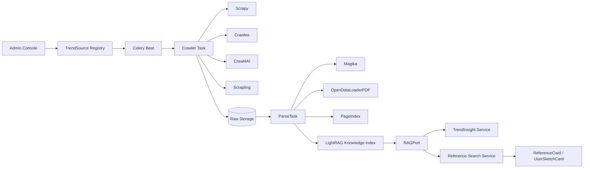

# SPEC-02-KNOWLEDGE: 트렌드 지식 시스템 + 레퍼런스 검색기

## 1. 개요 (Overview)

### 1.1 목적
디자인 컨셉 결정의 근거가 되는 “트렌드 지식 시스템”과, 컨셉을 시각적으로 구체화하기 위한 “레퍼런스 검색기”를 한 SPEC으로 정의한다. 출처 등록 → 수집 → 파싱 → 인사이트 추출 → 색인의 트렌드 파이프라인과, 키워드/이미지/스케치/문서/내부자산/확장 검색의 레퍼런스 파이프라인을 분리된 모듈(`trend_knowledge`, `references`)로 두되, RAG 색인을 공유한다. 룰베이스 키워드 매핑·하드코딩 taxonomy는 금지하고, 관리자 카탈로그+문서 기반 지식으로만 동작한다.

### 1.2 범위 (In Scope)
- 트렌드 출처/문서/인사이트/택소노미 도메인(`TrendSource`, `TrendDocument`, `TrendInsight`, `TrendTaxonomy`)
- 수집 파이프라인: 정적/동적/난도 높은 사이트 + LLM-ready Markdown 추출 + PDF 파싱 + 파일 타입 감지
- 색인: 지식 그래프 RAG + 긴 문서 의미 트리 색인
- 레퍼런스 검색: 7개 분류(Nature/Product/Architecture/Fashion/Graphic/Advertising/Material) + 6개 검색 유형(키워드/이미지/스케치/문서/내부자산/확장)
- 사용자 스케치 카드는 외부 레퍼런스 카드와 별도 타입으로 분리(SPEC-01에서 이미 분리, 본 SPEC은 검색 결과 노출 규칙만 정의)
- 라이선스/복제 위험 표시, 출처 인용 메타데이터 표준
- 트렌드 자료/레퍼런스 부족 상황의 명시적 “근거 부족” 응답

### 1.3 범위 외 (Out of Scope)
- 컨셉 생성·평가·결정 로직(SPEC-03)
- 추상화 규칙 도출 / 이미지 생성 / 스펙 작성(SPEC-03)
- 모델 라우팅 / 모델 정책(SPEC-04)
- 검색 결과를 보여주는 UI 디테일(SPEC-05). 본 SPEC은 데이터/엔드포인트 계약까지만.

### 1.4 가치 제안
- 컨셉 결정을 “출처 있는” 자료에 결합 → AI 환각 위험 차단
- 동일한 인덱스를 트렌드 근거 인용과 레퍼런스 분석에 재사용 → 운영 단순화
- 관리자 콘솔에서 출처/큐/실패를 명시적으로 운영 가능

### 1.5 User_Needs.md 매핑
- §3.2(근거 없는 제안 금지), §3.7(도메인팩 기반 확장), §8(트렌드 지식 시스템), §9(레퍼런스 검색기), §11.7(관리자 트렌드 큐), §20.1(라이브러리)

### 1.6 부록(Appendix)
- 본 SPEC의 “이미지 검색 제공자 카탈로그(Tier 1/2/3 + 어댑터 레지스트리)” 본체는 부록 [`image-providers.md`](./image-providers.md)에 정의된다. 본 spec.md의 §3.5.1(REQ-02-REF-009 ~ 017), §4(AC-02-R-009 ~ 012), §5.1(엔티티 보강), §6.1(라이브러리 표 보강), §7(NFR 보강), §8(INV-02-05 / INV-02-06), §10(.env 키 매핑)에서 부록을 명시 참조한다. 부록은 본 SPEC의 정식 일부이다.

---

## 2. 사용자 스토리 (User Stories)

- US-02-01 (관리자): 트렌드 출처(URL, 도메인, 수집 주기, 라이선스, 신뢰도)를 등록하고 비활성화할 수 있다.
- US-02-02 (관리자): 수집/파싱 실패 문서를 큐에서 보고 재시도하거나 비활성화한다.
- US-02-03 (디자이너): 컨셉 후보 화면에서 “이 주장의 근거”를 누르면 출처 문서로 연결된다.
- US-02-04 (디자이너): 키워드/이미지/스케치 기반으로 레퍼런스를 동시에 검색하고, 7개 분류 클러스터로 보드를 받는다.
- US-02-05 (디자이너): 라이선스 위험이 높은 레퍼런스는 “직접 스타일 적용” 버튼이 비활성화되고 추상화 전용으로만 표시된다.
- US-02-06 (디자이너): 트렌드 자료가 부족한 도메인에서는 “근거 부족” 메시지와 추가 검색 제안을 받는다.
- US-02-07 (디자이너): 사용자 스케치를 업로드하면 그 형태/구조와 충돌하지 않는 자료가 우선 검색된다.

---

## 3. 요구사항 (EARS Format Requirements)

### 3.1 트렌드 출처/수집/파싱 (REQ-02-TREND)

- REQ-02-TREND-001 (Ubiquitous): THE SYSTEM SHALL `TrendSource(name, url, domain, crawl_schedule, trust_level, license, active)` 엔티티로 출처를 관리한다. (근거: §8.2)
- REQ-02-TREND-002 (Event-driven): WHEN `TrendSource.active=true`이고 스케줄 시각이 도래하면, THE SYSTEM SHALL Celery 태스크로 수집을 큐잉한다. (근거: §8, §17)
- REQ-02-TREND-003 (Ubiquitous): THE SYSTEM SHALL `TrendDocument`에 `published_at`(발행일)과 `collected_at`(수집일)을 분리 저장한다. (근거: §8.3)
- REQ-02-TREND-004 (Ubiquitous): THE SYSTEM SHALL 같은 주장을 `M`개 이상 출처가 반복하면 인사이트 신뢰도(`confidence`)를 단조 증가 함수로 가중한다. M·가중치는 관리자 설정값. (근거: §8.3)
- REQ-02-TREND-005 (Ubiquitous): THE SYSTEM SHALL 오래된 트렌드는 폐기하지 않고 `recency_score`만 낮춘다. (근거: §8.3)
- REQ-02-TREND-006 (Unwanted): IF 코드 또는 문서에 도메인 키워드 → 트렌드 분류 하드코딩 매핑이 발견되면, THEN THE SYSTEM SHALL CI에서 빌드를 실패시킨다. (근거: §3.7, §7)
- REQ-02-TREND-007 (Event-driven): WHEN 문서 파싱이 실패하면, THE SYSTEM SHALL `ParsingFailureQueue`에 항목을 추가하고 관리자 콘솔에 노출한다. (근거: §11.7)
- REQ-02-TREND-008 (Ubiquitous): THE SYSTEM SHALL `TrendInsight(document_id, summary, keywords, domain_tags, evidence_quote, confidence)`를 생성하며 `evidence_quote`는 원문 인용을 포함한다. (근거: §3.2, §8.2)

### 3.2 파일 처리·파서 (REQ-02-FILE)

- REQ-02-FILE-001 (Event-driven): WHEN 파일이 수집되면, THE SYSTEM SHALL `Magika`로 파일 타입을 감지하고, 감지 결과에 따라 적절한 파서를 선택한다. (근거: §20.1)
- REQ-02-FILE-002 (Ubiquitous): THE SYSTEM SHALL PDF 문서는 `opendataloader-pdf`로 파싱하고, 긴 문서는 `PageIndex`로 의미 트리를 색인한다. (근거: §20.1)
- REQ-02-FILE-003 (Unwanted): IF 파서가 텍스트 추출에 실패하면, THEN THE SYSTEM SHALL 거짓 텍스트로 fallback하지 않고 실패로 기록한다. (근거: 작성자 지침, §3)
- REQ-02-FILE-004 (Optional): WHERE 수집 문서가 HWP/HWPX/DOCX 등 국내 업무 문서 형식이면, THE SYSTEM SHALL `kordoc`/`rhwp` 계열 파서 또는 동등한 문서 변환 어댑터를 `ParserPort` 뒤에 두고 Markdown/텍스트를 추출한다. 파서가 실패하면 `ParsingFailureQueue`에 기록하며 빈 본문이나 추정 텍스트로 보정하지 않는다. (근거: reference_library.md 문서 파싱 후보, User_Needs §20.2)

### 3.3 크롤링 (REQ-02-CRAWL)

- REQ-02-CRAWL-001 (Ubiquitous): THE SYSTEM SHALL 정적 페이지/뉴스/블로그는 `Scrapy` 기반 파이프라인으로 수집한다. (근거: §20.1)
- REQ-02-CRAWL-002 (Ubiquitous): THE SYSTEM SHALL JS 렌더링이 필요한 동적 페이지·이미지·문서는 `Crawlee Python`으로 수집한다. (근거: §20.1)
- REQ-02-CRAWL-003 (Ubiquitous): THE SYSTEM SHALL LLM-ready Markdown 변환이 필요한 트렌드 문서는 `Crawl4AI`로 전처리한다. (근거: §20.1)
- REQ-02-CRAWL-004 (Optional): WHERE 사이트 난도(예: 안티봇)가 높을 때 표시된 출처에 대해, THE SYSTEM SHALL `Scrapling`을 보조 수집기로 사용한다. (근거: §20.1)
- REQ-02-CRAWL-005 (Ubiquitous): THE SYSTEM SHALL 모든 크롤러는 `robots.txt`, 사이트별 사용 약관, 라이선스 메타를 준수한다. (근거: §22, NFR)
- REQ-02-CRAWL-006 (Ubiquitous): THE SYSTEM SHALL 모든 외부 URL 호출은 SPEC-01의 SSRF allowlist를 통과해야 한다. (근거: SPEC-01 NFR-01-SEC-003)

### 3.4 색인 / RAG (REQ-02-INDEX)

- REQ-02-INDEX-001 (Ubiquitous): THE SYSTEM SHALL 트렌드 문서/인사이트는 `LightRAG`(지식 그래프 + RAG) 색인을 통해 질의된다. (근거: §20.1)
- REQ-02-INDEX-002 (Ubiquitous): THE SYSTEM SHALL `LightRAG` 호출은 `application/ports/RAGPort` 인터페이스로 추상화하여 인프라 교체 가능하도록 한다.
- REQ-02-INDEX-003 (Ubiquitous): THE SYSTEM SHALL 응답에 인용 문서 ID·인용 구절·발행일을 포함한다. (근거: §3.2)
- REQ-02-INDEX-004 (Unwanted): IF 색인에서 충분한 근거를 찾지 못하면, THEN THE SYSTEM SHALL “근거 부족(insufficient_evidence)” 응답을 명시적으로 반환하고, 거짓 근거로 fallback하지 않는다. (근거: §3.2, 작성자 지침)

### 3.5 레퍼런스 검색기 (REQ-02-REF)

- REQ-02-REF-001 (Ubiquitous): THE SYSTEM SHALL 6개 검색 유형을 지원한다: 키워드, 이미지, 스케치 기반, 문서, 내부 자산, 확장 검색. (근거: §9.1)
- REQ-02-REF-002 (Ubiquitous): THE SYSTEM SHALL 검색 결과를 초기 상위 분류 7개(Nature, Product, Architecture, Fashion, Graphic, Advertising, Material)로 클러스터링한다. 이 7개 값은 코드 상수가 아니라 `TrendTaxonomy`/도메인팩 seed 데이터로 등록되며 관리자 콘솔에서 비활성·확장 가능해야 한다. (근거: §9.2, §3.7)
- REQ-02-REF-003 (Event-driven): WHEN 사용자가 자신의 스케치 자산 ID를 검색 입력으로 지정하면, THE SYSTEM SHALL 스케치의 형태/구조와 충돌하지 않는 자료를 우선 검색한다. (근거: §9, §10)
- REQ-02-REF-004 (Ubiquitous): THE SYSTEM SHALL `ReferenceAsset`에 `thumbnail`, `title`, `source_url`, `collected_at`, `published_at`, `license`, `license_risk`, `domain_tags`, `relevance_reason`, `abstractable_elements`, `copy_risk`를 보유한다. (근거: §9.3)
- REQ-02-REF-005 (Unwanted): IF `license_risk`가 높음(`high`)이면, THEN THE SYSTEM SHALL `direct_style_apply`를 비활성화하고 추상화 전용 사용으로만 노출한다. (근거: §4.2, §10.3)
- REQ-02-REF-006 (Ubiquitous): THE SYSTEM SHALL 사용자 스케치 카드(`UserSketchCard`)와 외부 레퍼런스 카드(`ReferenceCard`)를 별개 타입·별개 컬렉션으로 분리한다. (근거: §9.4, SPEC-01 INV)
- REQ-02-REF-007 (Optional): WHERE OpenDeepSearch 패턴이 적용된 “딥 검색”이 활성화된 경우, THE SYSTEM SHALL 검색→리랭킹→증거 추출 단계를 분리하여 인용 가능한 결과만 채택한다. (근거: §20.1)
- REQ-02-REF-008 (Ubiquitous): THE SYSTEM SHALL 레퍼런스 분석 결과를 `ReferenceAnalysis(relevance, form_grammar, structure_grammar, material_note, symbol_note, copy_risk)`로 구조화한다. (근거: §9, §10)

#### 3.5.1 이미지 검색 제공자 카탈로그(Tier 1/2/3) — 본문은 [`image-providers.md`](./image-providers.md) 참조

본 SPEC은 “레퍼런스는 편집 대상이 아니라 추상화 규칙 도출의 시각 자극”이라는 사용자 의도에 따라, 이미지 검색을 Tier 1(직접 사용 가능, 11개 제공자), Tier 2(라이선스 메타 검증 후 사용, 3개 경로), Tier 3(링크 전용·추상화 강제, 4종)로 분류한다. 전체 표·도메인 시드 매핑·rate limit 정책은 부록 §2~§9 참조.

- REQ-02-REF-009 (Ubiquitous): THE SYSTEM SHALL `ImageSearchPort`를 통해 Tier 1 제공자(unsplash, pexels, pixabay, wikimedia, openverse, met, smithsonian, europeana, rijks, nasa, kipris)별 어댑터로 검색을 분기한다. 어댑터는 `apps/references/infrastructure/image_search/<provider>.py` 1파일/제공자.
- REQ-02-REF-010 (Ubiquitous): THE SYSTEM SHALL 이미지는 썸네일·중간 해상도(긴변 ≤ 1024px, WebP 80%)만 내부에 저장하고, 원본 고해상도 다운로드를 금지한다. (사용자 의도: 대략적 시각 자극)
- REQ-02-REF-011 (Event-driven): WHEN Tier 2/3 출처에서 이미지가 들어오면, THE SYSTEM SHALL 원본을 내부 캐싱하지 않고 `external_url` + 자체 미니썸네일(서버 측 ≤ 256px, 인용 범위)만 보관한다.
- REQ-02-REF-012 (Ubiquitous): THE SYSTEM SHALL 모든 `ReferenceAsset`에 `provider`, `tier ∈ {1,2,3}`, `license_id`(SPDX 또는 제공자 라이선스명), `attribution_text`, `external_url`, `thumbnail_max_edge_px`를 저장한다.
- REQ-02-REF-013 (Unwanted): IF 검색 결과에 `license_id` 메타가 없거나 `unknown`이면, THEN THE SYSTEM SHALL `tier=3`, `license_risk=high`, `abstraction_only=true`로 자동 분류한다.
- REQ-02-REF-014 (Optional): WHERE 도메인이 `industrial`이면 KIPRIS를 시드 출처로 포함하고, WHERE 도메인이 `fashion`이면 Met Costume Institute · Europeana fashion · Rijks를 시드로 포함한다. 시드 매핑은 코드가 아닌 `domain_packs/<domain>/manifest.yaml.image_search.seed_providers`로 정의한다.
- REQ-02-REF-015 (Ubiquitous): THE SYSTEM SHALL 외부 검색 엔진(SerpAPI/Bing/Google CSE/DuckDuckGo) 호출은 `usage_rights=cc_*`(또는 동등) 필터를 강제한다. 어댑터 외부에서 이 API들을 호출하는 코드 경로는 CI 정적분석에서 차단한다.
- REQ-02-REF-016 (Ubiquitous): THE SYSTEM SHALL 제공자별 rate limit·일일 호출 한도를 `ImageProviderQuota(provider, daily_limit, used_today, reset_at, active, last_error_at)`로 관리하고, 초과 시 같은 Tier의 다른 제공자로 라운드로빈한다. 모든 제공자 한도 도달 시 거짓 결과 없이 “검색 한도 초과”를 명시 반환한다.
- REQ-02-REF-017 (Ubiquitous): THE SYSTEM SHALL UI 카드(SPEC-05 ReferenceCard)에 attribution(작가, 제공자, 라이선스명, 출처 URL)을 항상 표기한다.

### 3.6 모델 호출 위임 (REQ-02-MODEL)

- REQ-02-MODEL-001 (Ubiquitous): THE SYSTEM SHALL 트렌드 인사이트 추출, 이미지 인지, 문서 요약 등의 LLM/비전 호출을 SPEC-04의 `ModelRouter`에 위임하며, 기능 키 `TrendResearch`, `ReferenceAnalysis`를 사용한다. (근거: §14)
- REQ-02-MODEL-002 (Unwanted): IF 모델 호출이 실패하면, THEN THE SYSTEM SHALL SPEC-04 정책의 다음 모델로 재시도하거나, 모두 실패 시 “실패 보고”를 반환한다. 거짓 결과 반환은 금지한다. (근거: §14, 작성자 지침)

### 3.7 도메인 분리 (REQ-02-DOMAIN)

- REQ-02-DOMAIN-001 (Ubiquitous): THE SYSTEM SHALL 초기 도메인팩(industrial, fashion, visual, advertising)별로 출처 우선순위, 검색 시드, 분류 가중치를 관리자 콘솔에서 설정 가능하게 한다. 신규 도메인은 `domain_packs/<domain>/manifest.yaml`과 관리자 등록으로 추가되며 코드 변경을 요구하지 않는다. (근거: §3.7, §7)
- REQ-02-DOMAIN-002 (Unwanted): IF 도메인 분류가 코드에 정적 매핑으로 박혀 있다면, THEN THE SYSTEM SHALL CI에서 거부한다. (근거: §3.7)

---

## 4. 인수 기준 (Acceptance Criteria)

- AC-02-T-001: Given 동일한 트렌드 주장을 3개 출처가 반복할 때, When 인사이트가 생성되면, Then `confidence`가 단일 출처 대비 단조 증가하고 인용에 3개 출처가 모두 포함된다. (REQ-02-TREND-004, REQ-02-INDEX-003)
- AC-02-T-002: Given 출처 활성 상태에서 스케줄이 도래했을 때, When 수집 태스크가 실행되면, Then `TrendDocument.published_at`과 `collected_at`가 다른 값으로 저장된다. (REQ-02-TREND-003)
- AC-02-T-003: Given 인덱스에 매칭되는 문서가 없을 때, When 사용자가 트렌드 근거를 요청하면, Then 응답은 `insufficient_evidence` 플래그와 추가 검색 제안을 포함한다. (REQ-02-INDEX-004)
- AC-02-R-004: Given 라이선스 위험이 `high`로 표시된 레퍼런스에 대해, When UI가 요청을 보내면, Then `direct_style_apply=false`, `abstraction_only=true`로 응답된다. (REQ-02-REF-005)
- AC-02-R-005: Given 사용자 스케치 ID를 입력으로 한 검색에서, When 결과가 반환되면, Then `ReferenceCard`와 `UserSketchCard`가 응답 스키마에서 별개 컬렉션으로 분리된다. (REQ-02-REF-006)
- AC-02-R-006: Given 키워드 검색이 실행됐을 때, When 결과가 7개 분류 중 하나 이상으로 매핑되면, Then 각 결과 카드는 클러스터 라벨과 `relevance_reason`을 가진다. (REQ-02-REF-002, REQ-02-REF-008)
- AC-02-F-007: Given PDF 보고서가 수집되었을 때, When `opendataloader-pdf` 파싱이 성공하면, Then `PageIndex` 의미 트리가 생성되고 LightRAG 색인 키와 연결된다. (REQ-02-FILE-002, REQ-02-INDEX-001)
- AC-02-F-008: Given 파일 타입을 알 수 없는 업로드일 때, When `Magika`가 적합한 파서를 못 찾으면, Then 파싱 실패로 기록되고 거짓 텍스트로 fallback하지 않는다. (REQ-02-FILE-001, REQ-02-FILE-003)
- AC-02-R-009: Given Unsplash·Pexels·Pixabay 키가 `.env`에 설정되어 있을 때, When 키워드 검색이 실행되면, Then 3개 제공자가 병렬 호출되고 결과가 단일 7-클러스터 보드로 머지된다. (REQ-02-REF-009, REQ-02-REF-002)
- AC-02-R-010: Given license 메타 없는 이미지가 결과에 포함될 때, When 응답이 생성되면, Then 해당 자산은 `tier=3`, `license_risk=high`, `abstraction_only=true`로 표기되고 `direct_style_apply=false`다. (REQ-02-REF-013)
- AC-02-R-011: Given 산업디자인(industrial) 도메인 세션에서 검색이 실행될 때, When `KIPRIS_API_KEY`가 설정되어 있으면, Then 결과 시드에 KIPRIS 디자인등록이 포함된다. (REQ-02-REF-014)
- AC-02-R-012: Given Tier 1 제공자에서 이미지를 가져왔을 때, When 저장이 완료되면, Then 저장 파일의 긴변 픽셀 ≤ 1024이고 WebP로 압축되며, 원본 고해상도 파일은 보관되지 않는다. (REQ-02-REF-010, INV-02-05)
- AC-02-F-013: Given HWP/HWPX 업무 문서가 수집되었을 때, When 등록된 문서 변환 어댑터가 본문을 Markdown으로 변환하면, Then `TrendDocument.parsed_text_uri`가 생성되고 실패 시 `ParsingFailureQueue`에 기록되며 추정 본문은 저장되지 않는다. (REQ-02-FILE-004)

---

## 5. 도메인 모델 (Domain Model)

### 5.1 엔티티
- `TrendSource(id, name, url, domain, crawl_schedule, trust_level, license, active)`
- `TrendDocument(id, source_id, title, url, published_at, collected_at, raw_uri, parsed_text_uri, hash, parse_status)`
- `TrendInsight(id, document_id, summary, keywords[], domain_tags[], evidence_quote, confidence, recency_score)`
- `TrendTaxonomy(id, domain, category, label, description, parent_id, active)` ← 데이터로만 관리, 코드 정적 매핑 금지
- `ParsingFailureQueue(id, document_id, reason, created_at, retried_count)`
- `ReferenceAsset(id, session_id, kind, provider, tier, thumbnail_uri, thumbnail_max_edge_px, title, author, source_url, external_url, collected_at, published_at, license_id, license_risk, attribution_text, domain_tags[], relevance_reason, abstractable_elements[], copy_risk)` — kind ∈ {image, document, internal, web_page}; provider ∈ {unsplash, pexels, pixabay, wikimedia, openverse, met, smithsonian, europeana, rijks, nasa, kipris, flickr, internet_archive, web_search, youtube_thumbnail, web}; tier ∈ {1,2,3}; thumbnail_max_edge_px ≤ 1024
- `ReferenceAnalysis(id, asset_id, relevance, form_grammar, structure_grammar, material_note, symbol_note, copy_risk)`
- `ReferenceQuery(id, session_id, query_kind, payload, requested_by, created_at)` — query_kind ∈ {keyword, image, sketch, document, internal, expanded}
- `ImageProviderQuota(provider, daily_limit, used_today, reset_at, active, last_error_at)` — 제공자별 호출 한도 추적, REQ-02-REF-016 본문 데이터

### 5.2 컴포넌트 도식

---

## 6. 아키텍처 결정 (Architecture Decisions)

### 6.1 라이브러리 채택/보류

| 후보 | 판정 | 사유 |
|---|---|---|
| Scrapy | 채택 | 정적 페이지 안정성·파이프라인 풍부 |
| Crawlee Python | 채택 | 동적 렌더링 + 브라우저 자동화 필요 |
| Crawl4AI | 채택 | LLM-ready Markdown 추출 (RAG 전처리) |
| Scrapling | 조건부 채택 | 안티봇 사이트가 정책상 허용된 경우만 |
| LightRAG | 채택 | 지식그래프 + RAG 결합. `RAGPort` 뒤에 배치 |
| PageIndex | 채택 | 긴 PDF 의미 트리 색인 |
| OpenDeepSearch | 설계 참고 채택 | 검색→리랭킹→증거 분리 패턴을 자체 구현에 반영 |
| `opendataloader-pdf` | 채택 | PDF 파싱 정확도 우선 |
| `google/magika` | 채택 | 업로드 파일 타입 감지 |
| `kordoc` / `rhwp` 계열 문서 파서 | 조건부 채택 | HWP/HWPX 등 국내 문서 수집이 필요한 출처에 ParserPort 어댑터로만 적용 |
| AnyCrawl, Vane, MediaCrawler 등 기타 | 보류 | 경쟁/중국 소셜 등 라이선스/스코프 이슈 |
| Dify 류 | 보류 | 자체 Celery 파이프라인 사용 |
| Unsplash REST (직접 httpx 또는 python-unsplash) | 채택 | Tier 1 어댑터, `UNSPLASH_ACCESS_KEY` |
| Pexels REST (직접 httpx 또는 pexels-python) | 채택 | Tier 1 어댑터, `PEXELS_API_KEY` |
| Pixabay REST (직접 httpx 권장) | 채택 | Tier 1 어댑터, `PIXABAY_API_KEY` |
| Wikimedia Commons API (직접 REST) | 채택 | Tier 1, 키 불필요 |
| Openverse API (직접 REST) | 채택 | Tier 1, 키 불필요 |
| Met / Smithsonian / Europeana / Rijks / NASA REST | 채택 | Tier 1, 박물관·아카이브 |
| KIPRIS Plus / OPI REST | 채택 | Tier 1, 산업디자인 시드 |
| Flickr API(CC 필터 강제) | 채택(Tier 2) | `FLICKR_API_KEY` |
| Internet Archive Advanced Search | 채택(Tier 2) | 라이선스 메타 검증 |
| SerpAPI / Bing Image Search / DuckDuckGo Images | 채택(Tier 2) | `usage_rights=cc_*` 필터 강제 |
| YouTube Data API v3 (썸네일 메타) | 조건부 채택(Tier 3 기본) | `YOUTUBE_API_KEYS`, 영상 본체 다운로드 금지 |
| Sickle / pywikibot | 보류 | 직접 REST/SPARQL 호출이 단순·안정 |
| python-pixabay | 보류 | REST 직접 호출이 더 가벼움 |

### 6.2 모듈 경계
- `apps/trend_knowledge` — 출처/문서/인사이트/택소노미/실패큐
- `apps/references` — 검색 쿼리/카드/분석. `trend_knowledge` 색인을 RAGPort로 호출만 함(역방향 의존 금지)
- 두 모듈은 SPEC-04 ModelRouter, SPEC-01 객체 스토리지에 의존

### 6.3 포트 사용 (SPEC-01 §6.2 참조)
- 14040 = Knowledge Index 게이트웨이 (LightRAG 어댑터)
- 14041 = Crawler Worker 헬스체크 HTTP

### 6.4 Clean Architecture 4-layer 매핑
- domain: 출처/문서/인사이트 VO, 검색 쿼리 VO, 분류 VO
- application: 수집 UseCase(`ScheduleCollect`, `IngestDocument`, `IndexInsight`), 검색 UseCase(`SearchReferences`, `AnalyzeReference`), `RAGPort`/`CrawlerPort`/`ParserPort` 정의
- infrastructure: Scrapy/Crawlee/Crawl4AI/Scrapling 어댑터, opendataloader-pdf/PageIndex/Magika/kordoc/rhwp 계열 ParserPort 어댑터, LightRAG 어댑터
- presentation: 사용자 검색 API, 관리자 출처/큐 API (UI는 SPEC-05)

---

## 7. 비기능 요구사항 (NFR)

- NFR-02-PERF-001: 단일 텍스트 검색 응답 p95 ≤ 1.5s, 이미지/스케치 검색 p95 ≤ 4s.
- NFR-02-PERF-002: 일일 트렌드 문서 수집 처리량 ≥ 5,000 문서/워커풀.
- NFR-02-SEC-001: 모든 외부 호출 SSRF allowlist 적용. 다운로드 파일은 격리 스토리지에 저장 후 스캔.
- NFR-02-LIC-001: 라이선스 메타가 비어 있으면 기본값 `unknown`이며, `unknown`은 `direct_style_apply=false`로 처리.
- NFR-02-LIC-002: Tier별 처리 정책은 데이터로 관리. 코드에 제공자명을 if/elif로 두지 않고 어댑터 레지스트리 패턴(부록 §5)을 사용. 어댑터 외부에서 외부 도메인(api.unsplash.com, api.pexels.com 등) 직접 호출은 CI에서 차단.
- NFR-02-PRIVACY-001: 외부 이미지 다운로드 시 EXIF 개인정보(GPS, 카메라 ID, 저자메타 등)를 저장 전 제거. 원본 EXIF가 필요한 분석은 일시 메모리 처리만 허용한다.
- NFR-02-OBS-001: 크롤·파싱·색인·검색 단계마다 추적 ID 전파.
- NFR-02-DATA-001: 인사이트 수정은 새 버전 생성. 원본 문서 raw 파일은 immutable.
- NFR-02-PERF-003: 썸네일 변환은 비동기 워커에서 수행. 1024px 긴변 기준 WebP 80% 품질로 압축. 변환 작업 p95 ≤ 2s.
- NFR-02-COMP-001: 7개 초기 상위 분류와 도메인별 가중치는 데이터로만 정의, 코드 분기에 카테고리 문자열을 하드코딩하지 않는다.
- NFR-02-COMP-002: SerpAPI / Bing Image Search / Google CSE / DuckDuckGo Images 호출은 어댑터 내부에서 `usage_rights=cc_*`(또는 동등) 필터를 강제 적용. 필터 미적용 코드 경로는 정적분석에서 거부한다.

---

## 8. 불변 조건 (Invariants)

- INV-02-01: AI가 생성하는 트렌드 주장은 1개 이상 인용 문서와 결합되거나 `is_hypothesis=true`로 표시된다. (User_Needs §3.2)
- INV-02-02: 7개 초기 상위 분류·도메인 분류는 데이터(택소노미 테이블/도메인팩 seed)로만 관리한다. 코드 상수나 if/elif 분기로 고정하지 않는다. (User_Needs §3.7)
- INV-02-03: 라이선스가 `unknown` 또는 `high`인 자료는 “직접 스타일 적용”에 사용되지 않는다. (User_Needs §10.3)
- INV-02-04: `UserSketchCard`와 `ReferenceCard`는 절대 동일 컬렉션에 섞이지 않는다. (User_Needs §9.4)
- INV-02-05: 외부 이미지의 원본 고해상도 파일은 내부에 저장하지 않는다. 긴변 ≤ 1024px의 썸네일·중간 해상도(WebP 80%)만 보관. (사용자 의도: 레퍼런스는 시각 자극용)
- INV-02-06: Tier 3 자산은 `direct_style_apply=false` 불변. UI/API/생성 단계 모두에서 강제(SPEC-03 REQ-03-ABSTRACT-006와 정합).

---

## 9. 위험과 대응 (Risks)

| 위험 (User_Needs §22) | 대응 |
|---|---|
| 레퍼런스 표절 | 라이선스 위험 등급 + 추상화 전용 강제 |
| AI 환각 | RAG 인용 강제 + `insufficient_evidence` 명시 |
| 트렌드 노후화 | `recency_score` 가중치 + 발행/수집일 분리 |
| 도메인 혼선 | 도메인별 출처/시드 분리 (관리자 설정) |
| 외부 사이트 안정성 | 크롤러 재시도/실패큐 + 다중 백엔드 |
| 라이선스 미상 | `unknown`은 자동으로 보수적 처리 |

---

## 10. 의존성 (Dependencies)

- SPEC-01: 멀티테넌시·세션·객체 스토리지·Audit/UseCase 베이스
- SPEC-04: ModelRouter (`TrendResearch`, `ReferenceAnalysis` 기능 키)
- 외부 라이브러리: Scrapy, Crawlee Python, Crawl4AI, Scrapling, LightRAG, PageIndex, opendataloader-pdf, Magika, kordoc/rhwp 계열 문서 파서(조건부)
- 외부 API: 검색/이미지 검색 제공자(SPEC-04 정책으로 추상)

### 10.1 `.env` 키 매핑 (이미지 제공자)

본 SPEC의 어댑터가 사용하는 환경변수. 값이 누락되면 해당 어댑터는 자동으로 비활성(REQ-02-REF-016 라운드로빈에서 제외).

| 환경변수 | 어댑터/제공자 | Tier | 도메인 적합도 |
|---|---|---|---|
| `UNSPLASH_ACCESS_KEY` (보조: `UNSPLASH_ApplicationID`, `UNSPLASH_SECRET_KEY`) | unsplash | 1 | 사진 일반 |
| `PEXELS_API_KEY` | pexels | 1 | 사진/비디오 |
| `PIXABAY_API_KEY` | pixabay | 1 | 사진/일러스트/벡터 |
| (불필요) | wikimedia, openverse, met, nasa | 1 | 자연/문화/예술 |
| `SMITHSONIAN_API_KEY` | smithsonian | 1 | 자연사/예술 |
| `EUROPEANA_API_KEY` | europeana | 1 | 유럽 문화유산 |
| `RIJKS_API_KEY` | rijks | 1 | 미술/장식예술 |
| `KIPRIS_API_KEY` | kipris | 1 | 산업디자인(국내 등록) |
| `FLICKR_API_KEY` | flickr | 2 | CC 필터 강제 |
| `SERPAPI_KEY` 또는 `BING_SEARCH_KEY` | web_search | 2 | usage_rights 필터 강제 |
| `YOUTUBE_API_KEYS` | youtube_thumbnail | 3(기본) | 영상 썸네일(패션·광고 보조) |

전체 매핑·라이선스명·rate limit 기본값은 부록 [`image-providers.md`](./image-providers.md) §2 / §9 참조.

---

## 11. 범위 외 (Out of Scope)

- 컨셉 후보 생성/평가/결정(SPEC-03)
- 추상화 규칙·이미지 생성·스펙 문서 작성(SPEC-03)
- 모델 카탈로그/정책 UI(SPEC-04)
- 검색기 UI 컴포넌트, 클러스터 보드 디테일(SPEC-05)

---

## 12. 추적 매트릭스 (Traceability)

| REQ ID | User_Needs 매핑 | 인수 기준 |
|---|---|---|
| REQ-02-TREND-003 | §8.3 | AC-02-T-002 |
| REQ-02-TREND-004 | §8.3 | AC-02-T-001 |
| REQ-02-TREND-006 | §3.7 | (CI) |
| REQ-02-INDEX-001 | §20.1 | AC-02-F-007 |
| REQ-02-INDEX-004 | §3.2 | AC-02-T-003 |
| REQ-02-FILE-001~002 | §20.1 | AC-02-F-007, AC-02-F-008 |
| REQ-02-FILE-004 | §20.2, reference_library.md | AC-02-F-013 |
| REQ-02-CRAWL-001~004 | §20.1 | (수집 통합 검증) |
| REQ-02-REF-001 | §9.1 | (검색 6 유형) |
| REQ-02-REF-002 | §9.2 | AC-02-R-006 |
| REQ-02-REF-005 | §10.3 | AC-02-R-004 |
| REQ-02-REF-006 | §9.4 | AC-02-R-005 |
| REQ-02-MODEL-001 | §14 | (SPEC-04 통합 테스트) |
| REQ-02-DOMAIN-001~002 | §3.7 | (CI + 관리자 설정) |
| REQ-02-REF-009 | 사용자 의도 + 작성자 지침 | AC-02-R-009 |
| REQ-02-REF-010 | 사용자 의도 (대략적 시각 자극) | AC-02-R-012 |
| REQ-02-REF-011 | 작성자 지침 (Tier 2/3) | (저작권법상 인용 검증) |
| REQ-02-REF-012 | 사용자 의도 + §9.3 | (DB 스키마 검증) |
| REQ-02-REF-013 | NFR-02-LIC-001 + §10.3 | AC-02-R-010 |
| REQ-02-REF-014 | §3.7, §7 | AC-02-R-011 |
| REQ-02-REF-015 | NFR-02-COMP-002 | (CI 정적 분석) |
| REQ-02-REF-016 | 운영 안정성 | (Quota 라운드로빈 통합 테스트) |
| REQ-02-REF-017 | §11(SPEC-05) | (UI attribution 검증) |

---

문서 종료. 본 SPEC의 출력(`TrendInsight`, `ReferenceAsset`, `ReferenceAnalysis`, `UserSketchCard`, `ImageProviderQuota`)은 SPEC-03의 컨셉/추상화/생성 단계 입력으로 사용된다. 이미지 검색 제공자 카탈로그·어댑터 레지스트리·도메인 시드 매핑은 부록 [`image-providers.md`](./image-providers.md) 참조.
