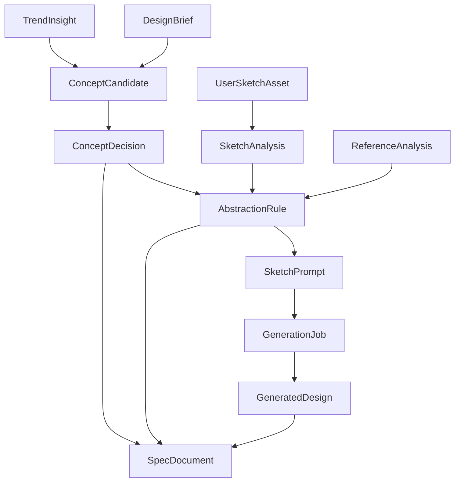

# SPEC-03-CREATION: 컨셉 / 추상화 / 생성 / 스펙 문서 빌더

## 1. 개요 (Overview)

### 1.1 목적
디자인 세션의 “창작” 단계 4가지(`concepts`, `abstraction`, `generation`, `specs`)를 한 SPEC으로 정의한다. 이 SPEC은 SPEC-01의 세션 상태머신 단계 중 `concepting → abstracting → generating → documenting`를 책임지며, SPEC-02의 트렌드 인사이트와 레퍼런스를 입력으로 사용한다. 핵심 목표는 “레퍼런스 복제 금지·추상화 우선·근거 추적·원본 스케치 보존”이다.

### 1.2 범위 (In Scope)
- `concepts`: ConceptCandidate(점수·근거·리스크), ConceptDecision(채택/보류/폐기 로그)
- `abstraction`: 6축(형태/구조/표면/색재료/의미/사용성), AbstractionRule, SketchAnalysis 통합, 원본보존형/컨셉확장형 SketchPrompt
- `generation`: GenerationJob, 원본보존형 구체화, 컨셉확장형 변형, 도메인 적용 이미지(스케치/룩/포스터/캠페인 컷 등)
- `specs`: SpecDocument 버전관리·승인, 도메인팩 템플릿(산업/패션/시각/광고), DESIGN.md 포맷 참고
- 프롬프트 패턴 라이브러리: `Awesome-Nano-Banana-images` 등 공개 이미지 생성 프롬프트 사례를 구조 참고/벤치마크로 분석하되, 실제 런타임 프롬프트는 도메인팩·PromptPolicy·추상화 규칙 기반으로 재구성
- 추적성: 모든 산출물이 어떤 브리프/인사이트/레퍼런스/추상화 규칙/원본 스케치에서 나왔는지 역추적

### 1.3 범위 외 (Out of Scope)
- 검색·색인·트렌드 출처 운영(SPEC-02)
- 모델 라우팅/정책/Provider 키 관리(SPEC-04)
- UI 컴포넌트(Generation Board, Decision Panel, Spec Builder UI 등 → SPEC-05)
- 멀티테넌시·세션 상태머신 자체(SPEC-01)

### 1.4 가치 제안
- 컨셉 결정의 근거를 “문서 인용 + 레퍼런스 분석”으로 강제 → 의사결정 품질 보장
- 추상화 우선 정책으로 레퍼런스 표절 위험 차단
- 사용자 스케치 “원본 보존”을 생성 단계에서도 강제 (원본 보존형 vs 컨셉 확장형 명확 분리)
- 도메인팩별 스펙 템플릿으로 산출물 표준화

### 1.5 User_Needs.md 매핑
- §3(원칙), §4.1(파이프라인 단계 6~16), §6(추상화 예시), §7(도메인팩), §10(추상화 엔진), §18(ERD 핵심 테이블), §21 Phase 1·4·5

---

## 2. 사용자 스토리 (User Stories)

- US-03-01 (디자이너): 브리프와 트렌드 인사이트를 바탕으로 컨셉 후보 3~5개를 점수·근거·리스크와 함께 받는다.
- US-03-02 (디자이너): 후보를 채택/보류/폐기/더 탐색으로 결정하면 결정 사유가 기록된다.
- US-03-03 (디자이너): 선택한 컨셉에 대해 6축으로 정리된 추상화 규칙을 받는다.
- US-03-04 (디자이너): 사용자 스케치가 있을 때 원본 보존형 구체화와 컨셉 확장형 변형을 별도로 받는다.
- US-03-05 (디자이너): 생성 결과를 컨셉/규칙/원본 스케치까지 역추적할 수 있다.
- US-03-06 (디자인 리드/PM): 산업/패션/시각/광고 도메인팩별로 스펙 문서가 다른 필드 구조로 저장된다.
- US-03-07 (디자이너): 스펙 문서는 버전관리되며 승인/반려 워크플로우를 가진다.

---

## 3. 요구사항 (EARS Format Requirements)

### 3.1 컨셉 (REQ-03-CONCEPT)

- REQ-03-CONCEPT-001 (Ubiquitous): THE SYSTEM SHALL `ConceptCandidate(name, description, score, rationale_refs, risks, novelty, fit_score)`로 후보를 저장한다. (근거: §6.3, §18)
- REQ-03-CONCEPT-002 (Ubiquitous): THE SYSTEM SHALL 각 후보의 `rationale_refs`에 SPEC-02 `TrendInsight` 또는 `ReferenceAnalysis`의 ID를 최소 1개 포함하지 않으면 후보 저장을 거부한다. (근거: §3.2, §4.2)
- REQ-03-CONCEPT-003 (Event-driven): WHEN 사용자가 후보를 채택/보류/폐기/더 탐색 중 하나로 결정하면, THE SYSTEM SHALL `ConceptDecision(action, decided_by, rationale, decided_at, evidence_refs)`를 생성한다. (근거: §3.4, §4.1)
- REQ-03-CONCEPT-004 (Ubiquitous): THE SYSTEM SHALL 자동 모드 결정도 `ConceptDecision.actor_kind=auto`로 동일 스키마에 저장한다. (근거: §3.4, §4.2; SPEC-01 INV-01-02)
- REQ-03-CONCEPT-005 (Unwanted): IF 모델 호출이 실패하여 컨셉 점수를 산출할 수 없다면, THEN THE SYSTEM SHALL 거짓 점수를 반환하지 않고 “점수 산출 실패” 상태로 표시한다. (근거: 작성자 지침)

### 3.2 추상화 (REQ-03-ABSTRACT)

- REQ-03-ABSTRACT-001 (Ubiquitous): THE SYSTEM SHALL 추상화 6축을 정의한다: form, structure, surface, color_material, meaning, usability. (근거: §10.1)
- REQ-03-ABSTRACT-002 (Ubiquitous): THE SYSTEM SHALL `AbstractionRule(session_id, axis, observation, applied_rule, source_refs, risk_note)`로 저장하며, 1개 컨셉당 최소 2개 축에 대한 규칙을 도출한다. (근거: §4.1)
- REQ-03-ABSTRACT-003 (Ubiquitous): THE SYSTEM SHALL `SketchAnalysis`(SPEC-01)를 추상화의 입력으로 직접 받아 “원본 유지 요소”와 “변형 가능 요소”를 규칙에 반영한다. (근거: §10, §5.3)
- REQ-03-ABSTRACT-004 (Ubiquitous): THE SYSTEM SHALL `SketchPrompt(kind, template, variables, source_refs)`를 두 종류로 분리 생성한다: `kind=preserve_original` (원본 보존형), `kind=expand_concept` (컨셉 확장형). (근거: §5.3, §10.2)
- REQ-03-ABSTRACT-005 (Unwanted): IF 추상화 규칙이 특정 브랜드/작가 스타일을 직접 모사하도록 도출되면, THEN THE SYSTEM SHALL 해당 규칙을 거부하고 risk_note에 사유를 기록한다. (근거: §10.3)
- REQ-03-ABSTRACT-006 (Unwanted): IF 레퍼런스 라이선스가 `high` 또는 `unknown`이고 규칙이 “직접 스타일 적용”을 시도하면, THEN THE SYSTEM SHALL 규칙을 거부한다. (근거: SPEC-02 REQ-02-REF-005)

### 3.3 생성 (REQ-03-GEN)

- REQ-03-GEN-001 (Ubiquitous): THE SYSTEM SHALL `GenerationJob(id, session_id, kind, prompt_id, brief_id, concept_id, rule_ids, sketch_id?, status, model_policy_key, output_uris[], cost_meta)`로 생성 작업을 기록한다. kind ∈ {sketch, refinement, variation, domain_application}. (근거: §4.1, §18)
- REQ-03-GEN-002 (Unwanted): IF `GenerationJob`이 브리프, 컨셉, 추상화 규칙, 레퍼런스 중 하나에도 연결되지 않으면, THEN THE SYSTEM SHALL 작업 등록을 거부한다. (근거: §4.2)
- REQ-03-GEN-003 (Ubiquitous): THE SYSTEM SHALL 원본 보존형 생성(`refinement`)은 `UserSketchAsset`을 입력으로 받고, 결과는 원본 자산 ID를 `parent_sketch_id`로 참조한다. 원본은 절대 덮어쓰지 않는다. (근거: §5.3, §10.3; SPEC-01 INV-01-01)
- REQ-03-GEN-004 (Ubiquitous): THE SYSTEM SHALL 컨셉 확장형 생성(`variation`)은 결과를 새 자산으로 저장하며 적용 규칙(`rule_ids`)을 명시한다. (근거: §10.2)
- REQ-03-GEN-005 (Ubiquitous): THE SYSTEM SHALL 도메인 적용 생성(`domain_application`)은 도메인팩(본 SPEC §3.4)에 따라 출력 형식이 달라진다(제품 변형/룩/포스터/캠페인 컷 등). (근거: §7)
- REQ-03-GEN-006 (Ubiquitous): THE SYSTEM SHALL 모든 생성 호출은 SPEC-04 `ModelRouter`의 기능 키 `ImageGeneration` 또는 `SketchPrompt`(텍스트 프롬프트 작성용)를 통해서만 수행한다. (근거: §14)
- REQ-03-GEN-007 (Unwanted): IF 모델 호출이 실패하면, THEN THE SYSTEM SHALL 거짓 이미지나 placeholder 이미지를 반환하지 않고 실패로 기록한 뒤 SPEC-04 fallback 정책으로 재시도한다. (근거: §14, 작성자 지침)
- REQ-03-GEN-008 (Ubiquitous): THE SYSTEM SHALL 이미지 생성(스케치 구체화/변형/도메인 적용)의 기본 제공자로 ByteDance Seedream 4.5(BytePlus Ark)를 사용하며, SPEC-04 ModelRouter `ImageGeneration` 기능 키의 primary 정책으로 등록한다. 모델명·엔드포인트는 코드 하드코딩 금지(SPEC-04 REQ-04-CATALOG-003), `FeatureModelPolicy` 시드로만 설정. (근거: 작성자 지침, `.env`의 `BYTEDANCE_SEEDREAM_API_KEY`·`IMAGE_GEN_PROVIDER`·`IMAGE_GENERATION_MODEL`)
- REQ-03-GEN-009 (Ubiquitous): THE SYSTEM SHALL Seedream 호출은 `apps/generation/infrastructure/image_providers/seedream_adapter.py`에서 수행하고 BytePlus Ark API 스펙(`POST {base_url}{endpoint_path}`, `Authorization: Bearer {api_key}`)을 따른다. SPEC-04 `ModelProvider`는 provider=`bytedance`, api_key_env=`BYTEDANCE_SEEDREAM_API_KEY`, base_url=`https://ark.ap-southeast.bytepluses.com/api/v3`, endpoint_path=`/images/generations`를 시드 데이터로 주입한다. 어댑터가 `/api/v3` 경로를 중복 결합하면 안 된다.
- REQ-03-GEN-010 (Unwanted): IF Seedream 호출이 실패하거나 quota를 초과하면, THEN THE SYSTEM SHALL 거짓 fallback 없이 SPEC-04 정책상 다음 모델 순서로 순차 재시도한다: ① `alibaba/z-image-turbo` → ② `google/gemini-3.1-flash-image-preview`(별칭 `nanobanana2`) → ③ `openai/gpt-image-2`. 모두 실패 시 명시 실패(`error_code=ALL_MODELS_FAILED`)를 반환한다. (근거: 작성자 지침, SPEC-04 REQ-04-ROUTER-003)

### 3.4 도메인팩 (REQ-03-DOMAIN)

- REQ-03-DOMAIN-001 (Ubiquitous): THE SYSTEM SHALL `DomainPack(domain, brief_schema, evaluation_axes, spec_template_uri, generation_outputs)`을 데이터로 보관하고, 4개 도메인을 초기 제공한다: industrial, fashion, visual, advertising. (근거: §7)
- REQ-03-DOMAIN-002 (Unwanted): IF 코드에 도메인별 if/elif 분기로 평가 기준이나 스펙 필드를 하드코딩하면, THEN THE SYSTEM SHALL CI에서 거부한다. (근거: §3.7)
- REQ-03-DOMAIN-003 (Ubiquitous): THE SYSTEM SHALL 도메인팩의 `spec_template_uri`는 DESIGN.md 포맷(google-labs-code/design.md) 구조를 참조하여 헤더·섹션·메타·인용 규칙을 따른다. (근거: §20.1, §11.6)

### 3.5 스펙 문서 빌더 (REQ-03-SPEC)

- REQ-03-SPEC-001 (Ubiquitous): THE SYSTEM SHALL `SpecDocument(id, session_id, domain, version, status, sections, evidence_links, created_by)`로 문서를 보관하며, status ∈ {draft, in_review, approved, rejected, superseded}. (근거: §11.6, §18)
- REQ-03-SPEC-002 (Ubiquitous): THE SYSTEM SHALL `SpecDocument.sections`은 다음을 필수 포함한다: 프로젝트 브리프, 트렌드 근거, 컨셉 후보와 평가, 최종 컨셉 결정, 사용자 스케치 원본과 AI 해석, 레퍼런스 보드, 추상화 규칙, 스케치와 생성 이미지, 최종안 비교, 도메인별 스펙, 출처/라이선스/AI 사용 고지. (근거: §11.6)
- REQ-03-SPEC-003 (Ubiquitous): THE SYSTEM SHALL 모든 섹션은 출처·결정 로그·생성 작업 ID로 역참조 링크를 가진다. (근거: §12.1)
- REQ-03-SPEC-004 (Event-driven): WHEN 문서가 승인되면, THE SYSTEM SHALL 새 버전 작성 시 이전 버전을 `superseded`로 전이시키고 변경 사항 diff 메타를 기록한다. (근거: §22)
- REQ-03-SPEC-005 (Ubiquitous): THE SYSTEM SHALL 폐기/보류된 컨셉과 그 사유도 스펙 문서에 보존한다. (근거: §4.2)

### 3.6 추적성 (REQ-03-TRACE)

- REQ-03-TRACE-001 (Ubiquitous): THE SYSTEM SHALL 모든 `GeneratedDesign` 자산은 `brief_id`, `concept_id`, `rule_ids`, `sketch_id?`, `reference_ids?`, `model_policy_key`, `prompt_id`를 메타로 가진다. (근거: §4.2, §10)
- REQ-03-TRACE-002 (Ubiquitous): THE SYSTEM SHALL `SpecDocument`는 모든 `GeneratedDesign`, `AbstractionRule`, `ConceptDecision`을 인용하지 않으면 `approved`로 전이될 수 없다. (근거: §11.6)

### 3.7 이미지 생성 프롬프트 패턴 라이브러리 (REQ-03-PROMPT)

- REQ-03-PROMPT-001 (Ubiquitous): THE SYSTEM SHALL `reference_library.md`의 `PicoTrex/Awesome-Nano-Banana-images`를 이미지 생성 프롬프트 구조 참고 자료와 회귀 벤치마크 후보로 사용한다. 실제 구현 시 해당 저장소의 사례를 분석해 입력 유형, 출력 목적, 구도, 스타일, 제약, 금지 조건, 다중 이미지 참조, 일관성 요구를 `PromptPattern` 데이터로 정리한다.
- REQ-03-PROMPT-002 (Ubiquitous): THE SYSTEM SHALL 외부 프롬프트 예시는 런타임 템플릿으로 그대로 복사하지 않는다. 모든 실제 프롬프트는 `DesignBrief`, `AbstractionRule`, `SketchAnalysis`, `ReferenceAnalysis`, `DomainPack`, SPEC-04 `PromptPolicy`에서 조립된 구조화 입력으로 생성한다.
- REQ-03-PROMPT-003 (Ubiquitous): THE SYSTEM SHALL 이미지 생성 프롬프트를 다음 패턴 카테고리로 분류해 도메인팩에서 선택 가능하게 한다: line_to_render, multi_reference_fusion, product_packaging, material_texture, exploded_view, storyboard, moodboard_collage, diagram/annotation, domain_application, refinement_preserve_original.
- REQ-03-PROMPT-004 (Unwanted): IF 프롬프트가 특정 작가·브랜드·저작물 스타일을 직접 모사하거나 외부 레퍼런스를 그대로 복제하도록 구성되면, THEN THE SYSTEM SHALL 생성 요청을 거부하고 `PromptSafetyViolation`을 기록한다. (근거: SPEC-02 INV-02-06, REQ-03-ABSTRACT-005)
- REQ-03-PROMPT-005 (Ubiquitous): THE SYSTEM SHALL 프롬프트 생성 전 `PromptPolicy`의 안전 규칙을 적용하여 필수 필드 누락, 라이선스 위험, 사용자 스케치 승인 여부, 모델 capability, 출력 비율/해상도 제약을 검증한다.
- REQ-03-PROMPT-006 (Ubiquitous): THE SYSTEM SHALL 프롬프트 패턴 벤치마크는 “구조 준수”와 “도메인 목적 적합성”을 검증하는 테스트 데이터로만 사용한다. 외부 저장소의 이미지/프롬프트를 운영 산출물로 재배포하지 않는다.

---

## 4. 인수 기준 (Acceptance Criteria)

- AC-03-C-001: Given 트렌드 인사이트 0건일 때, When 컨셉 후보 저장이 시도되면, Then `rationale_refs` 누락으로 거부되고 사용자에게 “근거 부족” 안내가 표시된다. (REQ-03-CONCEPT-002, SPEC-02 REQ-02-INDEX-004)
- AC-03-A-002: Given 사용자 스케치 분석이 완료된 세션에서, When 추상화가 수행되면, Then `SketchPrompt`가 `preserve_original`과 `expand_concept` 두 종류로 각각 1개 이상 생성된다. (REQ-03-ABSTRACT-004)
- AC-03-A-003: Given 라이선스 위험 `high` 레퍼런스를 입력으로 한 추상화에서, When 규칙이 “직접 스타일 적용”을 도출하면, Then 규칙은 거부되고 `risk_note`에 사유가 기록된다. (REQ-03-ABSTRACT-006)
- AC-03-G-004: Given `refinement` 생성 작업이 등록되었을 때, When 결과가 저장되면, Then 결과 자산의 `parent_sketch_id`가 원본 `UserSketchAsset.id`이며 원본의 SHA-256은 변경되지 않는다. (REQ-03-GEN-003)
- AC-03-G-005: Given `GenerationJob`이 브리프/컨셉/규칙/레퍼런스 어느 것에도 연결되지 않았을 때, When 등록 요청이 오면, Then 시스템은 422 검증 오류를 반환한다. (REQ-03-GEN-002)
- AC-03-G-006: Given 모델 호출 3회 실패 후 fallback도 모두 실패했을 때, When 작업이 종료되면, Then 작업 상태는 `failed`이고 placeholder/허위 이미지는 산출되지 않는다. (REQ-03-GEN-007)
- AC-03-D-007: Given 도메인 `fashion` 세션에서, When 스펙 문서가 생성되면, Then 도메인팩 `fashion`의 템플릿 섹션(아이템/소재/컬러/패턴/스타일링/시즌 근거)이 모두 포함된다. (REQ-03-DOMAIN-001, REQ-03-SPEC-002)
- AC-03-S-008: Given 폐기된 컨셉이 1개 이상 존재할 때, When 스펙 문서를 생성하면, Then 문서에 폐기 컨셉과 사유가 보존된다. (REQ-03-SPEC-005)
- AC-03-S-009: Given v1이 승인된 스펙 문서에서, When v2가 승인되면, Then v1의 status는 `superseded`로 전이된다. (REQ-03-SPEC-004)
- AC-03-G-010: Given `BYTEDANCE_SEEDREAM_API_KEY`가 설정되고 SPEC-04 시드가 적용된 신규 환경에서, When 이미지 생성이 호출되면, Then 요청은 `ModelProvider.base_url + endpoint_path`를 결합한 BytePlus Ark `https://ark.ap-southeast.bytepluses.com/api/v3/images/generations` 엔드포인트로 `Authorization: Bearer ...` 헤더와 함께 송신되고, 응답 이미지가 객체 스토리지에 저장된 뒤 `GeneratedDesign.model_policy_key='bytedance/seedream-4.5'`로 기록된다. `/api/v3/api/v3/...` 중복 경로는 허용되지 않는다. (REQ-03-GEN-008, REQ-03-GEN-009)
- AC-03-G-011: Given Seedream primary가 5xx로 실패할 때, When fallback 체인이 동작하면, Then `[bytedance/seedream-4.5 → alibaba/z-image-turbo → google/gemini-3.1-flash-image-preview(별칭 nanobanana2) → openai/gpt-image-2]` 순서로 재시도되고 placeholder/허위 이미지는 산출되지 않는다. (REQ-03-GEN-010, SPEC-04 REQ-04-POLICY-006)
- AC-03-P-012: Given `Awesome-Nano-Banana-images` 기반 prompt pattern seed가 적재되었을 때, When `line_to_render` 패턴으로 사용자 스케치 구체화 프롬프트를 생성하면, Then 최종 프롬프트는 외부 예시 문장을 그대로 포함하지 않고 `SketchAnalysis.keep_elements`, `AbstractionRule.rule_ids`, `DomainPack.generation_outputs`를 참조한다. (REQ-03-PROMPT-001~003)
- AC-03-P-013: Given 패턴이 특정 작가/브랜드 스타일 직접 모사를 요구할 때, When 프롬프트 생성이 시도되면, Then `PromptSafetyViolation`으로 거부되고 생성 작업은 등록되지 않는다. (REQ-03-PROMPT-004)

---

## 5. 도메인 모델 (Domain Model)

### 5.1 엔티티
- `ConceptCandidate(id, session_id, name, description, score, fit_score, novelty, rationale_refs[], risks[], status)`
- `ConceptDecision(id, candidate_id, action, actor_kind, actor_id, rationale, evidence_refs[], decided_at)` — action ∈ {adopt, hold, discard, explore_more}
- `AbstractionRule(id, session_id, concept_id, axis, observation, applied_rule, source_refs[], risk_note)` — axis ∈ {form, structure, surface, color_material, meaning, usability}
- `SketchPrompt(id, session_id, kind, template, variables, source_refs[])` — kind ∈ {preserve_original, expand_concept}
- `GenerationJob(id, session_id, kind, prompt_id, brief_id, concept_id, rule_ids[], sketch_id?, reference_ids[], status, model_policy_key, retries, cost_meta)`
- `GeneratedDesign(id, job_id, asset_uri, asset_kind, parent_sketch_id?, brief_id, concept_id, rule_ids[], reference_ids[], model_policy_key, prompt_id)`
- `DomainPack(id, domain, brief_schema, evaluation_axes, spec_template_uri, generation_outputs)`
- `SpecDocument(id, session_id, domain, version, status, sections, evidence_links, created_by, approved_by?, supersedes_id?)`
- `PromptPattern(id, name, category, source_reference, input_slots, output_constraints, safety_rules, domain_tags[], active)` — source_reference는 외부 저장소/문서 출처 메타만 저장, 원문 프롬프트 복제 금지
- `PromptSafetyViolation(id, session_id, prompt_id?, reason, source_refs[], created_at)`

### 5.2 단계 흐름

---

## 6. 아키텍처 결정 (Architecture Decisions)

### 6.1 라이브러리 채택/보류

| 후보 | 판정 | 사유 |
|---|---|---|
| DESIGN.md(google-labs-code) 포맷 | 채택(참조) | 도메인팩 스펙 템플릿 구조에 반영 |
| awesome-design-md 컬렉션 | 채택(참조) | 도메인별 스펙 문서 사례 학습 |
| PicoTrex/Awesome-Nano-Banana-images | 채택(참조/벤치마크) | 이미지 생성·편집 프롬프트 패턴을 PromptPattern seed와 회귀 테스트 후보로 분석. 원문 프롬프트/이미지의 런타임 복제는 금지 |
| Nano Banana 데이터셋 | 보류 | 실제 운영 모델은 SPEC-04 카탈로그가 결정하며, 데이터셋은 라이선스/출처 검토 후 별도 SPEC 없이는 학습 데이터로 사용하지 않음 |
| Krea/Vizcom/Firefly | 설계 참고 | UX/스타일 레퍼런스(SPEC-05)와 추상화 정책에만 반영, 코드 의존 없음 |
| OpenViking, MiroFish 등 | 보류 | MVP 핵심 아님 |
| ByteDance Seedream 4.5 (BytePlus Ark) | 채택 (기본 이미지 생성) | `.env: BYTEDANCE_SEEDREAM_API_KEY`. base_url=`https://ark.ap-southeast.bytepluses.com/api/v3`, endpoint_path=`/images/generations`. 어댑터: `apps/generation/infrastructure/image_providers/seedream_adapter.py` |
| Alibaba `z-image-turbo` | 채택 (fallback #1) | `.env: ALIBABA_API_KEY`. 비용 ~$0.015/img. 어댑터: `image_providers/alibaba_zimage_adapter.py` |
| Google `gemini-3.1-flash-image-preview` (별칭 `nanobanana2`) | 채택 (fallback #2) | `.env: GEMINI_API_KEYS`. 어댑터: `image_providers/gemini_image_adapter.py` |
| OpenAI `gpt-image-2` | 채택 (fallback #3) | `.env: OPENAI_API_KEY`. 어댑터: `image_providers/openai_image_adapter.py` |

### 6.2 모듈 경계
- `apps/concepts`, `apps/abstraction`, `apps/generation`, `apps/specs` 4개 모듈
- 모든 모듈은 SPEC-02 결과(`TrendInsight`, `ReferenceAnalysis`)와 SPEC-01 자산(`UserSketchAsset`, `SketchAnalysis`)을 application port로만 호출
- SPEC-04 `ModelRouter`는 동일하게 application port

### 6.3 포트 사용 (SPEC-01 §6.2)
- 14050 = Image Generation 게이트웨이(이미지 모델 어댑터 호스트)
- 14051 = Spec Builder 미리보기 서버(개발용 렌더링)

### 6.4 Clean Architecture 4-layer 매핑
- domain: ConceptCandidate, AbstractionRule, GenerationJob, SpecDocument VO/Aggregate
- application: 후보 생성/평가/결정 UseCase, 추상화/프롬프트 생성 UseCase, 생성 작업 큐잉/조회 UseCase, 스펙 문서 작성/승인 UseCase
- infrastructure: ORM Repository, Celery 어댑터, ImageGeneration 어댑터(SPEC-04 통해)
- presentation: 결정/승인/문서 조회 API. UI는 SPEC-05.

---

## 7. 비기능 요구사항 (NFR)

- NFR-03-PERF-001: 컨셉 후보 5개 생성 p95 ≤ 8s (모델 호출 큐잉 후 첫 응답).
- NFR-03-PERF-002: 이미지 생성 작업 큐잉 → 결과 알림 p95 ≤ 60s, 실패는 30s 내 보고.
- NFR-03-DATA-001: 모든 `GeneratedDesign`은 자산 객체 스토리지에 immutable 저장.
- NFR-03-SEC-001: 사용자 입력 프롬프트는 prompt-injection 검사 후 모델에 전달.
- NFR-03-LIC-001: 도메인팩 템플릿은 라이선스 메타를 포함하고 외부 출처(DESIGN.md 등) 인용 시 출처 고지를 자동 포함.
- NFR-03-AUDIT-001: 컨셉/생성/스펙의 모든 상태 전이는 SPEC-01 `AuditLog`에 기록.
- NFR-03-A11Y-001: 스펙 문서는 SPEC-05의 접근성 요구를 만족하도록 시맨틱 마크다운/HTML로 산출.
- NFR-03-COMP-001: 외부 프롬프트 모음의 라이선스·출처·작성자 메타를 PromptPattern에 보존한다. 라이선스가 불명확하거나 원출처가 소셜 미디어인 사례는 운영 프롬프트 seed가 아니라 참고 메모로만 둔다.

---

## 8. 불변 조건 (Invariants)

- INV-03-01: `GeneratedDesign`은 `parent_sketch_id`가 있으면 `kind=refinement`이며, 원본은 변경되지 않는다. (User_Needs §5.3)
- INV-03-02: `ConceptCandidate.rationale_refs`는 SPEC-02의 인사이트/레퍼런스 ID로만 채워진다. (§3.2)
- INV-03-03: 도메인 분기 로직은 데이터(`DomainPack`)로만 표현되며, 코드 if 분기에 도메인 문자열을 사용하지 않는다. (§3.7)
- INV-03-04: `SpecDocument.approved` 전이는 모든 필수 섹션·인용·결정 로그가 충족되어야 한다. (§11.6)
- INV-03-05: 자동 모드의 결정도 `ConceptDecision.actor_kind=auto`로 동일 로그에 저장된다. (§4.2; SPEC-01 INV-01-02)
- INV-03-06: 외부 프롬프트 사례는 구조 참고/벤치마크일 뿐이며, 사용자 산출물 프롬프트에 원문을 그대로 주입하지 않는다.

---

## 9. 위험과 대응 (Risks)

| 위험 (User_Needs §22) | 대응 |
|---|---|
| 레퍼런스 표절 | 추상화 우선·라이선스 차단 + REQ-03-ABSTRACT-005~006 |
| AI 환각 | 컨셉 근거 강제(rationale_refs) + 출처 인용 |
| 도메인 혼선 | DomainPack로 분리, 코드 분기 금지 |
| 자동 모드 품질 저하 | 점수/근거/리스크 저장 + 검토 필요 표시(SPEC-01) |
| 원본 스케치 손실 | 원본 보존형/확장형 분리 + parent_sketch_id 유지 |
| 모델 비용 폭증 | SPEC-04 정책 max_cost로 제한 + GenerationJob.cost_meta 누적 |
| 외부 프롬프트 무단 복제/스타일 모사 | PromptPattern은 구조화 메타로만 저장 + PromptSafetyViolation + SPEC-02 라이선스 정책 연계 |

---

## 10. 의존성 (Dependencies)

- SPEC-01: 세션·브리프·UserSketchAsset·SketchAnalysis·DecisionLog·AuditLog
- SPEC-02: TrendInsight·ReferenceAsset·ReferenceAnalysis
- SPEC-04: ModelRouter 기능 키 `ConceptChat`, `Abstraction`, `SketchPrompt`, `ImageGeneration`, `SpecWriting`, `Verification`

---

## 11. 범위 외 (Out of Scope)

- UI 컴포넌트(Generation Board, Decision Panel, Spec Builder UI 디테일) → SPEC-05
- 모델 호출 실제 수행/요금/실패율 모니터링 → SPEC-04
- 트렌드/레퍼런스 검색 자체 → SPEC-02

---

## 12. 추적 매트릭스 (Traceability)

| REQ ID | User_Needs 매핑 | 인수 기준 |
|---|---|---|
| REQ-03-CONCEPT-002 | §3.2, §4.2 | AC-03-C-001 |
| REQ-03-CONCEPT-004 | §4.2 | (DecisionLog 검증) |
| REQ-03-ABSTRACT-001 | §10.1 | (6축 enum) |
| REQ-03-ABSTRACT-004 | §5.3, §10.2 | AC-03-A-002 |
| REQ-03-ABSTRACT-006 | §10.3 | AC-03-A-003 |
| REQ-03-GEN-002 | §4.2 | AC-03-G-005 |
| REQ-03-GEN-003 | §5.3, §10.3 | AC-03-G-004 |
| REQ-03-GEN-007 | §14, 작성자 지침 | AC-03-G-006 |
| REQ-03-GEN-008~010 | §14, 작성자 지침 | AC-03-G-010, AC-03-G-011 |
| REQ-03-PROMPT-001~006 | reference_library.md, PicoTrex/Awesome-Nano-Banana-images | AC-03-P-012, AC-03-P-013 |
| REQ-03-DOMAIN-001 | §7 | AC-03-D-007 |
| REQ-03-DOMAIN-002 | §3.7 | (CI) |
| REQ-03-SPEC-002 | §11.6 | AC-03-D-007 |
| REQ-03-SPEC-004 | §22 | AC-03-S-009 |
| REQ-03-SPEC-005 | §4.2 | AC-03-S-008 |

---

문서 종료. 본 SPEC의 출력(`SpecDocument`, `GeneratedDesign`, `AbstractionRule`, `ConceptDecision`)은 SPEC-05의 Decision Panel·Spec Builder UI가 시각화 대상으로 사용한다.
