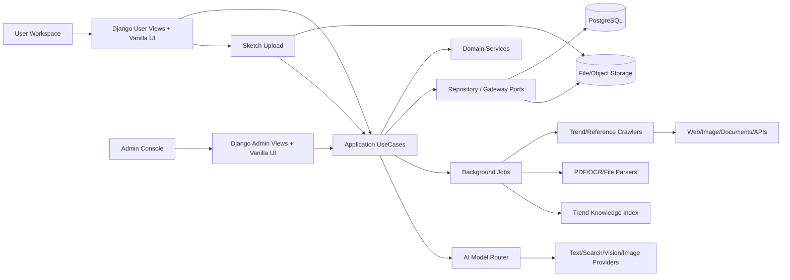
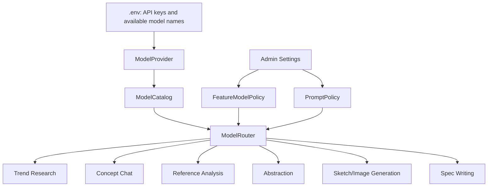
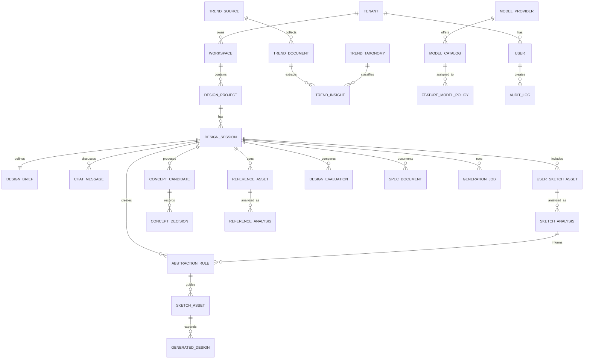
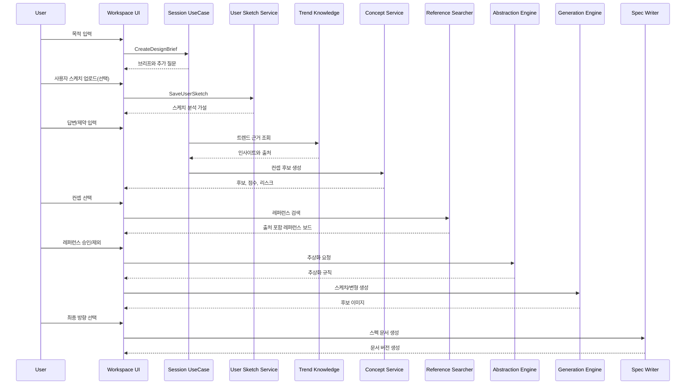
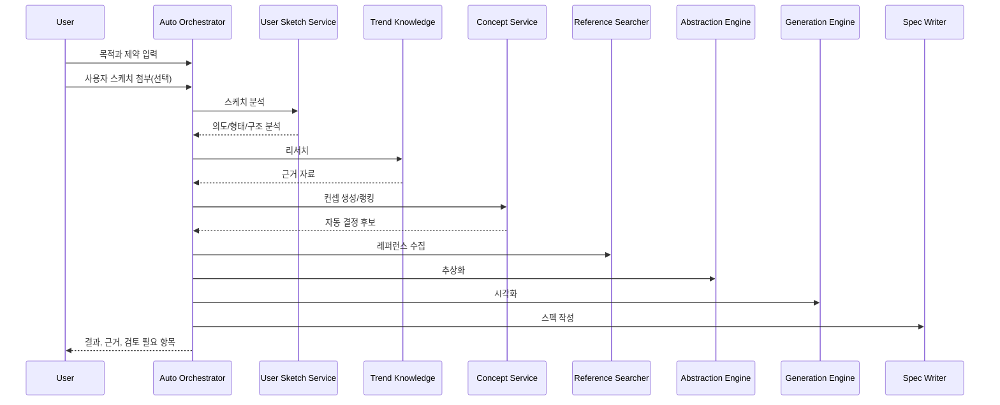
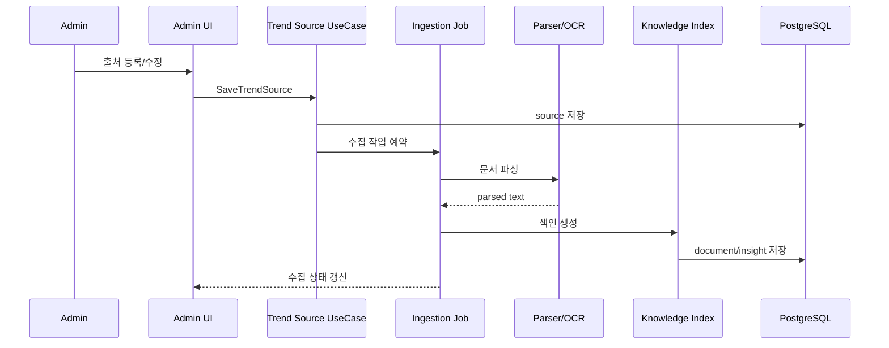

# User Needs v01: 범용 디자인 창작 지원도구 상세 기획

**작성일**: 2026-05-07 KST  
**대상 스택**: Django, PostgreSQL, Vanilla HTML, Vanilla JS, Vanilla CSS  
**서비스 형태**: SaaS, 사용자 워크스페이스와 관리자 프로그램 분리  
**핵심 정의**: 편집툴이 아니라 디자이너의 디자인 창작을 지원하는 아이디어 도구다. 사용자의 디자인 목적을 구조화하고, 최신 트렌드와 실제 레퍼런스를 근거로 컨셉을 결정하며, 레퍼런스를 추상화해 시각화하고, 디자인 문법에 맞는 스펙 문서로 남긴다.

---

## 1. 제품의 본질

이 프로그램은 이미지를 편집하거나 캔버스 위에서 세밀하게 조작하는 도구가 아니다. 핵심 가치는 다음 질문에 답하는 것이다.

- 어떤 디자인 목적이 있는가.
- 이 목적에 적합한 컨셉은 무엇인가.
- 그 컨셉은 어떤 트렌드와 실제 자료에 근거하는가.
- 어떤 레퍼런스를 참고할 수 있는가.
- 레퍼런스를 그대로 따라 하지 않고 어떤 디자인 문법으로 추상화할 수 있는가.
- 사용자가 직접 그린 스케치가 있다면, 그것을 어떤 창작 의도와 구조로 해석할 수 있는가.
- 추상화된 디자인 문법을 실제 대상물에 어떻게 적용할 수 있는가.
- 그 과정과 결과를 디자이너, 팀, 클라이언트가 이해 가능한 문서로 어떻게 남길 것인가.

따라서 이 제품은 “AI 이미지 생성기”가 아니라 **근거 기반 디자인 발상 시스템**이다. 생성 이미지는 산출물 중 하나일 뿐이며, 더 중요한 것은 컨셉 결정의 근거, 레퍼런스 해석, 추상화 규칙, 최종 스펙이다.

---

## 2. 핵심 사용자와 사용 상황

### 2.1 주요 사용자

| 사용자 | 목적 | 필요한 지원 |
|---|---|---|
| 산업디자이너 | 제품, 가구, 패키지, 소형 오브젝트 컨셉 개발 | 형태/구조/재질 추상화, 사용성 검토, 제작 스펙 |
| 패션디자이너 | 시즌별 룩, 아이템, 소재, 실루엣 기획 | 트렌드 분석, 스타일 보드, 룩 변형, 소재/패턴 문서화 |
| 시각디자이너 | 브랜딩, 로고, 포스터, 편집, 그래픽 시스템 | 색/타입/레이아웃 문법, 키비주얼, 디자인 가이드 |
| 광고/브랜드 디자이너 | 캠페인 비주얼과 메시지 컨셉 개발 | 타깃 인사이트, 메시지, 컷 구성, 채널별 소재 스펙 |
| 디자인 리드/PM | 방향성 검토, 의사결정 기록, 팀 공유 | 결정 근거, 버전 비교, 출처와 리스크 관리 |

### 2.2 대표 사용 상황

- “휴대폰 거치대를 자연물 컨셉으로 디자인하고 싶다.”
- “2026 S/S 여성복 컬렉션의 핵심 무드와 룩 방향이 필요하다.”
- “신규 카페 브랜드의 로고와 키비주얼 방향을 정해야 한다.”
- “친환경 세제 광고 캠페인의 시각 컨셉을 여러 개 탐색하고 싶다.”
- “클라이언트에게 왜 이 컨셉을 선택했는지 근거 있는 문서로 설명해야 한다.”

---

## 3. 제품 원칙

1. **편집보다 창작 지원이 우선**  
   캔버스 편집, 레이어 조작, 세밀한 이미지 보정은 핵심 범위가 아니다. 브리프, 리서치, 컨셉, 레퍼런스, 추상화, 스펙화가 핵심이다.

2. **근거 없는 제안 금지**  
   트렌드, 시장, 레퍼런스, 디자인 사례에 대한 주장은 출처와 연결되어야 한다. 출처가 없으면 “아이디어 가설”로 표시하고 컨셉 결정 근거로 사용하지 않는다.

3. **레퍼런스 복제 금지**  
   레퍼런스는 모방 대상이 아니라 분석 대상이다. 시스템은 원본 이미지를 형태, 구조, 비례, 재질, 상징, 사용성 규칙으로 변환해야 한다.

4. **디자이너의 판단 보존**  
   사용자가 선택한 컨셉, 버린 컨셉, 보류한 레퍼런스, 채택한 추상화 규칙을 모두 Decision Log로 남긴다.

5. **사용자 스케치 존중**  
   사용자가 업로드한 스케치는 외부 레퍼런스가 아니라 사용자 고유의 창작 입력물이다. AI는 이를 참고해 의도를 해석하고, 더 구체적인 형태와 스타일로 발전시킬 수 있어야 한다.

6. **자동화는 옵션**  
   챗봇과 협업하며 단계적으로 진행할 수도 있고, 목적만 제시해 자동으로 끝까지 진행할 수도 있다. 자동 모드도 중간 과정과 근거를 숨기지 않는다.

7. **도메인팩 기반 확장**  
   산업디자인, 패션디자인, 시각디자인, 광고디자인은 같은 기본 파이프라인을 공유하되 입력 항목, 평가 기준, 스펙 템플릿은 분리한다.

8. **관리 가능한 AI 시스템**  
   AI 모델은 기능별로 관리자 페이지에서 설정한다. 모델명과 API 키는 코드에 하드코딩하지 않고 `.env`와 모델 카탈로그를 통해 관리한다.

---

## 4. 전체 파이프라인

```text
1. 목적 입력
2. 브리프 구조화
3. 사용자 스케치/참고 이미지 업로드(선택)
4. 추가 질문과 제약 확인
5. 트렌드/시장/사용자/도메인 근거 조사
6. 컨셉 후보 생성
7. 컨셉 후보 평가
8. 컨셉 결정
9. 레퍼런스 검색과 수집
10. 레퍼런스 클러스터링과 적합성 분석
11. 사용자 스케치와 레퍼런스 분석
12. 레퍼런스/스케치 추상화
13. 추상화 스케치 생성 또는 사용자 스케치 구체화
14. 대상물/매체/아이템에 적용한 디자인 변형 생성
15. 후보 비교와 최종 방향 선택
16. 스펙 문서 작성
17. 검토, 승인, 버전 관리
```

### 4.1 단계별 입력/처리/출력/검증

| 단계 | 입력 | 처리 | 출력 | 검증 조건 |
|---|---|---|---|---|
| 목적 입력 | 자연어 목적, 도메인 선택 | 목적 분해 | RawDesignRequest | 도메인과 목적이 존재 |
| 브리프 구조화 | RawDesignRequest | 대상, 사용 맥락, 제약 추출 | DesignBrief | 용도, 대상, 결과 형태가 비어 있지 않음 |
| 스케치 업로드 | 사용자 스케치, 메모 | 파일 검증, 의도 질문 생성 | UserSketchAsset | 원본 파일, 작성자, 사용 의도 저장 |
| 추가 질문 | DesignBrief | 누락 필드 판정 | ClarifyingQuestion | 자동 진행 가능 여부 판단 |
| 트렌드 조사 | Brief, 도메인 | RAG, 웹 검색, 문서 검색 | TrendInsight | 출처 URL, 발행일, 수집일 저장 |
| 컨셉 후보 | Brief, TrendInsight | 후보 생성, 스코어링 | ConceptCandidate | 후보별 근거와 리스크 존재 |
| 컨셉 결정 | 후보, 사용자 선택 | 승인/보류/폐기 기록 | ConceptDecision | 결정자, 시각, 사유 저장 |
| 레퍼런스 검색 | 선택 컨셉 | 웹/이미지/문서 검색 | ReferenceAsset | 출처, 라이선스, 타입 저장 |
| 레퍼런스 분석 | ReferenceAsset | 의미/형태/구조 분석 | ReferenceAnalysis | 복제 위험과 추상화 가능성 분리 |
| 스케치 분석 | UserSketchAsset | 의도/형태/구조/미완성 부분 분석 | SketchAnalysis | 사용자 원본과 AI 해석이 연결됨 |
| 추상화 | ReferenceAnalysis, SketchAnalysis | 디자인 문법 변환 | AbstractionRule | 형태/구조/재질/상징 중 2개 이상 도출 |
| 시각화 | Rule, Brief, UserSketchAsset | 스케치 생성/구체화/변형 | SketchAsset, GeneratedDesign | 어떤 규칙과 원본에서 생성됐는지 추적 |
| 후보 비교 | 이미지, 규칙, Brief | 장단점 비교 | DesignEvaluation | 선택/보류/폐기 사유 저장 |
| 스펙 문서 | 모든 산출물 | 문서 구조화 | SpecDocument | 근거, 결정, 레퍼런스, 최종안 포함 |

### 4.2 파이프라인 불변 조건

- 출처 없는 트렌드 주장은 컨셉 결정의 근거로 쓰지 않는다.
- 레퍼런스 원본과 AI 생성 이미지는 데이터 타입, UI 라벨, 저장 테이블에서 구분한다.
- 사용자 업로드 스케치는 외부 레퍼런스와 구분하고, 원본을 덮어쓰지 않는다.
- 자동 모드가 내린 결정도 사용자 결정과 동일하게 Decision Log에 저장한다.
- 이미지 생성 요청은 최소 하나 이상의 브리프, 컨셉, 레퍼런스, 추상화 규칙과 연결되어야 한다.
- 스펙 문서는 최종 결과만 기록하지 않고 버린 대안과 선택 사유도 기록한다.
- 레퍼런스의 저작권 위험이 높으면 “직접 스타일 적용”을 막고 추상화 전용으로만 사용한다.
- 사용자 스케치 구체화 결과는 원본 스케치, 분석 결과, 적용한 추상화 규칙과 함께 저장한다.

---

## 5. 사용자 진행 모드

### 5.1 챗봇 협업 모드

디자이너와 AI가 함께 컨셉을 좁혀가는 기본 모드다.

흐름:

```text
사용자 목적 입력
-> 사용자 스케치 업로드(선택)
-> AI 질문
-> 사용자가 제약/선호 답변
-> AI가 스케치가 있다면 의도/형태/구조 해석을 확인
-> AI가 트렌드 근거와 컨셉 후보 제시
-> 사용자가 후보 선택/보류/폐기
-> AI가 레퍼런스 보드 구성
-> 사용자가 레퍼런스 선택
-> AI가 추상화 규칙과 스케치 제시
-> 사용자가 변형안 선택
-> AI가 스펙 문서 생성
```

필수 UX:

- AI 답변 옆에 근거 출처 표시
- 사용자 스케치가 있으면 AI 해석 가설과 확인 질문 표시
- 컨셉 후보 카드마다 점수와 리스크 표시
- 선택 버튼: `채택`, `보류`, `폐기`, `더 탐색`
- 사용자가 바꾼 결정은 Decision Log에 버전으로 저장
- 다음 단계로 넘어가기 전에 “현재 결정 요약” 표시

### 5.2 자동 진행 모드

사용자가 목적과 제약만 입력하면 시스템이 끝까지 진행한다.

자동 모드 필수 조건:

- 자동 결정마다 점수, 근거, 대안, 리스크를 저장
- 불확실성이 큰 항목은 “검토 필요”로 표시
- 최종 결과는 완성품이 아니라 “검토 가능한 디자인 패키지”로 제공
- 자동 모드 결과도 사용자가 되돌아가 특정 단계부터 재실행 가능

자동 모드 상태:

| 상태 | 의미 | UI 표시 |
|---|---|---|
| `queued` | 작업 대기 | 예상 단계와 모델 표시 |
| `researching` | 트렌드/자료 조사 | 수집 출처와 진행률 |
| `concepting` | 컨셉 후보 생성 | 후보 생성 중 스켈레톤 |
| `referencing` | 레퍼런스 수집 | 출처별 수집 수 |
| `abstracting` | 디자인 문법 추출 | 형태/구조/의미 축 표시 |
| `generating` | 스케치/이미지 생성 | 생성 작업 로그 |
| `documenting` | 스펙 작성 | 문서 섹션 진행 |
| `review_ready` | 검토 가능 | 검토 필요 항목 강조 |
| `failed` | 실패 | 실패 단계, 원인, 재시도 조건 |

### 5.3 사용자 스케치 기반 진행

사용자는 자신의 스케치를 업로드해 챗봇이 참고하게 하거나, 그 스케치를 더 구체화하도록 요청할 수 있다. 이 기능은 편집툴이 아니라 “사용자 발상 해석과 구체화” 기능이다.

사용 흐름:

```text
스케치 업로드
-> AI가 스케치의 의도/형태/구조/미완성 부분 분석
-> 챗봇이 사용자에게 해석이 맞는지 확인
-> 필요한 레퍼런스와 트렌드 근거 수집
-> 스케치의 핵심 아이디어를 추상화 규칙으로 정리
-> 원본 방향을 유지한 구체화안 생성
-> 다른 컨셉으로 확장한 변형안 생성
-> 스케치 원본, 분석, 구체화 결과를 스펙 문서에 기록
```

스케치 업로드 유형:

| 유형 | 예 | 처리 |
|---|---|---|
| 러프 스케치 | 손그림, 낙서, 아이디어 메모 | 형태와 의도 파악, 질문 생성 |
| 구조 스케치 | 제품 단면, 조립 방식, 실루엣 | 기능 구조와 제작 리스크 분석 |
| 스타일 스케치 | 패션 룩, 그래픽 레이아웃, 광고 컷 | 분위기, 비례, 시선 흐름 분석 |
| 혼합 자료 | 스케치+메모+레퍼런스 이미지 | 사용자 아이디어와 외부 참고 분리 |

필수 원칙:

- 원본 스케치를 절대 덮어쓰지 않는다.
- AI 해석은 “확정”이 아니라 사용자 확인이 필요한 가설로 표시한다.
- 구체화 결과는 원본 스케치의 어떤 요소를 유지/변형했는지 설명해야 한다.
- 사용자가 원하면 스케치를 중심으로 컨셉 후보를 다시 만들 수 있어야 한다.
- 외부 레퍼런스 스타일을 사용자의 스케치에 직접 덮어씌우기보다, 추상화 규칙을 통해 적용한다.

---

## 6. 추상화 예시: 산 컨셉 휴대폰 거치대

### 6.1 사용자 목적

“휴대폰 거치대를 디자인하고 싶다. 자연적인 느낌이 있으면서 책상 위 오브젝트처럼 보였으면 좋겠다.”

### 6.2 챗봇 질문

- 사용하는 공간은 사무실, 침실, 카페 중 어디인가.
- 타깃은 학생, 직장인, 크리에이터, 프리미엄 사용자 중 누구인가.
- 소재는 플라스틱, 금속, 목재, 세라믹, 3D 프린팅 중 무엇을 선호하는가.
- 기능은 세로/가로 거치, 충전 케이블, 접이식, 휴대성 중 무엇이 중요한가.
- 가격대와 생산 방식은 어느 정도인가.

### 6.3 컨셉 후보

| 후보 | 의미 | 장점 | 리스크 |
|---|---|---|---|
| 산 | 안정감, 자연, 능선, 높이 | 지지 구조와 잘 연결 | 장식적으로 흐를 위험 |
| 조약돌 | 부드러움, 촉감, 균형 | 책상 오브젝트화 용이 | 휴대폰 지지 각도 구현 난도 |
| 접힌 종이 | 가벼움, 구조, 절곡 | 제조 논리 명확 | 차가운 인상 가능 |
| 건축 파사드 | 질서, 반복, 구조 | 프리미엄 제품화 가능 | 자연 컨셉과 거리감 |

### 6.4 산 컨셉 선택 후 레퍼런스 수집

수집 범주:

- 실제 산: 능선, 절벽, 계곡, 층리, 정상부
- 산을 활용한 제품: 오브젝트, 문구류, 조명, 가구
- 산을 활용한 건축/공간: 지붕선, 경사, 단차, 재료감
- 산을 활용한 그래픽: 실루엣, 라인, 색면, 패턴

### 6.5 추상화 규칙

| 추상화 축 | 산에서 관찰한 요소 | 휴대폰 거치대 적용 |
|---|---|---|
| 형태 | 삼각 실루엣, 능선 라인 | 후면 지지대의 경사 실루엣 |
| 구조 | 하중을 받는 경사면 | 휴대폰 무게를 받는 받침 각도 |
| 레이어 | 산맥의 중첩 | 케이블 홈과 미끄럼 방지 단차 |
| 표면 | 암석 질감, 거친 면 | 무광 세라믹/텍스처 플라스틱 |
| 의미 | 안정감, 고요함, 자연 | 책상 위 조형 오브젝트 |

### 6.6 산출물

- 추상화 스케치 3종
- 제품 적용 스케치 6종
- 소재/색상 변형 4종
- 구조 검토 메모
- 최종 후보별 제품 스펙
- 레퍼런스와 추상화 규칙이 포함된 스펙 문서

---

## 7. 도메인팩 설계

도메인팩은 공통 파이프라인 위에 얹히는 입력/평가/출력 템플릿이다. 도메인별 로직은 하드코딩된 키워드 매핑이 아니라 관리자 카탈로그와 문서 기반 지식으로 확장한다.

| 도메인 | 특화 분석 | 시각화 | 스펙 필드 |
|---|---|---|---|
| 산업디자인 | 사용성, 구조, 재료, 생산성, CMF, 안전성 | 형태 스케치, 구조 스케치, 사용 장면, 변형안 | 치수 가정, 소재, 구조, 제조 방식, 사용 시나리오, 리스크 |
| 패션디자인 | 시즌, 타깃, 실루엣, 소재, 패턴, 착장, 문화 맥락 | 무드보드, 룩 스케치, 착장 이미지, 패턴 방향 | 아이템, 소재, 컬러, 패턴, 스타일링, 시즌 근거, 생산 유의 |
| 시각디자인 | 브랜드 톤, 색, 타입, 그리드, 레이아웃, 인지성 | 키비주얼, 로고 방향, 포스터, 그래픽 시스템 | 색/타입/그리드, 사용 규칙, 금지 규칙, 매체 확장 |
| 광고디자인 | 타깃 인사이트, 메시지, 후킹, 채널, 캠페인 톤 | 캠페인 컷, 소셜 소재, 카피 방향, 스토리보드 | 메시지, 채널, 비주얼 톤, 카피, 규격, CTA |

패션 도메인은 기존 구현을 고도화한다. 기존의 트렌드 수집, 분석, 이미지 생성, 리포트 생성은 유지하되 다음 중간 단계를 추가한다.

- 패션 브리프 구조화
- 시즌/타깃/아이템별 컨셉 후보
- 레퍼런스 보드와 출처 관리
- 실루엣/소재/패턴 추상화
- 룩 변형안 비교
- 패션 스펙 문서

---

## 8. 트렌드 지식 시스템

이 프로그램은 디자인 트렌드를 기본으로 알고 있어야 한다. 단, 코드에 고정된 트렌드 분류표를 넣는 방식은 금지한다. 관리자가 트렌드 출처와 문서를 관리하고, 시스템은 이를 색인해 AI가 근거로 사용할 수 있게 한다.

### 8.1 트렌드 문서 수집 대상

초기 카탈로그 후보:

- 패션: Vogue Business, Business of Fashion, WGSN류 리포트, 패션위크 리뷰, 브랜드 룩북
- 산업디자인: Core77, Dezeen, DesignWanted, Yanko Design, 제조/소재 리포트
- 시각디자인: AIGA Eye on Design, It’s Nice That, Brand New, 디자인 시스템 문서
- 광고디자인: Cannes Lions, Campaign, AdAge, The Drum, 브랜드 캠페인 아카이브
- 범용 크리에이티브: Adobe Creative Trends, Pinterest Predicts, Behance, Dribbble, Google DESIGN.md 사례

### 8.2 트렌드 문서 엔티티

| 엔티티 | 주요 필드 |
|---|---|
| TrendSource | 이름, URL, 도메인, 수집 주기, 신뢰도, 라이선스, 활성 상태 |
| TrendDocument | source, title, url, published_at, collected_at, raw_file, parsed_text, hash |
| TrendInsight | document, summary, keywords, domain_tags, evidence_quote, confidence |
| TrendTaxonomy | domain, category, label, description, parent, active |

### 8.3 트렌드 품질 기준

- 발행일과 수집일을 분리한다.
- 같은 주장을 여러 출처가 반복하면 근거 강도를 높인다.
- 오래된 트렌드는 자동 폐기하지 않고 최신성 점수를 낮춘다.
- AI 응답에는 출처와 근거 문서가 연결되어야 한다.
- 출처가 불확실한 내용은 “가설” 또는 “검증 필요”로 표시한다.

---

## 9. 레퍼런스 검색기

레퍼런스 검색기는 단순 이미지 검색 화면이 아니다. 디자인 컨셉을 구체화하기 위한 증거 수집과 해석 도구다.

사용자 스케치가 있는 경우 레퍼런스 검색기는 스케치의 의도와 충돌하지 않는 자료를 찾는 역할도 한다. 예를 들어 사용자가 이미 곡선형 제품 스케치를 올렸다면, 시스템은 무작위로 유행 레퍼런스를 붙이는 것이 아니라 그 곡선 구조를 더 잘 설명하거나 발전시킬 수 있는 소재, 구조, 유사 제품, 자연물, 그래픽 사례를 찾는다.

### 9.1 검색 유형

- 키워드 검색: 컨셉, 도메인, 소재, 시대, 무드
- 이미지 검색: 사용자가 업로드한 이미지와 유사한 사례
- 스케치 기반 검색: 사용자 스케치의 형태/구조와 연결되는 사례
- 문서 검색: 트렌드 문서, 브랜드 문서, 리포트
- 내부 자산 검색: 이전 프로젝트, 팀 라이브러리
- 확장 검색: 자연물, 건축, 제품, 패션, 그래픽, 광고 사례

### 9.2 레퍼런스 분류

| 분류 | 설명 |
|---|---|
| Nature | 자연물, 생물, 지형, 계절, 기후 |
| Product | 제품, 가구, 도구, 패키지 |
| Architecture | 건축, 공간, 구조, 파사드 |
| Fashion | 룩, 아이템, 소재, 실루엣 |
| Graphic | 포스터, 로고, 타이포, 패턴 |
| Advertising | 캠페인, 컷, 메시지, 매체 |
| Material | 소재, 표면, 질감, CMF |

### 9.3 레퍼런스 카드 필수 정보

- 썸네일
- 제목
- 출처 URL
- 수집일
- 발행일 또는 업로드일
- 라이선스 또는 사용 위험
- 도메인 태그
- 왜 관련 있는지
- 추상화 가능 요소
- 표절/복제 위험

### 9.4 사용자 스케치 카드 필수 정보

사용자 스케치는 외부 레퍼런스 카드와 별도 타입으로 보여준다.

- 원본 썸네일
- 업로드 사용자
- 업로드 시각
- 사용자가 입력한 설명
- AI가 추정한 의도
- AI가 추정한 형태/구조 요소
- 미확정 또는 질문 필요 요소
- 구체화에 유지할 요소
- 변형 가능한 요소
- 연결된 생성 결과와 스펙 문서

---

## 10. 추상화 엔진

추상화 엔진은 레퍼런스를 디자인 문법으로 바꾸는 핵심 모듈이다. 사용자가 산, 파도, 조약돌, 건축물, 특정 문화 요소 등을 컨셉으로 선택하면 AI는 그것을 형태와 기능으로 번역해야 한다.

사용자 스케치가 있는 경우 추상화 엔진은 외부 레퍼런스뿐 아니라 사용자의 스케치 자체도 분석한다. 이때 목표는 스케치를 고쳐 그리는 것이 아니라, 스케치 안의 창작 의도와 구조를 명확한 디자인 문법으로 정리하는 것이다.

### 10.1 추상화 축

| 축 | 분석 질문 | 산출 예 |
|---|---|---|
| 형태 | 외곽선, 비례, 반복, 곡률은 어떤가 | 삼각 실루엣, 긴 수평선 |
| 구조 | 하중, 결합, 지지, 접힘은 어떤가 | 경사 지지, 레이어 구조 |
| 표면 | 질감, 광택, 패턴은 어떤가 | 무광, 거친 입자, 결 |
| 색/재료 | 색상 대비와 소재 감각은 어떤가 | 흙색, 암석색, 반투명 소재 |
| 의미 | 상징과 감정은 무엇인가 | 안정, 고요, 힘, 자연성 |
| 사용성 | 제품/매체의 기능과 어떻게 연결되는가 | 잡기 쉬움, 세워짐, 접힘 |

### 10.2 추상화 출력

- AbstractionRule
- SketchAnalysis
- SketchPrompt
- MaterialDirection
- FormGrammar
- RiskNote
- ReferenceLink

사용자 스케치 기반 출력:

- 원본에서 유지할 핵심 실루엣
- 원본에서 강화할 구조
- 원본에서 불명확한 기능 요소
- 구체화 방향 3~5개
- 원본 보존형 생성 프롬프트
- 컨셉 확장형 생성 프롬프트

### 10.3 금지 사항

- 원본 레퍼런스의 구도를 그대로 복제하지 않는다.
- 특정 브랜드/작가 스타일을 그대로 모사하지 않는다.
- 출처 없는 이미지로 상업적 사용 가능성을 단정하지 않는다.
- 기능 요구와 무관한 장식 요소만 추출하지 않는다.
- 사용자 스케치 원본을 AI 생성 결과로 대체해 원본 이력을 잃게 하지 않는다.

---

## 11. UX/UI 상세 설계

UX/UI는 매우 신중하게 설계해야 한다. 사용자가 “무엇을 입력해야 하는지”보다 “지금 무엇을 판단해야 하는지”를 항상 이해해야 한다.

### 11.1 UX 구조 원칙

- 화면은 파이프라인 단계와 1:1로 연결된다.
- 모든 단계는 현재 상태, 근거, 다음 결정, 되돌아가기 경로를 가진다.
- 챗봇은 오른쪽 아래 보조가 아니라 디자인 세션의 핵심 인터페이스다.
- 근거 보드와 결정 패널은 항상 보인다.
- 사용자 스케치, 외부 레퍼런스, 추상화, 생성 이미지를 시각적으로 명확히 구분한다.
- 로딩 중에는 단순 스피너가 아니라 단계별 스켈레톤과 실제 작업 로그를 표시한다.

### 11.2 사용자 워크스페이스

```text
+--------------------------------------------------------------------------------+
| Workspace / Project / Session / Mode: Guided or Auto                            |
+----------------------+--------------------------------------+------------------+
| Project Navigator    | Design Studio                         | Decision Panel   |
| - Project list       | [Chat with Design Expert]             | Current Stage    |
| - Session timeline   | [Evidence Board]                      | Brief Score      |
| - User sketches      | [Reference Clusters]                  | Concept Scores   |
| - Reference library  | [Sketch Analysis]                     | Selected Sketch  |
| - Generated assets   | [Abstraction Sketches]                | Selected Refs    |
| - Spec documents     | [Design Variations]                   | Next Decision    |
+----------------------+--------------------------------------+------------------+
```

역할:

- Project Navigator: 프로젝트와 세션의 맥락을 잃지 않게 한다.
- Design Studio: 대화, 근거, 시각화가 연결되는 중심 화면이다.
- Decision Panel: 다음 행동과 결정 근거를 압축해서 보여준다.

### 11.3 Design Studio 상세

Design Studio는 탭 중심이 아니라 단계 중심이다.

| 영역 | 기능 |
|---|---|
| Chat Panel | 질문, 답변, 컨셉 토론, 사용자 결정 |
| Evidence Board | 트렌드 근거, 검색 결과, 인용 출처 |
| Sketch Input Board | 사용자 업로드 스케치, AI 해석, 구체화 옵션 |
| Reference Board | 이미지/문서/사례 레퍼런스 |
| Abstraction Board | 형태/구조/재질/상징 규칙 |
| Generation Board | 스케치, 변형안, 도메인 적용 이미지 |
| Decision Panel | 현재 단계, 승인 필요 항목, 다음 액션 |

### 11.4 Sketch Input Board

Sketch Input Board는 사용자가 업로드한 스케치를 디자인 세션의 정식 입력으로 다루는 화면이다.

```text
+--------------------------------------------------------------------------------+
| Uploaded Sketch                                                                 |
+---------------------------+---------------------------+------------------------+
| Original Sketch           | AI Interpretation         | Refinement Actions     |
| image preview             | intent, form, structure   | keep / clarify / vary  |
| user memo                 | unclear points            | refine / expand / use  |
| upload metadata           | questions for user        | as concept evidence    |
+---------------------------+---------------------------+------------------------+
```

필수 상호작용:

- 스케치 업로드
- 스케치 설명 추가
- AI 해석 승인/수정
- 유지할 요소 선택
- 바꿀 수 있는 요소 선택
- 스케치 기반 레퍼런스 검색
- 스케치 구체화 생성
- 스케치 기반 스펙 문서 반영

### 11.5 레퍼런스 검색기

```text
+--------------------------------------------------------------------------------+
| Query / Domain / Source / Date / License / Abstraction Fit                      |
+------------------+--------------------------+----------------------------------+
| Source Clusters  | Reference Grid           | Analysis                         |
| Nature           | image, title, source     | Why relevant                     |
| Product          | image, title, source     | Form grammar                     |
| Architecture     | image, title, source     | Structure/material/symbol        |
| Graphic/Fashion  | image, title, source     | Copyright risk                   |
+------------------+--------------------------+----------------------------------+
```

필수 상호작용:

- 레퍼런스 저장
- 추상화 후보로 추가
- 제외 사유 기록
- 유사 레퍼런스 더 찾기
- 출처 보기
- 라이선스 위험 표시

### 11.6 Spec Builder

Spec Builder는 문서 편집기가 아니라 의사결정 기록을 문서로 구조화하는 화면이다.

문서 섹션:

- 프로젝트 브리프
- 트렌드 근거
- 컨셉 후보와 평가
- 최종 컨셉 결정
- 사용자 스케치 원본과 AI 해석
- 레퍼런스 보드
- 추상화 규칙
- 스케치와 생성 이미지
- 최종안 비교
- 도메인별 스펙
- 출처/라이선스/AI 사용 고지

### 11.7 관리자 프로그램

```text
+--------------------------------------------------------------------------------+
| Admin Console                                                                  |
+----------------------+-------------------------+-------------------------------+
| Trend Knowledge      | Model Catalog           | Operations                    |
| - Source registry    | - Provider              | - Tenants                     |
| - Crawl schedule     | - Model list            | - Users                       |
| - Parse status       | - Feature policy        | - Jobs                        |
| - Taxonomy           | - Cost/token limit      | - Audit logs                  |
| - Quality review     | - Prompt policy         | - Failure analysis            |
+----------------------+-------------------------+-------------------------------+
```

관리자는 다음을 수행한다.

- 트렌드 출처 등록/수정/비활성화
- 문서 수집 주기 설정
- 문서 파싱 실패 확인
- 도메인별 트렌드 분류 관리
- 기능별 AI 모델 지정
- 모델 비용/토큰/실패율 확인
- 사용자 워크스페이스와 권한 관리

---

## 12. UX/UI 검증 기준

### 12.1 화면 논리 검증

| 질문 | 통과 기준 |
|---|---|
| 사용자가 현재 단계가 어디인지 아는가 | 상단 단계 표시와 Decision Panel에 현재 단계 표시 |
| 사용자가 다음에 무엇을 해야 하는지 아는가 | 다음 결정 버튼과 이유 표시 |
| AI 제안의 근거를 확인할 수 있는가 | 근거 출처 링크와 인용 문서 연결 |
| 레퍼런스와 생성 이미지가 혼동되지 않는가 | 라벨, 저장 위치, 카드 색상 체계 분리 |
| 자동 모드 결과를 되짚을 수 있는가 | 단계별 로그와 중간 산출물 보존 |
| 스펙 문서가 검토 가능한가 | 섹션별 출처와 결정 로그 연결 |

### 12.2 오류/빈 상태 검증

| 상황 | UI 대응 |
|---|---|
| 트렌드 자료 부족 | “근거 부족” 표시, 추가 검색 제안 |
| 레퍼런스 없음 | 검색어 확장, 도메인 전환, 수동 업로드 제안 |
| 라이선스 위험 | 사용 제한 표시, 추상화 전용 처리 |
| 모델 실패 | 실패 기능, 모델명, 재시도 가능 여부 표시 |
| 자동 모드 불확실성 높음 | 사용자 검토 필요 단계로 중단 |
| 문서 파싱 실패 | 관리자 큐에 실패 문서 표시 |

---

## 13. SaaS 구조

사용자 워크스페이스와 관리자 프로그램은 분리한다.

### 13.1 사용자 영역

- 프로젝트 관리
- 디자인 세션 관리
- 챗봇 협업
- 사용자 스케치 업로드와 구체화
- 레퍼런스 검색
- 이미지/스케치 결과 확인
- 스펙 문서 검토
- 팀 공유와 승인

### 13.2 관리자 영역

- 테넌트/사용자/권한 관리
- 트렌드 출처 관리
- 문서 수집과 색인 관리
- 기능별 AI 모델 설정
- 비용, 실패율, 토큰 사용량 확인
- 감사 로그 확인

### 13.3 멀티테넌시 원칙

- 모든 사용자 데이터는 Tenant와 Workspace에 종속된다.
- 레퍼런스와 트렌드 공용 데이터는 공개/비공개 범위를 구분한다.
- 프로젝트 자산은 기본적으로 워크스페이스 내부에서만 보인다.
- 관리자 작업은 AuditLog에 저장한다.

---

## 14. AI 모델 카탈로그

`.env`는 사용 가능한 Provider/API Key/기본 모델을 제공하고, 관리자 페이지가 기능별 모델 정책을 관리한다. 코드에 모델명을 직접 박아 넣지 않는다.

### 14.1 기능별 모델 정책

| 기능 | 모델 유형 | 설정 항목 |
|---|---|---|
| Trend Research | 검색/텍스트 모델 | provider, model, temperature, max tokens |
| Concept Chat | 대화 모델 | provider, model, system prompt version |
| User Sketch Analysis | 비전/멀티모달 모델 | provider, model, image detail, analysis schema |
| Reference Analysis | 비전/멀티모달 모델 | provider, model, image limit |
| Abstraction | 추론/텍스트 모델 | provider, model, reasoning depth |
| Sketch Prompt | 텍스트 모델 | provider, model, prompt template |
| Image Generation | 이미지 모델 | provider, model, size, variations |
| Spec Writing | 긴 문서 모델 | provider, model, citation policy |
| Verification | 텍스트/비전 모델 | provider, model, validation rules |

### 14.2 모델 엔티티

- ModelProvider: provider name, api key env name, base url, active
- ModelCatalog: provider, model name, type, context limit, cost estimate, active
- FeatureModelPolicy: feature key, model, parameters, fallback policy, max cost
- PromptPolicy: feature key, prompt version, active, reviewer

Fallback은 거짓 결과를 반환하는 방식이 아니라 “실패를 명확히 보고하고 재시도 가능한 다른 모델 정책을 사용하는 방식”이어야 한다.

---

## 15. 클린 아키텍처

모든 기능은 독립 모듈로 구성한다. 하나의 모듈 변경이 다른 기능에 사이드이펙트를 만들지 않게 한다.

```text
apps/
  accounts/
    domain/ application/ infrastructure/ presentation/
  workspaces/
    domain/ application/ infrastructure/ presentation/
  design_projects/
    domain/ application/ infrastructure/ presentation/
  design_sessions/
    domain/ application/ infrastructure/ presentation/
  conversations/
    domain/ application/ infrastructure/ presentation/
  user_assets/
    domain/ application/ infrastructure/ presentation/
  trend_knowledge/
    domain/ application/ infrastructure/ presentation/
  references/
    domain/ application/ infrastructure/ presentation/
  concepts/
    domain/ application/ infrastructure/ presentation/
  abstraction/
    domain/ application/ infrastructure/ presentation/
  generation/
    domain/ application/ infrastructure/ presentation/
  specs/
    domain/ application/ infrastructure/ presentation/
  model_catalog/
    domain/ application/ infrastructure/ presentation/
  admin_console/
    domain/ application/ infrastructure/ presentation/
  audit_logs/
    domain/ application/ infrastructure/ presentation/
shared/
  domain/
  application/
  infrastructure/
  presentation/
templates/
static/
```

레이어 규칙:

- Domain: Entity, Value Object, Domain Service. Django ORM에 의존하지 않는다.
- Application: UseCase, DTO, Command, Query, Port 인터페이스.
- Infrastructure: Django ORM Repository, 외부 API, 크롤러, 파일 저장소, RAG.
- Presentation: Django View, Template, Vanilla JS, CSS.

모듈 간 직접 ORM 접근은 금지한다. 다른 모듈 데이터가 필요하면 Application Port 또는 Query Service를 통해 접근한다.

---

## 16. 주요 모듈 책임

| 모듈 | 책임 |
|---|---|
| accounts | 사용자, 인증, 역할 |
| workspaces | 테넌트, 워크스페이스, 권한 |
| design_projects | 프로젝트 목적, 도메인, 상태 |
| design_sessions | 창작 파이프라인 상태, 모드, 진행률 |
| conversations | 챗봇 대화, 질문, 답변, 결정 연결 |
| user_assets | 사용자 업로드 스케치, 메모, 원본 보존, 분석 결과 연결 |
| trend_knowledge | 출처, 문서, 인사이트, RAG 색인 |
| references | 레퍼런스 검색, 저장, 라이선스, 분석 |
| concepts | 컨셉 후보, 점수, 결정 로그 |
| abstraction | 디자인 문법 변환, 추상화 규칙 |
| generation | 스케치, 이미지, 변형안 생성 작업 |
| specs | 스펙 문서, 버전, 승인 |
| model_catalog | Provider, 모델, 기능별 정책 |
| admin_console | 운영 UI, 설정 |
| audit_logs | 사용자/관리자/AI 호출 감사 로그 |

---

## 17. 아키텍처 구성도



모델 설정 구성:



---

## 18. ERD 초안



핵심 테이블 설명:

| 테이블 | 설명 |
|---|---|
| DesignBrief | 목적, 도메인, 타깃, 사용 맥락, 제약 |
| UserSketchAsset | 사용자 원본 스케치, 메모, 업로드 사용자, 파일 메타데이터 |
| SketchAnalysis | 스케치 의도, 형태, 구조, 불명확한 요소, 구체화 방향 |
| ConceptCandidate | 컨셉명, 설명, 점수, 근거, 리스크 |
| ConceptDecision | 선택/보류/폐기, 결정자, 결정 사유 |
| ReferenceAsset | 이미지/문서/URL, 출처, 라이선스, 수집일 |
| ReferenceAnalysis | 관련성, 형태 문법, 구조 문법, 위험 |
| AbstractionRule | 형태/구조/재질/상징/사용성 규칙 |
| GeneratedDesign | 생성 이미지, 연결된 규칙, 생성 모델 |
| SpecDocument | 스펙 문서, 버전, 승인 상태 |
| FeatureModelPolicy | 기능별 모델과 파라미터 |

---

## 19. 시퀀스 다이어그램

### 19.1 챗봇 협업 모드



### 19.2 자동 진행 모드



### 19.3 관리자 트렌드 문서 수집



---

## 20. 레퍼런스/라이브러리 검토

`reference_library.md`의 후보들은 그대로 제품에 붙이는 것이 아니라 적용 난이도와 목적 적합성으로 분류한다. 실제 도입 전에는 라이선스, 보안, 유지보수, 의존성 충돌을 확인한다.

### 20.1 직접 도입 또는 강한 후보

| 후보 | 확인 URL | 판단 | 적용 방식 |
|---|---|---|---|
| Scrapy | https://github.com/scrapy/scrapy | Python 기반 안정적 크롤링 프레임워크 | 정적 웹/뉴스/트렌드 문서 수집 |
| Crawlee Python | https://github.com/apify/crawlee-python | 웹 스크래핑과 브라우저 자동화 지원 | 동적 페이지와 이미지/문서 수집 |
| Crawl4AI | https://github.com/unclecode/crawl4ai | LLM-ready Markdown 추출에 적합 | 트렌드 문서 RAG 전처리 |
| Scrapling | https://github.com/D4Vinci/Scrapling | 적응형 스크래핑, 프록시/페처 지원 | 난도 높은 사이트 보조 수집 |
| LightRAG | https://github.com/HKUDS/LightRAG | 지식 그래프와 RAG 결합 | 트렌드 지식 베이스 후보 |
| PageIndex | https://github.com/VectifyAI/PageIndex | 긴 PDF/문서 의미 트리 색인 | 리포트/브랜드 문서 색인 |
| OpenDeepSearch | https://github.com/sentient-agi/OpenDeepSearch | 검색, 크롤링, 리랭킹 구조 | 레퍼런스 딥서치 설계 참고 |
| Magika | https://github.com/google/magika | 파일 타입 감지 | 업로드 파일 검증과 파서 선택 |
| DESIGN.md | https://github.com/google-labs-code/design.md | 디자인 시스템 문서 포맷 | 스펙 문서의 디자인 문법 구조 참고 |
| Dify | https://github.com/langgenius/dify | LLM 워크플로우 플랫폼 | 관리자 워크플로우 UX 참고 |

### 20.2 설계 참고 후보

| 후보군 | 포함 | 판단 |
|---|---|---|
| 에이전트 플랫폼 | OpenClaw, OpenJarvis, AionUi, Hermes, OpenHarness | 자동 작업 상태, 에이전트 UX 참고 |
| 오케스트레이션 | Symphony, multica, paperclip, harness-100 | 자동 모드 작업 단위와 증거 제출 구조 참고 |
| 스킬/프롬프트 | MiniMax skills, pm-skills, ui-ux-pro-max-skill, system prompts | 역할 정의와 워크플로우 템플릿 참고 |
| 문서/브라우저 | chrome-devtools-mcp, rhwp, kordoc, googleworkspace/cli | QA, 한글 문서 파싱, 외부 문서 연동 후보 |
| 보류 | fish-speech, Unsloth, MiroFish, Personas-Korea | MVP 핵심 아님. 특정 기능 검증 후 도입 |

### 20.3 벤치마크 반영

| 서비스 | 확인 URL | 배울 점 | 우리 제품의 경계 |
|---|---|---|---|
| Figma AI | https://help.figma.com/hc/en-us/articles/23870272542231-Use-AI-tools-in-Figma-Design | 아이디어를 디자인 초안으로 전환, 자산 검색 | 편집 생산성보다 컨셉 근거와 추상화 |
| Canva AI | https://www.canva.com/canva-ai/ | 대화형 생성, 브랜드 맥락 연결 | 제작/편집이 아니라 발상 과정 지원 |
| Adobe Firefly | https://developer.adobe.com/firefly-services/docs/firefly-api/guides/concepts/style-image-reference/ | 스타일 레퍼런스와 변형 생성 | 스타일 복제보다 출처/추상화 규칙 |
| Vizcom | https://docs.vizcom.com/Introduction | 스케치, 레퍼런스, 렌더 스타일 | 스케치 전 컨셉 논리와 문서화 강화 |
| Krea | https://docs.krea.ai/user-guide/get-started/what-is-krea | 최신 모델 반복, 실시간 탐색 | 모델 반복보다 결정 기록과 도메인팩 |

---

## 21. MVP 구현 순서

### Phase 1: Design Session

- 프로젝트/세션/브리프
- 챗봇 협업 모드
- 사용자 스케치 업로드와 원본 보존
- 스케치 기반 AI 해석 확인
- 컨셉 후보와 결정 로그
- 기본 스펙 문서

### Phase 2: Trend Knowledge

- 관리자 출처 등록
- 문서 수집/파싱/색인
- 트렌드 근거 인용
- 출처와 최신성 관리

### Phase 3: Reference Searcher

- 웹/이미지/문서 검색
- 레퍼런스 저장
- 출처/라이선스/위험 표시
- 클러스터와 분석 패널

### Phase 4: Abstraction & Generation

- 레퍼런스 분석
- 사용자 스케치 분석
- 추상화 규칙 생성
- 스케치 프롬프트
- 원본 보존형 구체화 이미지 생성
- 컨셉 확장형 변형 이미지 생성

### Phase 5: Spec Builder & Admin

- 도메인별 스펙 템플릿
- 문서 버전 관리
- 모델 카탈로그
- 작업 로그와 비용/품질 모니터링

---

## 22. 위험과 대응

| 위험 | 대응 |
|---|---|
| 레퍼런스 표절 | 원본 복제 금지, 추상화 규칙 저장, 출처/라이선스 표시 |
| AI 환각 | 출처 없는 트렌드 주장 금지, 근거 문서 연결 |
| UX 복잡도 | 현재 단계, 다음 결정, 근거만 우선 표시 |
| 자동 모드 품질 저하 | 중간 산출물 저장, 검토 필요 항목 표시 |
| 모델 비용 증가 | 기능별 모델 정책, 비용 제한, 작업 큐 |
| 도메인 혼선 | 도메인팩별 입력/출력/스펙 템플릿 분리 |
| SaaS 데이터 혼선 | Tenant/Workspace 접근 제어와 감사 로그 |
| 트렌드 문서 노후화 | 발행일/수집일/최신성 점수 관리 |
| 관리자 설정 오류 | 정책 버전, 변경 로그, 롤백 기능 |
| 사용자 스케치 오해석 | AI 해석을 가설로 표시하고 사용자 승인 후 다음 단계 진행 |
| 원본 스케치 손실 | 원본 파일 불변 저장, 구체화 결과는 별도 버전으로 저장 |

---

## 23. 성공 기준

- 목적 입력만으로 구조화된 디자인 브리프가 생성된다.
- 컨셉 후보마다 트렌드 근거, 레퍼런스 가능성, 제작 리스크가 표시된다.
- 사용자는 챗봇 협업 모드와 자동 진행 모드를 선택할 수 있다.
- 사용자는 자신의 스케치를 업로드하고, 챗봇은 이를 참고해 질문/분석/구체화 방향을 제시한다.
- 레퍼런스는 출처와 라이선스가 저장되고 추상화 규칙으로 변환된다.
- 사용자 스케치 원본, AI 해석, 구체화 결과는 서로 연결되어 추적된다.
- 스케치와 생성 이미지는 어떤 추상화 규칙에서 나왔는지 추적된다.
- 스펙 문서는 브리프, 근거, 결정, 레퍼런스, 추상화, 최종안을 포함한다.
- 관리자 페이지에서 트렌드 지식과 기능별 AI 모델을 분리 관리한다.
- UX는 사용자가 현재 단계, 다음 결정, 근거를 항상 파악할 수 있게 한다.
