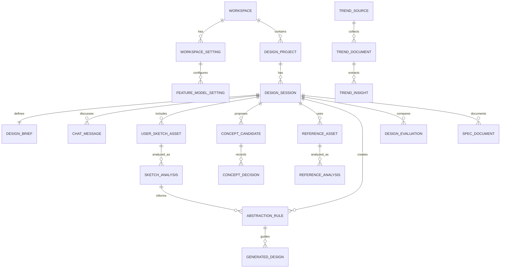

# User Needs v01: 범용 디자인 창작 지원도구 재기획

**작성일**: 2026-05-09 KST  
**대상 스택**: FastAPI, PostgreSQL, Vanilla HTML, Vanilla JS, Vanilla CSS  
**서비스 형태**: 기존 레거시 디자인과 템플릿을 유지하는 사용자 워크스페이스 중심 웹 애플리케이션  
**핵심 정의**: 이 제품은 편집툴이 아니라 디자이너의 창작 과정을 지원하는 근거 기반 디자인 발상 시스템이다. 사용자의 목적을 구조화하고, 트렌드와 실제 레퍼런스를 근거로 컨셉을 결정하며, 레퍼런스를 디자인 문법으로 추상화하고, 결과를 검토 가능한 스펙 문서로 남긴다.

---

## 1. 재기획 배경

실제 테스트 결과, 기존 기획은 다음 전제에서 과도한 복잡성과 운영 부담을 만들었다.

- 관리자 페이지와 사용자 워크스페이스를 분리하는 구조가 초기 제품 범위에 비해 무겁다.
- Django 기반 앱 구조와 다수의 운영 모듈이 빠른 검증과 수정에 불리하다.
- 신규 UI를 크게 도입하면 기존 레거시 디자인, 템플릿, 사용 흐름과 충돌한다.
- 기능을 지나치게 많이 나누면 사용자가 디자인 판단보다 시스템 조작에 더 많은 시간을 쓰게 된다.

따라서 이번 재기획은 다음 원칙으로 문서를 완전히 정리한다.

- FastAPI 기반의 단순하고 명확한 서버 구조로 전환한다.
- 데이터 저장소는 PostgreSQL을 기준으로 한다.
- 화면은 Vanilla HTML, Vanilla JS, Vanilla CSS로 구현한다.
- 관리자 페이지는 만들지 않는다.
- 설정은 사용자 워크스페이스 내부의 설정 메뉴에서 처리한다.
- 기존 레거시 디자인과 템플릿은 그대로 유지한다.
- 추가되는 기능에 대해서만 필요한 UX를 논리적으로 확장한다.
- 기존보다 세련된 시각 표현은 신규 기능 영역과 공통 CSS 개선 범위에서만 적용한다.

---

## 2. 제품의 본질

이 프로그램은 이미지를 세밀하게 편집하거나 캔버스 위에서 그래픽을 조작하는 도구가 아니다. 핵심 가치는 다음 질문에 답하는 것이다.

- 사용자의 디자인 목적은 무엇인가.
- 이 목적에 적합한 컨셉은 무엇인가.
- 그 컨셉은 어떤 트렌드, 사용자 맥락, 실제 레퍼런스에 근거하는가.
- 어떤 레퍼런스를 참고할 수 있는가.
- 레퍼런스를 그대로 따라 하지 않고 어떤 디자인 문법으로 추상화할 수 있는가.
- 사용자가 직접 그린 스케치가 있다면 어떤 창작 의도와 구조로 해석할 수 있는가.
- 추상화된 디자인 문법을 대상물, 매체, 아이템에 어떻게 적용할 수 있는가.
- 그 과정과 결과를 디자이너, 팀, 클라이언트가 이해 가능한 문서로 어떻게 남길 것인가.

따라서 이 제품은 **근거 기반 디자인 발상 시스템**이다. 생성 이미지는 산출물 중 하나이며, 더 중요한 것은 컨셉 결정의 근거, 레퍼런스 해석, 추상화 규칙, 최종 스펙이다.

---

## 3. 핵심 사용자와 사용 상황

| 사용자 | 목적 | 필요한 지원 |
|---|---|---|
| 산업디자이너 | 제품, 가구, 패키지, 소형 오브젝트 컨셉 개발 | 형태, 구조, 재질, 사용성, 제작 스펙 정리 |
| 패션디자이너 | 시즌별 룩, 아이템, 소재, 실루엣 기획 | 트렌드 분석, 스타일 보드, 룩 변형, 소재/패턴 문서화 |
| 시각디자이너 | 브랜딩, 로고, 포스터, 편집, 그래픽 시스템 | 색, 타입, 레이아웃 문법, 키비주얼, 디자인 가이드 |
| 광고/브랜드 디자이너 | 캠페인 비주얼과 메시지 컨셉 개발 | 타깃 인사이트, 메시지, 컷 구성, 채널별 소재 스펙 |
| 디자인 리드/PM | 방향성 검토, 의사결정 기록, 팀 공유 | 결정 근거, 버전 비교, 출처와 리스크 관리 |

대표 사용 상황:

- “휴대폰 거치대를 자연물 컨셉으로 디자인하고 싶다.”
- “2026 S/S 여성복 컬렉션의 핵심 무드와 룩 방향이 필요하다.”
- “신규 카페 브랜드의 로고와 키비주얼 방향을 정해야 한다.”
- “친환경 세제 광고 캠페인의 시각 컨셉을 여러 개 탐색하고 싶다.”
- “클라이언트에게 왜 이 컨셉을 선택했는지 근거 있는 문서로 설명해야 한다.”

---

## 4. 제품 원칙

1. **편집보다 창작 지원이 우선**  
   캔버스 편집, 레이어 조작, 세밀한 이미지 보정은 핵심 범위가 아니다. 브리프, 리서치, 컨셉, 레퍼런스, 추상화, 스펙화가 핵심이다.

2. **기존 레거시 UI 유지**  
   기존 템플릿, 레이아웃, 화면 흐름은 유지한다. 신규 기능은 기존 UI 안에 자연스럽게 삽입하고, 전체 화면 구조를 새로 만들지 않는다.

3. **추가 기능만 세련되게 확장**  
   신규 기능 영역은 기존 디자인보다 정돈된 타이포그래피, 카드 밀도, 스켈레톤 로딩, 상태 표시, 빈 상태 UI를 적용한다. 단, 기존 화면과 시각적으로 단절되어 보이면 안 된다.

4. **관리자 페이지 금지**  
   별도 관리자 페이지나 운영 콘솔은 만들지 않는다. 모델, API 키 이름, 기능별 사용 여부, 레퍼런스 소스, 워크스페이스 기본값은 사용자 워크스페이스의 설정 메뉴에서 관리한다.

5. **근거 없는 제안 금지**  
   트렌드, 시장, 레퍼런스, 디자인 사례에 대한 주장은 출처와 연결되어야 한다. 출처가 없으면 “아이디어 가설”로 표시하고 컨셉 결정 근거로 사용하지 않는다.

6. **레퍼런스 복제 금지**  
   레퍼런스는 모방 대상이 아니라 분석 대상이다. 시스템은 원본 이미지를 형태, 구조, 비례, 재질, 상징, 사용성 규칙으로 변환해야 한다.

7. **사용자 스케치 존중**  
   사용자가 업로드한 스케치는 외부 레퍼런스가 아니라 사용자 고유의 창작 입력물이다. 원본을 보존하고, AI 해석과 생성 결과를 별도 자산으로 관리한다.

8. **자동화는 옵션**  
   사용자는 챗봇과 단계적으로 진행할 수도 있고, 목적만 제시해 자동으로 끝까지 진행할 수도 있다. 자동 모드도 중간 과정과 근거를 숨기지 않는다.

9. **거짓 fallback 금지**  
   실제 런타임 경로에서 MOCK, Placeholder, 하드코딩 anchor, 하드코딩 taxonomy, 거짓 데이터 fallback을 사용하지 않는다. 실패하면 실패를 명확히 표시하고 재시도 조건을 제공한다.

---

## 5. 기술 전제

### 5.1 아키텍처 및 개발 스택

| 영역 | 선택 |
|---|---|
| Backend | FastAPI |
| Database | PostgreSQL |
| Migration | Alembic |
| Template | 기존 레거시 HTML 템플릿 유지 |
| Frontend | Vanilla HTML, Vanilla JS, Vanilla CSS |
| Async Work | 필요한 경우 FastAPI BackgroundTasks 또는 별도 워커를 사용하되 운영 복잡도를 최소화 |
| AI Provider | `.env` 기반 API Key와 워크스페이스 설정 기반 기능별 모델 선택 |
| File Storage | 초기에는 로컬/서버 파일 저장소, 추후 object storage 확장 가능 |

### 5.2 구현 경계

- Django, Django Admin, Django Template, Django ORM 전제를 제거한다.
- 관리자 전용 앱, 관리자 콘솔, 운영 대시보드는 범위에서 제외한다.
- 기존 레거시 HTML/CSS/JS 구조를 최대한 유지한다.
- 신규 화면은 “완전한 새 앱”이 아니라 기존 사용자 워크스페이스의 메뉴, 패널, 모달, 카드로 추가한다.
- 데이터 모델 변경은 Alembic 버전으로 관리한다.
- DB 필수 필드 추가 또는 변경이 있으면 `db_reference.md`에 누적 기록한다.

---

## 6. 사용자 워크스페이스 구조

관리자 페이지를 만들지 않으므로 모든 사용자는 사용자 워크스페이스 안에서 작업과 설정을 수행한다.

```text
--------------------------------------------------------------------------------+
| Header: Project / Session / Mode / Settings                                    |
+----------------------+--------------------------------------+------------------+
| Legacy Navigation    | Design Workspace                      | Decision Panel   |
| - Projects           | - Chat and Brief                      | Current Stage    |
| - Sessions           | - Evidence Board                      | Next Action      |
| - Assets             | - Reference Board                     | Required Review  |
| - Specs              | - Sketch Board                        | Selected Concept |
| - Settings           | - Generation Results                  | Export Status    |
+----------------------+--------------------------------------+------------------+
```

기존 레거시 디자인을 유지하면서 다음 메뉴만 추가한다.

- `Settings`: 워크스페이스 설정
- `Reference Library`: 저장된 레퍼런스와 출처 확인
- `Sketches`: 사용자 스케치 원본과 AI 해석 확인
- `Spec Documents`: 생성된 스펙 문서와 버전 확인

### 6.1 워크스페이스 설정 메뉴

관리자 페이지 대신 사용자 워크스페이스 안에 설정 메뉴를 둔다.

| 설정 영역 | 기능 |
|---|---|
| AI 모델 설정 | 기능별 provider/model 선택, temperature, max tokens, 이미지 크기 |
| API Key 연결 | `.env`에 등록된 key alias 선택. 실제 key 값은 UI에 노출하지 않음 |
| 도메인 기본값 | 산업/패션/시각/광고 도메인 기본 템플릿 선택 |
| 레퍼런스 소스 | 사용할 검색 소스 활성/비활성, 기본 검색 범위 |
| 출력 문서 | 스펙 문서 섹션 표시 여부, export 형식 |
| 개인정보/자산 | 업로드 자산 보존 정책, 삭제 요청 |

설정 UX 원칙:

- 위험한 설정은 즉시 저장하지 않고 확인 모달을 표시한다.
- 모델 설정은 기능별로 분리한다.
- API Key 원문은 저장하거나 표시하지 않는다.
- 설정이 없어 실행할 수 없는 기능은 실행 전에 명확히 안내한다.
- 설정 오류를 임시 성공처럼 보이게 하지 않는다.

---

## 7. 전체 파이프라인

```text
1. 목적 입력
2. 브리프 구조화
3. 사용자 스케치/참고 이미지 업로드(선택)
4. 추가 질문과 제약 확인
5. 트렌드/시장/사용자/도메인 근거 조사
6. 컨셉 후보 생성
7. 컨셉 후보 평가
8. 컨셉 결정
9. 레퍼런스 검색과 수집
10. 레퍼런스 클러스터링과 적합성 분석
11. 사용자 스케치와 레퍼런스 분석
12. 레퍼런스/스케치 추상화
13. 추상화 스케치 생성 또는 사용자 스케치 구체화
14. 대상물/매체/아이템에 적용한 디자인 변형 생성
15. 후보 비교와 최종 방향 선택
16. 스펙 문서 작성
17. 검토, 승인, 버전 관리
```

### 7.1 단계별 입력/처리/출력

| 단계 | 입력 | 처리 | 출력 | 검증 조건 |
|---|---|---|---|---|
| 목적 입력 | 자연어 목적, 도메인 선택 | 목적 분해 | RawDesignRequest | 도메인과 목적 존재 |
| 브리프 구조화 | RawDesignRequest | 대상, 사용 맥락, 제약 추출 | DesignBrief | 용도, 대상, 결과 형태 존재 |
| 스케치 업로드 | 사용자 스케치, 메모 | 파일 검증, 의도 질문 생성 | UserSketchAsset | 원본 파일과 메타데이터 저장 |
| 추가 질문 | DesignBrief | 누락 필드 판정 | ClarifyingQuestion | 자동 진행 가능 여부 판단 |
| 트렌드 조사 | Brief, 도메인 | 문서/웹/내부 자료 검색 | TrendInsight | 출처 URL, 발행일, 수집일 저장 |
| 컨셉 후보 | Brief, TrendInsight | 후보 생성, 스코어링 | ConceptCandidate | 후보별 근거와 리스크 존재 |
| 컨셉 결정 | 후보, 사용자 선택 | 승인/보류/폐기 기록 | ConceptDecision | 결정자, 시각, 사유 저장 |
| 레퍼런스 검색 | 선택 컨셉 | 이미지/문서/사례 검색 | ReferenceAsset | 출처, 라이선스, 타입 저장 |
| 레퍼런스 분석 | ReferenceAsset | 의미/형태/구조 분석 | ReferenceAnalysis | 복제 위험과 추상화 가능성 분리 |
| 스케치 분석 | UserSketchAsset | 의도/형태/구조/미완성 부분 분석 | SketchAnalysis | 원본과 AI 해석 연결 |
| 추상화 | ReferenceAnalysis, SketchAnalysis | 디자인 문법 변환 | AbstractionRule | 형태/구조/재질/상징 중 2개 이상 도출 |
| 시각화 | Rule, Brief, UserSketchAsset | 스케치 생성/구체화/변형 | GeneratedDesign | 생성 근거 추적 가능 |
| 후보 비교 | 이미지, 규칙, Brief | 장단점 비교 | DesignEvaluation | 선택/보류/폐기 사유 저장 |
| 스펙 문서 | 모든 산출물 | 문서 구조화 | SpecDocument | 근거, 결정, 레퍼런스, 최종안 포함 |

### 7.2 파이프라인 불변 조건

- 출처 없는 트렌드 주장은 컨셉 결정의 근거로 쓰지 않는다.
- 레퍼런스 원본과 AI 생성 이미지는 데이터 타입, UI 라벨, 저장 테이블에서 구분한다.
- 사용자 업로드 스케치는 외부 레퍼런스와 구분하고 원본을 덮어쓰지 않는다.
- 자동 모드가 내린 결정도 Decision Log에 저장한다.
- 이미지 생성 요청은 브리프, 컨셉, 레퍼런스, 추상화 규칙 중 필요한 근거와 연결되어야 한다.
- 스펙 문서는 최종 결과만 기록하지 않고 버린 대안과 선택 사유도 기록한다.
- 저작권 위험이 높은 레퍼런스는 직접 스타일 적용을 막고 추상화 전용으로만 사용한다.

---

## 8. 사용자 진행 모드

### 8.1 챗봇 협업 모드

디자이너와 AI가 함께 컨셉을 좁혀가는 기본 모드다.

```text
사용자 목적 입력
-> 사용자 스케치 업로드(선택)
-> AI 질문
-> 사용자가 제약/선호 답변
-> AI가 스케치 의도/형태/구조 해석을 확인
-> AI가 트렌드 근거와 컨셉 후보 제시
-> 사용자가 후보 선택/보류/폐기
-> AI가 레퍼런스 보드 구성
-> 사용자가 레퍼런스 선택
-> AI가 추상화 규칙과 스케치 제시
-> 사용자가 변형안 선택
-> AI가 스펙 문서 생성
```

필수 UX:

- AI 답변 옆에 근거 출처 표시
- 사용자 스케치가 있으면 AI 해석 가설과 확인 질문 표시
- 컨셉 후보 카드마다 점수와 리스크 표시
- 선택 버튼: `채택`, `보류`, `폐기`, `더 탐색`
- 사용자가 바꾼 결정은 Decision Log에 버전으로 저장
- 다음 단계로 넘어가기 전에 현재 결정 요약 표시

### 8.2 자동 진행 모드

사용자가 목적과 제약만 입력하면 시스템이 끝까지 진행한다.

자동 모드 필수 조건:

- 자동 결정마다 점수, 근거, 대안, 리스크를 저장한다.
- 불확실성이 큰 항목은 “검토 필요”로 표시한다.
- 최종 결과는 완성품이 아니라 “검토 가능한 디자인 패키지”로 제공한다.
- 사용자가 특정 단계부터 재실행할 수 있어야 한다.

자동 모드 상태:

| 상태 | 의미 | UI 표시 |
|---|---|---|
| `queued` | 작업 대기 | 예상 단계와 모델 표시 |
| `researching` | 트렌드/자료 조사 | 수집 출처와 진행률 |
| `concepting` | 컨셉 후보 생성 | 후보 생성 중 스켈레톤 |
| `referencing` | 레퍼런스 수집 | 출처별 수집 수 |
| `abstracting` | 디자인 문법 추출 | 형태/구조/의미 축 표시 |
| `generating` | 스케치/이미지 생성 | 생성 작업 로그 |
| `documenting` | 스펙 작성 | 문서 섹션 진행 |
| `review_ready` | 검토 가능 | 검토 필요 항목 강조 |
| `failed` | 실패 | 실패 단계, 원인, 재시도 조건 |

### 8.3 사용자 스케치 기반 진행

사용자는 자신의 스케치를 업로드해 챗봇이 참고하게 하거나, 그 스케치를 더 구체화하도록 요청할 수 있다.

```text
스케치 업로드
-> AI가 스케치의 의도/형태/구조/미완성 부분 분석
-> 챗봇이 사용자에게 해석이 맞는지 확인
-> 필요한 레퍼런스와 트렌드 근거 수집
-> 스케치의 핵심 아이디어를 추상화 규칙으로 정리
-> 원본 방향을 유지한 구체화안 생성
-> 다른 컨셉으로 확장한 변형안 생성
-> 스케치 원본, 분석, 구체화 결과를 스펙 문서에 기록
```

필수 원칙:

- 원본 스케치를 절대 덮어쓰지 않는다.
- AI 해석은 사용자 확인이 필요한 가설로 표시한다.
- 구체화 결과는 원본 스케치의 어떤 요소를 유지/변형했는지 설명해야 한다.
- 사용자가 원하면 스케치를 중심으로 컨셉 후보를 다시 만들 수 있어야 한다.
- 외부 레퍼런스 스타일을 사용자의 스케치에 직접 덮어씌우지 않고 추상화 규칙을 통해 적용한다.

---

## 9. 도메인팩 설계

도메인팩은 공통 파이프라인 위에 얹히는 입력/평가/출력 템플릿이다. 도메인별 로직은 코드의 하드코딩 키워드 매핑이 아니라 데이터베이스 설정, 문서 기반 지식, 사용자 입력으로 확장한다.

| 도메인 | 특화 분석 | 시각화 | 스펙 필드 |
|---|---|---|---|
| 산업디자인 | 사용성, 구조, 재료, 생산성, CMF, 안전성 | 형태 스케치, 구조 스케치, 사용 장면, 변형안 | 치수 가정, 소재, 구조, 제조 방식, 사용 시나리오, 리스크 |
| 패션디자인 | 시즌, 타깃, 실루엣, 소재, 패턴, 착장, 문화 맥락 | 무드보드, 룩 스케치, 착장 이미지, 패턴 방향 | 아이템, 소재, 컬러, 패턴, 스타일링, 시즌 근거, 생산 유의 |
| 시각디자인 | 브랜드 톤, 색, 타입, 그리드, 레이아웃, 인지성 | 키비주얼, 로고 방향, 포스터, 그래픽 시스템 | 색/타입/그리드, 사용 규칙, 금지 규칙, 매체 확장 |
| 광고디자인 | 타깃 인사이트, 메시지, 후킹, 채널, 캠페인 톤 | 캠페인 컷, 소셜 소재, 카피 방향, 스토리보드 | 메시지, 채널, 비주얼 톤, 카피, 규격, CTA |

패션 도메인은 기존 구현을 고도화한다. 기존의 트렌드 수집, 분석, 이미지 생성, 리포트 생성은 유지하되 다음 중간 단계를 추가한다.

- 패션 브리프 구조화
- 시즌/타깃/아이템별 컨셉 후보
- 레퍼런스 보드와 출처 관리
- 실루엣/소재/패턴 추상화
- 룩 변형안 비교
- 패션 스펙 문서

---

## 10. 트렌드 지식 시스템

이 프로그램은 디자인 트렌드를 근거로 활용해야 한다. 단, 코드에 고정된 트렌드 분류표를 넣는 방식은 금지한다. 사용자가 워크스페이스 설정에서 사용할 트렌드 소스와 도메인팩을 선택하고, 시스템은 수집/색인된 문서를 근거로 사용한다.

### 10.1 트렌드 문서 수집 대상

초기 카탈로그 후보:

- 패션: Vogue Business, Business of Fashion, WGSN류 리포트, 패션위크 리뷰, 브랜드 룩북
- 산업디자인: Core77, Dezeen, DesignWanted, Yanko Design, 제조/소재 리포트
- 시각디자인: AIGA Eye on Design, It’s Nice That, Brand New, 디자인 시스템 문서
- 광고디자인: Cannes Lions, Campaign, AdAge, The Drum, 브랜드 캠페인 아카이브
- 범용 크리에이티브: Adobe Creative Trends, Pinterest Predicts, Behance, Dribbble, Google Design 사례

### 10.2 트렌드 데이터

| 엔티티 | 주요 필드 |
|---|---|
| TrendSource | 이름, URL, 도메인, 수집 주기, 신뢰도, 라이선스, 활성 상태 |
| TrendDocument | source, title, url, published_at, collected_at, raw_file, parsed_text, hash |
| TrendInsight | document, summary, keywords, domain_tags, evidence_quote, confidence |
| WorkspaceTrendSetting | workspace, enabled_sources, default_domain, recency_policy |

### 10.3 품질 기준

- 발행일과 수집일을 분리한다.
- 같은 주장을 여러 출처가 반복하면 근거 강도를 높인다.
- 오래된 트렌드는 자동 폐기하지 않고 최신성 점수를 낮춘다.
- AI 응답에는 출처와 근거 문서가 연결되어야 한다.
- 출처가 불확실한 내용은 “가설” 또는 “검증 필요”로 표시한다.

---

## 11. 레퍼런스 검색기

레퍼런스 검색기는 단순 이미지 검색 화면이 아니다. 디자인 컨셉을 구체화하기 위한 증거 수집과 해석 도구다.

사용자 스케치가 있는 경우, 레퍼런스 검색기는 스케치의 의도와 충돌하지 않는 자료를 찾는 역할도 한다. 예를 들어 사용자가 이미 곡선형 제품 스케치를 올렸다면, 시스템은 유행 레퍼런스를 무작위로 붙이지 않고 그 곡선 구조를 더 잘 설명하거나 발전시킬 수 있는 소재, 구조, 유사 제품, 자연물, 그래픽 사례를 찾는다.

### 11.1 검색 유형

- 키워드 검색: 컨셉, 도메인, 소재, 시대, 무드
- 이미지 검색: 사용자가 업로드한 이미지와 유사한 사례
- 스케치 기반 검색: 사용자 스케치의 형태/구조와 연결되는 사례
- 문서 검색: 트렌드 문서, 브랜드 문서, 리포트
- 내부 자산 검색: 이전 프로젝트, 워크스페이스 라이브러리
- 확장 검색: 자연물, 건축, 제품, 패션, 그래픽, 광고 사례

### 11.2 레퍼런스 카드 필수 정보

- 썸네일
- 제목
- 출처 URL
- 수집일
- 발행일 또는 업로드일
- 라이선스 또는 사용 위험
- 도메인 태그
- 왜 관련 있는지
- 추상화 가능 요소
- 표절/복제 위험

### 11.3 사용자 스케치 카드 필수 정보

사용자 스케치는 외부 레퍼런스 카드와 별도 타입으로 보여준다.

- 원본 썸네일
- 업로드 사용자
- 업로드 시각
- 사용자가 입력한 설명
- AI가 추정한 의도
- AI가 추정한 형태/구조 요소
- 미확정 또는 질문 필요 요소
- 구체화에 유지할 요소
- 변형 가능한 요소
- 연결된 생성 결과와 스펙 문서

---

## 12. 추상화 엔진

추상화 엔진은 레퍼런스를 디자인 문법으로 바꾸는 핵심 모듈이다. 사용자가 산, 파도, 조약돌, 건축물, 특정 문화 요소 등을 컨셉으로 선택하면 AI는 그것을 형태와 기능으로 번역해야 한다.

사용자 스케치가 있는 경우 추상화 엔진은 외부 레퍼런스뿐 아니라 사용자의 스케치 자체도 분석한다. 목표는 스케치를 고쳐 그리는 것이 아니라, 스케치 안의 창작 의도와 구조를 명확한 디자인 문법으로 정리하는 것이다.

### 12.1 추상화 축

| 축 | 분석 질문 | 산출 예 |
|---|---|---|
| 형태 | 외곽선, 비례, 반복, 곡률은 어떤가 | 삼각 실루엣, 긴 수평선 |
| 구조 | 하중, 결합, 지지, 접힘은 어떤가 | 경사 지지, 레이어 구조 |
| 표면 | 질감, 광택, 패턴은 어떤가 | 무광, 거친 입자, 결 |
| 색/재료 | 색상 대비와 소재 감각은 어떤가 | 흙색, 암석색, 반투명 소재 |
| 의미 | 상징과 감정은 무엇인가 | 안정, 고요, 힘, 자연성 |
| 사용성 | 제품/매체의 기능과 어떻게 연결되는가 | 잡기 쉬움, 세워짐, 접힘 |

### 12.2 출력

- AbstractionRule
- SketchAnalysis
- SketchPrompt
- MaterialDirection
- FormGrammar
- RiskNote
- ReferenceLink

사용자 스케치 기반 출력:

- 원본에서 유지할 핵심 실루엣
- 원본에서 강화할 구조
- 원본에서 불명확한 기능 요소
- 구체화 방향 3~5개
- 원본 보존형 생성 프롬프트
- 컨셉 확장형 생성 프롬프트

### 12.3 금지 사항

- 원본 레퍼런스의 구도를 그대로 복제하지 않는다.
- 특정 브랜드/작가 스타일을 그대로 모사하지 않는다.
- 출처 없는 이미지로 상업적 사용 가능성을 단정하지 않는다.
- 기능 요구와 무관한 장식 요소만 추출하지 않는다.
- 사용자 스케치 원본을 AI 생성 결과로 대체해 원본 이력을 잃게 하지 않는다.

---

## 13. UX/UI 상세 설계

UX/UI는 기존 레거시 디자인과 템플릿을 유지하면서 신규 기능에 필요한 판단 흐름만 추가한다. 새 기능은 기존 화면을 덮어쓰지 않고, 기존 레이아웃의 섹션, 패널, 모달, 탭, 카드 패턴을 재사용한다.

### 13.1 UX 구조 원칙

- 화면은 파이프라인 단계와 1:1로 연결된다.
- 모든 단계는 현재 상태, 근거, 다음 결정, 되돌아가기 경로를 가진다.
- 챗봇은 보조 팝업이 아니라 디자인 세션의 핵심 인터페이스다.
- 근거 보드와 결정 패널은 가능한 한 같은 화면에서 확인 가능해야 한다.
- 사용자 스케치, 외부 레퍼런스, 추상화, 생성 이미지를 시각적으로 명확히 구분한다.
- 로딩 중에는 단순 스피너보다 단계별 스켈레톤과 실제 작업 로그를 표시한다.
- 오류, 빈 상태, 권한 부족, 설정 누락은 사용자에게 명확히 설명한다.

### 13.2 신규 기능의 디자인 개선 범위

기존 디자인보다 세련되게 보이도록 다음 요소를 적용한다.

- 신규 카드의 border radius는 8px 이하로 유지한다.
- 정보 밀도는 높이되 제목, 메타데이터, 상태 배지를 명확히 구분한다.
- 생성/검색/분석 대기 상태에는 스켈레톤 로딩 애니메이션을 적용한다.
- 선택 가능한 항목은 hover, selected, disabled 상태를 분명히 제공한다.
- AI 결과에는 항상 근거, 상태, 위험도를 같은 위치에 표시한다.
- 빈 상태는 실제 다음 행동을 제안한다.
- 버튼은 기능성 중심으로 배치하고 과도한 장식은 피한다.

### 13.3 Sketch Input Board

```text
+--------------------------------------------------------------------------------+
| Uploaded Sketch                                                                 |
+---------------------------+---------------------------+------------------------+
| Original Sketch           | AI Interpretation         | Refinement Actions     |
| image preview             | intent, form, structure   | keep / clarify / vary  |
| user memo                 | unclear points            | refine / expand / use  |
| upload metadata           | questions for user        | as concept evidence    |
+---------------------------+---------------------------+------------------------+
```

필수 상호작용:

- 스케치 업로드
- 스케치 설명 추가
- AI 해석 승인/수정
- 유지할 요소 선택
- 바꿀 수 있는 요소 선택
- 스케치 기반 레퍼런스 검색
- 스케치 구체화 생성
- 스케치 기반 스펙 문서 반영

### 13.4 Reference Board

```text
+--------------------------------------------------------------------------------+
| Query / Domain / Source / Date / License / Abstraction Fit                      |
+------------------+--------------------------+----------------------------------+
| Source Clusters  | Reference Grid           | Analysis                         |
| Nature           | image, title, source     | Why relevant                     |
| Product          | image, title, source     | Form grammar                     |
| Architecture     | image, title, source     | Structure/material/symbol        |
| Graphic/Fashion  | image, title, source     | Copyright risk                   |
+------------------+--------------------------+----------------------------------+
```

필수 상호작용:

- 레퍼런스 저장
- 추상화 후보로 추가
- 제외 사유 기록
- 유사 레퍼런스 더 찾기
- 출처 보기
- 라이선스 위험 표시

### 13.5 Spec Builder

Spec Builder는 문서 편집기가 아니라 의사결정 기록을 문서로 구조화하는 화면이다.

문서 섹션:

- 프로젝트 브리프
- 트렌드 근거
- 컨셉 후보와 평가
- 최종 컨셉 결정
- 사용자 스케치 원본과 AI 해석
- 레퍼런스 보드
- 추상화 규칙
- 스케치와 생성 이미지
- 최종안 비교
- 도메인별 스펙
- 출처/라이선스/AI 사용 고지

---

## 14. 오류/빈 상태/비정상 상황 대응

| 상황 | UI 대응 | 시스템 동작 |
|---|---|---|
| 트렌드 자료 부족 | “근거 부족” 표시, 추가 검색 제안 | 컨셉 결정 근거로 사용하지 않음 |
| 레퍼런스 없음 | 검색어 확장, 도메인 전환, 수동 업로드 제안 | 빈 결과를 정상 결과처럼 저장하지 않음 |
| 라이선스 위험 | 사용 제한 표시, 추상화 전용 처리 | 직접 스타일 적용 차단 |
| 모델 설정 없음 | 설정 메뉴 이동 CTA 표시 | 요청 실행 차단 |
| 모델 실패 | 실패 기능, 모델명, 재시도 가능 여부 표시 | 거짓 결과 생성 금지 |
| 자동 모드 불확실성 높음 | 사용자 검토 필요 단계로 중단 | 다음 단계 자동 진행 금지 |
| 파일 파싱 실패 | 실패 파일과 원인 표시 | 원문 없는 요약 생성 금지 |
| 이미지 업로드 오류 | 허용 형식/용량 안내 | 손상 파일 저장 금지 |

---

## 15. FastAPI 기반 모듈 구조

단순하고 검증 가능한 구조를 우선한다. 클린 아키텍처를 따르되, 초기 구현에서 불필요한 계층을 과도하게 만들지 않는다.

```text
app/
  main.py
  core/
    config.py
    database.py
    security.py
  api/
    routes/
      workspace.py
      settings.py
      sessions.py
      conversations.py
      assets.py
      trends.py
      references.py
      concepts.py
      abstraction.py
      generation.py
      specs.py
  domain/
    entities/
    services/
  application/
    use_cases/
    ports/
    dtos/
  infrastructure/
    repositories/
    ai_clients/
    search/
    storage/
    parsers/
  templates/
  static/
    css/
    js/
alembic/
```

레이어 규칙:

- Domain: Entity, Value Object, Domain Service. FastAPI나 SQLAlchemy에 의존하지 않는다.
- Application: UseCase, DTO, Port 인터페이스.
- Infrastructure: SQLAlchemy Repository, 외부 API, 파일 저장소, 검색/파서.
- API: FastAPI Router, Request/Response Schema, Template Response.
- Frontend: 기존 Vanilla HTML/JS/CSS 패턴을 유지한다.

---

## 16. 주요 모듈 책임

| 모듈 | 책임 |
|---|---|
| workspace | 프로젝트, 세션, 자산, 설정으로 이동하는 사용자 중심 허브 |
| settings | 워크스페이스 설정, 기능별 모델 선택, 레퍼런스 소스 설정 |
| sessions | 창작 파이프라인 상태, 진행 모드, 진행률 |
| conversations | 챗봇 대화, 질문, 답변, 결정 연결 |
| assets | 사용자 업로드 스케치, 메모, 원본 보존 |
| trends | 트렌드 출처, 문서, 인사이트, 근거 검색 |
| references | 레퍼런스 검색, 저장, 라이선스, 분석 |
| concepts | 컨셉 후보, 점수, 결정 로그 |
| abstraction | 디자인 문법 변환, 추상화 규칙 |
| generation | 스케치, 이미지, 변형안 생성 작업 |
| specs | 스펙 문서, 버전, 승인 |

관리자 페이지가 없으므로 `settings` 모듈은 운영 콘솔이 아니라 사용자 워크스페이스 설정만 담당한다.

---

## 17. 데이터 모델 초안



핵심 테이블:

| 테이블 | 설명 |
|---|---|
| Workspace | 사용자 작업 공간 |
| WorkspaceSetting | 워크스페이스 기본 설정 |
| FeatureModelSetting | 기능별 AI provider/model/parameter 설정 |
| DesignProject | 프로젝트 목적, 도메인, 상태 |
| DesignSession | 창작 파이프라인 세션, 모드, 진행률 |
| DesignBrief | 목적, 도메인, 타깃, 사용 맥락, 제약 |
| UserSketchAsset | 사용자 원본 스케치, 메모, 파일 메타데이터 |
| SketchAnalysis | 스케치 의도, 형태, 구조, 불명확한 요소 |
| ConceptCandidate | 컨셉명, 설명, 점수, 근거, 리스크 |
| ConceptDecision | 선택/보류/폐기, 결정자, 결정 사유 |
| ReferenceAsset | 이미지/문서/URL, 출처, 라이선스, 수집일 |
| ReferenceAnalysis | 관련성, 형태 문법, 구조 문법, 위험 |
| AbstractionRule | 형태/구조/재질/상징/사용성 규칙 |
| GeneratedDesign | 생성 이미지, 연결된 규칙, 생성 모델 |
| SpecDocument | 스펙 문서, 버전, 승인 상태 |

---

## 18. AI 모델 설정

AI 모델은 코드에 하드코딩하지 않는다. `.env`는 사용 가능한 provider/API key alias를 제공하고, 워크스페이스 설정은 기능별 모델 정책을 가진다.

| 기능 | 모델 유형 | 설정 항목 |
|---|---|---|
| Trend Research | 검색/텍스트 모델 | provider, model, temperature, max tokens |
| Concept Chat | 대화 모델 | provider, model, system prompt version |
| User Sketch Analysis | 비전/멀티모달 모델 | provider, model, image detail, analysis schema |
| Reference Analysis | 비전/멀티모달 모델 | provider, model, image limit |
| Abstraction | 추론/텍스트 모델 | provider, model, reasoning depth |
| Sketch Prompt | 텍스트 모델 | provider, model, prompt template |
| Image Generation | 이미지 모델 | provider, model, size, variations |
| Spec Writing | 긴 문서 모델 | provider, model, citation policy |
| Verification | 텍스트/비전 모델 | provider, model, validation rules |

Fallback 원칙:

- fallback은 거짓 결과를 반환하는 방식이 아니다.
- 같은 기능에 대체 모델이 설정되어 있으면 실패 원인을 기록하고 대체 모델로 재시도한다.
- 대체 모델이 없으면 실패 상태를 반환한다.
- 실패한 결과를 성공한 것처럼 저장하지 않는다.

---

## 19. API 요구사항 초안

| Method | Path | 목적 |
|---|---|---|
| GET | `/workspace` | 사용자 워크스페이스 홈 |
| GET/POST | `/workspace/settings` | 워크스페이스 설정 조회/수정 |
| POST | `/api/sessions` | 디자인 세션 생성 |
| GET | `/api/sessions/{session_id}` | 세션 상세 조회 |
| POST | `/api/sessions/{session_id}/brief` | 브리프 구조화 |
| POST | `/api/sessions/{session_id}/messages` | 챗봇 메시지 전송 |
| POST | `/api/sessions/{session_id}/sketches` | 사용자 스케치 업로드 |
| POST | `/api/sessions/{session_id}/trends/search` | 트렌드 근거 검색 |
| POST | `/api/sessions/{session_id}/concepts` | 컨셉 후보 생성 |
| POST | `/api/concepts/{concept_id}/decisions` | 컨셉 결정 기록 |
| POST | `/api/sessions/{session_id}/references/search` | 레퍼런스 검색 |
| POST | `/api/references/{reference_id}/analyze` | 레퍼런스 분석 |
| POST | `/api/sessions/{session_id}/abstractions` | 추상화 규칙 생성 |
| POST | `/api/sessions/{session_id}/generations` | 생성 작업 요청 |
| POST | `/api/sessions/{session_id}/specs` | 스펙 문서 생성 |

API 원칙:

- 생성형 작업은 실행 상태와 결과를 분리한다.
- 실패 응답은 실패 단계, 원인, 재시도 가능 여부를 포함한다.
- 출처가 필요한 응답은 evidence 링크를 포함한다.
- UI 표시 문장을 서버 코드에서 임의 조립하지 않고 구조화된 필드로 전달한다.

---

## 20. 런타임 검증 기준

### 20.1 기능 검증

| 영역 | 검증 기준 |
|---|---|
| 브리프 | 목적, 도메인, 대상, 결과물이 누락되지 않음 |
| 챗봇 | 질문과 답변이 세션/단계/결정과 연결됨 |
| 트렌드 | 출처 없는 주장이 결정 근거로 저장되지 않음 |
| 레퍼런스 | 원본, 출처, 라이선스, 수집일이 저장됨 |
| 스케치 | 원본과 AI 분석/생성 결과가 분리됨 |
| 추상화 | 형태/구조/재질/상징/사용성 규칙이 명확히 저장됨 |
| 생성 | 생성 이미지가 브리프/컨셉/규칙과 연결됨 |
| 스펙 | 최종안, 버린 대안, 결정 사유, 출처가 포함됨 |
| 설정 | 모델 설정 누락 시 실행을 차단하고 안내함 |

### 20.2 UI 검증

| 질문 | 통과 기준 |
|---|---|
| 사용자가 현재 단계가 어디인지 아는가 | 상단 단계 표시와 Decision Panel에 현재 단계 표시 |
| 사용자가 다음에 무엇을 해야 하는지 아는가 | 다음 결정 버튼과 이유 표시 |
| AI 제안의 근거를 확인할 수 있는가 | 근거 출처 링크와 인용 문서 연결 |
| 레퍼런스와 생성 이미지가 혼동되지 않는가 | 라벨, 저장 위치, 카드 스타일 분리 |
| 자동 모드 결과를 되짚을 수 있는가 | 단계별 로그와 중간 산출물 보존 |
| 스펙 문서가 검토 가능한가 | 섹션별 출처와 결정 로그 연결 |
| 기존 디자인과 충돌하지 않는가 | 신규 UI가 기존 템플릿 안에서 일관되게 표시 |

---

## 21. 개발 우선순위

### Phase 1: 구조 정리와 워크스페이스 설정

- FastAPI 기본 구조 정리
- PostgreSQL 연결과 Alembic 마이그레이션 구성
- 기존 레거시 템플릿 유지
- 워크스페이스 설정 메뉴 추가
- 기능별 모델 설정 저장/조회
- 설정 누락/오류 상태 UI 구현

### Phase 2: 디자인 세션과 브리프

- 디자인 세션 생성
- 목적 입력과 브리프 구조화
- 챗봇 협업 모드 기본 흐름
- Decision Panel 추가
- 세션 상태와 로그 저장

### Phase 3: 스케치와 레퍼런스

- 사용자 스케치 업로드와 원본 보존
- 스케치 분석 결과 저장
- 레퍼런스 검색과 저장
- 레퍼런스 카드와 라이선스 위험 표시
- 스켈레톤 로딩과 빈 상태 UI

### Phase 4: 컨셉, 추상화, 생성

- 컨셉 후보 생성과 평가
- 컨셉 결정 로그
- 레퍼런스/스케치 추상화
- 생성 작업 요청과 결과 저장
- 자동 모드의 단계별 상태 표시

### Phase 5: 스펙 문서와 검증

- 스펙 문서 생성
- 버전 관리
- 출처/라이선스/AI 사용 고지
- 전체 파이프라인 e2e 검증
- 오류 상황과 재시도 흐름 검증

---

## 22. 비범위

이번 재기획에서 제외한다.

- 별도 관리자 페이지
- Django Admin 또는 운영 콘솔
- 사용자/권한/테넌트 관리용 별도 백오피스
- 전문 이미지 편집기 수준의 캔버스/레이어/브러시 기능
- 출처 없는 자동 트렌드 분류
- 하드코딩된 카테고리 매핑
- 거짓 데이터 fallback
- 기존 레거시 템플릿을 전면 교체하는 신규 디자인 시스템

---

## 23. 성공 기준

이 문서 기준의 구현은 다음 조건을 만족해야 한다.

- FastAPI, PostgreSQL, Vanilla HTML/JS/CSS 구조로 동작한다.
- 관리자 페이지 없이 사용자 워크스페이스 안에서 설정이 가능하다.
- 기존 레거시 디자인과 템플릿을 유지한다.
- 신규 기능은 기존 화면 흐름과 충돌하지 않는다.
- 브리프, 트렌드, 컨셉, 레퍼런스, 스케치, 추상화, 생성, 스펙이 하나의 세션으로 연결된다.
- 출처 없는 주장과 거짓 fallback이 실제 결과로 저장되지 않는다.
- 사용자는 현재 단계, 필요한 판단, 다음 액션, 실패 원인을 명확히 알 수 있다.
- 생성 결과보다 의사결정 근거와 디자인 문법이 더 잘 보존된다.
